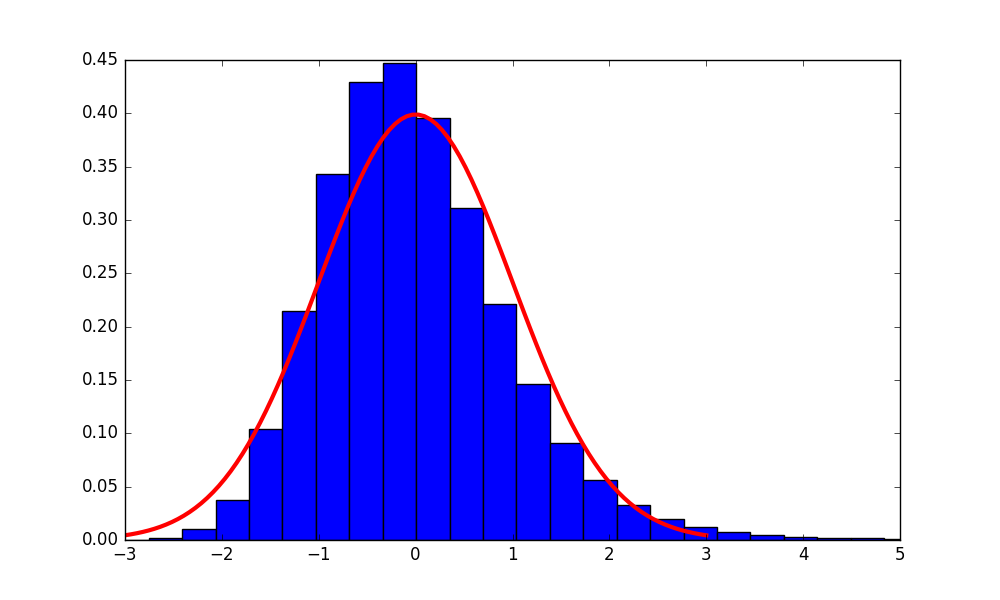
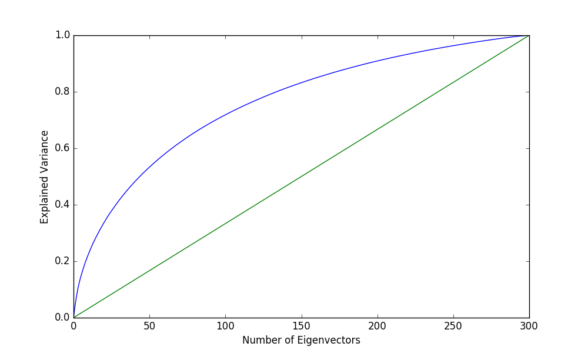
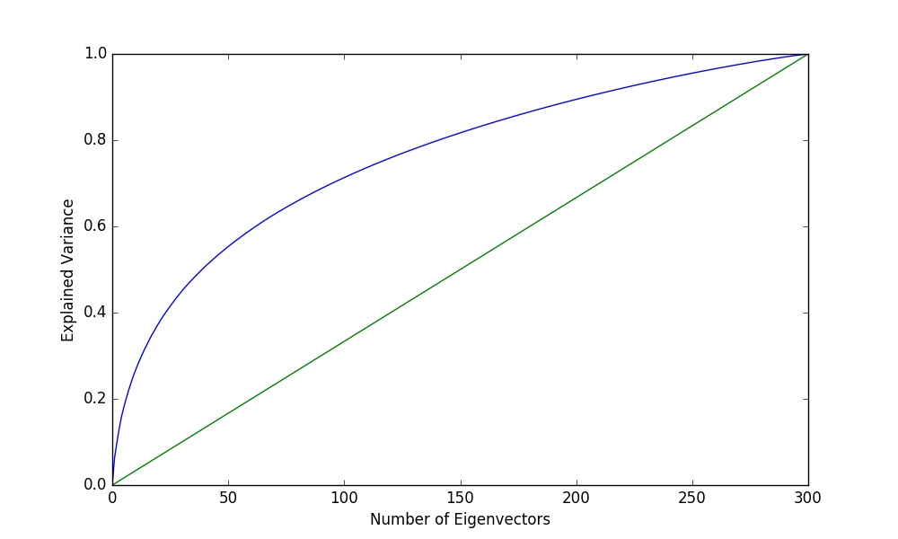
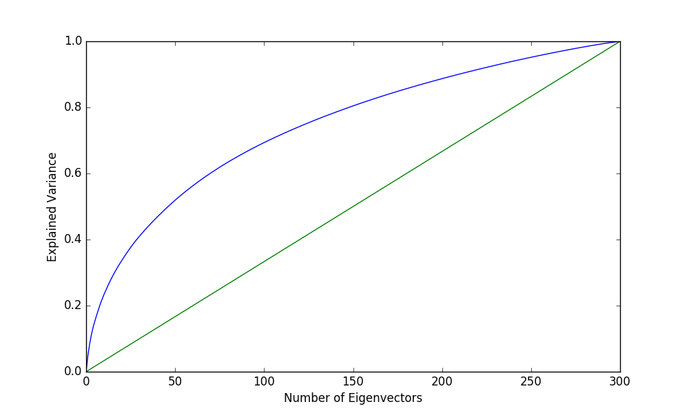

# Fasttext EDA  
## German  
- Vocabulary Size = 1,137,616  
- Embedding Length = 300  
#### Embedding L2 Norms  
  
- Anderson-Darling Test Statistic: 6981.49  
- Anderson-Darling Critical Value (1%): 1.09  
- Anderson-Darling Test Result: Reject  

- Kolmogorov-Smirnov p-value: 0.0  
- Kolmogorov-Smirnov Test Result: Reject  

- Shapiro-Wilk p-value: 0.0  
- Shapiro-Wilk Test Result: Reject  

#### Embedding Isotropy  
  
- Isotropy: 0.48  

## English  
- Vocabulary Size = 1,259,685  
- Embedding Length = 300  
#### Embedding L2 Norms  
  
- Anderson-Darling Test Statistic: 38324.57  
- Anderson-Darling Critical Value (1%): 1.09  
- Anderson-Darling Test Result: Reject  

- Kolmogorov-Smirnov p-value: 0.0  
- Kolmogorov-Smirnov Test Result: Reject  

- Shapiro-Wilk p-value: 0.0  
- Shapiro-Wilk Test Result: Reject  

#### Embedding Isotropy  
  
- Isotropy: 0.48  

## Russian  
- Vocabulary Size = 944,211  
- Embedding Length = 300  
#### Embedding L2 Norms  
  
- Anderson-Darling Test Statistic: 6871.69  
- Anderson-Darling Critical Value (1%): 1.09  
- Anderson-Darling Test Result: Reject  

- Kolmogorov-Smirnov p-value: 0.0  
- Kolmogorov-Smirnov Test Result: Reject  

- Shapiro-Wilk p-value: 0.0  
- Shapiro-Wilk Test Result: Reject  

#### Embedding Isotropy  
  
- Isotropy: 0.51  

