# Gensim EDA  
## Bengali  
- Vocabulary Size = 10,059  
- Embedding Length = 300  
#### Embedding L2 Norms  
  
- Anderson-Darling Test Statistic: 290.12  
- Anderson-Darling Critical Value (1%): 1.09  
- Anderson-Darling Test Result: Reject  

- Kolmogorov-Smirnov p-value: 0.0  
- Kolmogorov-Smirnov Test Result: Reject  

- Shapiro-Wilk p-value: 0.0  
- Shapiro-Wilk Test Result: Reject  

#### Embedding Isotropy  
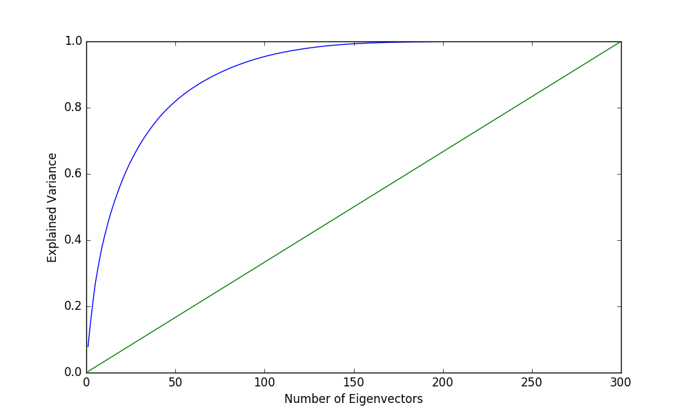  
- Isotropy: 0.18  

## Catalan  
- Vocabulary Size = 50,013  
- Embedding Length = 300  
#### Embedding L2 Norms  
  
- Anderson-Darling Test Statistic: 1339.05  
- Anderson-Darling Critical Value (1%): 1.09  
- Anderson-Darling Test Result: Reject  

- Kolmogorov-Smirnov p-value: 0.0  
- Kolmogorov-Smirnov Test Result: Reject  

- Shapiro-Wilk p-value: 0.0  
- Shapiro-Wilk Test Result: Reject  

#### Embedding Isotropy  
  
- Isotropy: 0.42  

## Chinese  
- Vocabulary Size = 50,101  
- Embedding Length = 300  
#### Embedding L2 Norms  
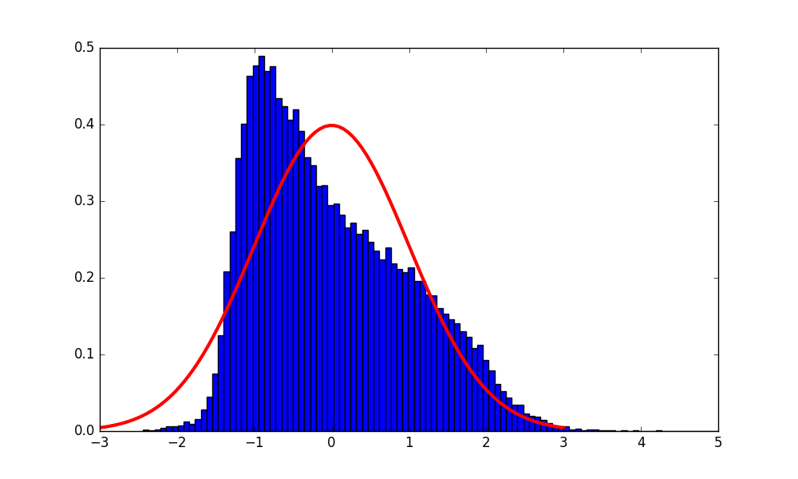  
- Anderson-Darling Test Statistic: 724.62  
- Anderson-Darling Critical Value (1%): 1.09  
- Anderson-Darling Test Result: Reject  

- Kolmogorov-Smirnov p-value: 0.0  
- Kolmogorov-Smirnov Test Result: Reject  

- Shapiro-Wilk p-value: 0.0  
- Shapiro-Wilk Test Result: Reject  

#### Embedding Isotropy  
  
- Isotropy: 0.42  

## Danish  
- Vocabulary Size = 30,134  
- Embedding Length = 300  
#### Embedding L2 Norms  
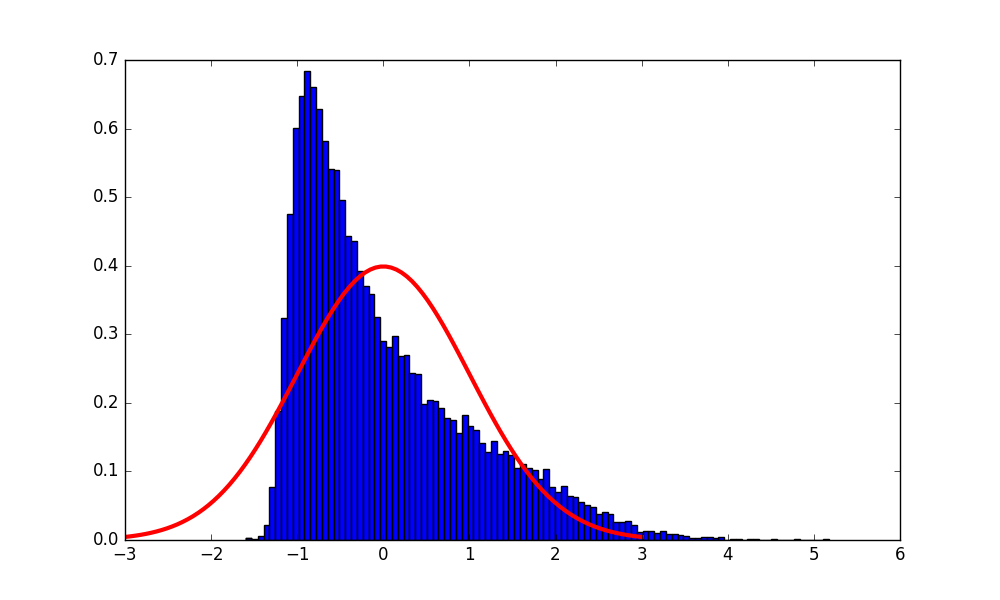  
- Anderson-Darling Test Statistic: 942.12  
- Anderson-Darling Critical Value (1%): 1.09  
- Anderson-Darling Test Result: Reject  

- Kolmogorov-Smirnov p-value: 0.0  
- Kolmogorov-Smirnov Test Result: Reject  

- Shapiro-Wilk p-value: 0.0  
- Shapiro-Wilk Test Result: Reject  

#### Embedding Isotropy  
  
- Isotropy: 0.3  

## Dutch  
- Vocabulary Size = 50,160  
- Embedding Length = 300  
#### Embedding L2 Norms  
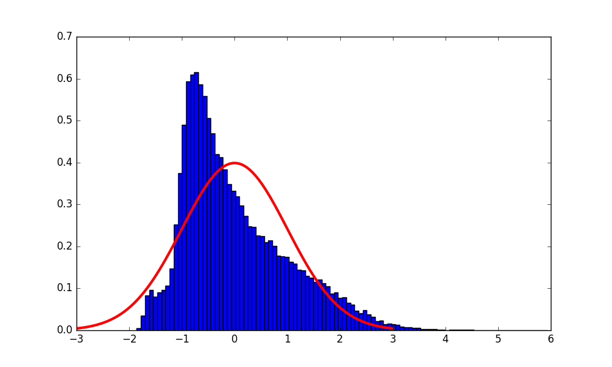  
- Anderson-Darling Test Statistic: 1075.81  
- Anderson-Darling Critical Value (1%): 1.09  
- Anderson-Darling Test Result: Reject  

- Kolmogorov-Smirnov p-value: 0.0  
- Kolmogorov-Smirnov Test Result: Reject  

- Shapiro-Wilk p-value: 0.0  
- Shapiro-Wilk Test Result: Reject  

#### Embedding Isotropy  
  
- Isotropy: 0.43  

## Esperanto  
- Vocabulary Size = 50,597  
- Embedding Length = 300  
#### Embedding L2 Norms  
  
- Anderson-Darling Test Statistic: 3020.93  
- Anderson-Darling Critical Value (1%): 1.09  
- Anderson-Darling Test Result: Reject  

- Kolmogorov-Smirnov p-value: 0.0  
- Kolmogorov-Smirnov Test Result: Reject  

- Shapiro-Wilk p-value: 0.0  
- Shapiro-Wilk Test Result: Reject  

#### Embedding Isotropy  
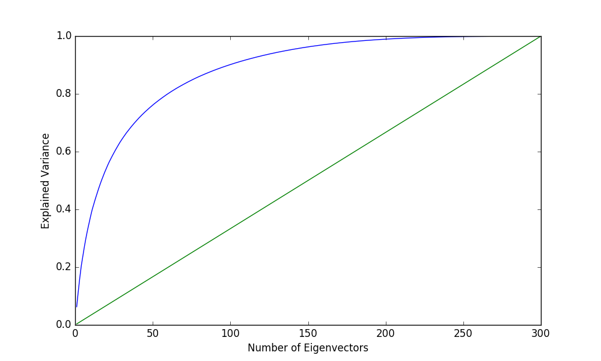  
- Isotropy: 0.23  

## Finnish  
- Vocabulary Size = 30,029  
- Embedding Length = 300  
#### Embedding L2 Norms  
  
- Anderson-Darling Test Statistic: 643.79  
- Anderson-Darling Critical Value (1%): 1.09  
- Anderson-Darling Test Result: Reject  

- Kolmogorov-Smirnov p-value: 0.0  
- Kolmogorov-Smirnov Test Result: Reject  

- Shapiro-Wilk p-value: 0.0  
- Shapiro-Wilk Test Result: Reject  

#### Embedding Isotropy  
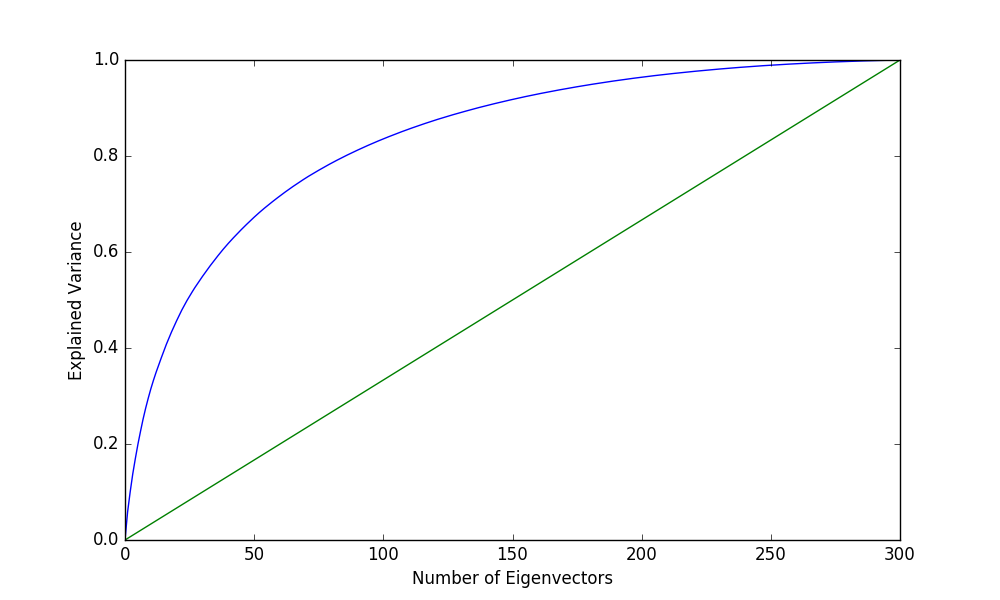  
- Isotropy: 0.32  

## French  
- Vocabulary Size = 50,130  
- Embedding Length = 300  
#### Embedding L2 Norms  
  
- Anderson-Darling Test Statistic: 1217.36  
- Anderson-Darling Critical Value (1%): 1.09  
- Anderson-Darling Test Result: Reject  

- Kolmogorov-Smirnov p-value: 0.0  
- Kolmogorov-Smirnov Test Result: Reject  

- Shapiro-Wilk p-value: 0.0  
- Shapiro-Wilk Test Result: Reject  

#### Embedding Isotropy  
  
- Isotropy: 0.43  

## German  
- Vocabulary Size = 50,006  
- Embedding Length = 300  
#### Embedding L2 Norms  
  
- Anderson-Darling Test Statistic: 1093.11  
- Anderson-Darling Critical Value (1%): 1.09  
- Anderson-Darling Test Result: Reject  

- Kolmogorov-Smirnov p-value: 0.0  
- Kolmogorov-Smirnov Test Result: Reject  

- Shapiro-Wilk p-value: 0.0  
- Shapiro-Wilk Test Result: Reject  

#### Embedding Isotropy  
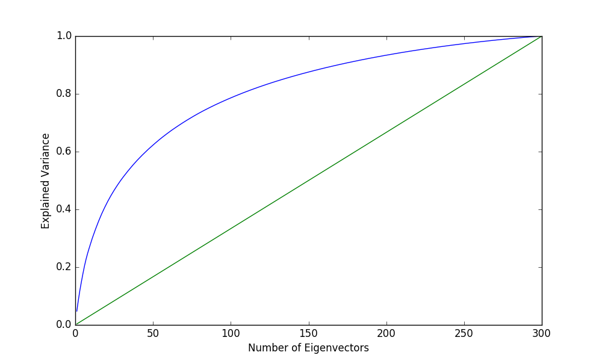  
- Isotropy: 0.39  

## Hindi  
- Vocabulary Size = 30,393  
- Embedding Length = 300  
#### Embedding L2 Norms  
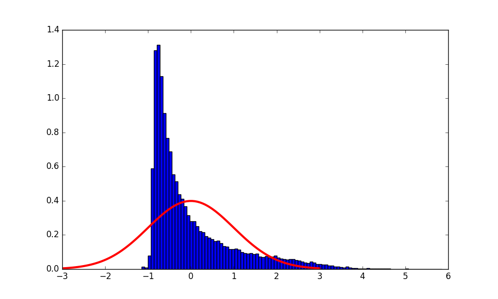  
- Anderson-Darling Test Statistic: 2040.53  
- Anderson-Darling Critical Value (1%): 1.09  
- Anderson-Darling Test Result: Reject  

- Kolmogorov-Smirnov p-value: 0.0  
- Kolmogorov-Smirnov Test Result: Reject  

- Shapiro-Wilk p-value: 0.0  
- Shapiro-Wilk Test Result: Reject  

#### Embedding Isotropy  
  
- Isotropy: 0.26  

## Hungarian  
- Vocabulary Size = 40,122  
- Embedding Length = 300  
#### Embedding L2 Norms  
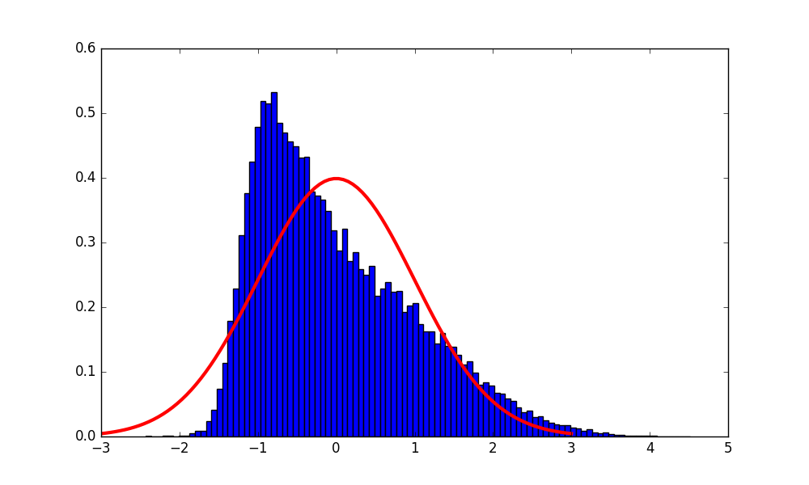  
- Anderson-Darling Test Statistic: 692.19  
- Anderson-Darling Critical Value (1%): 1.09  
- Anderson-Darling Test Result: Reject  

- Kolmogorov-Smirnov p-value: 0.0  
- Kolmogorov-Smirnov Test Result: Reject  

- Shapiro-Wilk p-value: 0.0  
- Shapiro-Wilk Test Result: Reject  

#### Embedding Isotropy  
  
- Isotropy: 0.39  

## Indonesian  
- Vocabulary Size = 30,048  
- Embedding Length = 300  
#### Embedding L2 Norms  
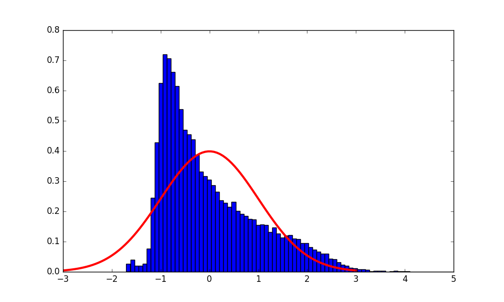  
- Anderson-Darling Test Statistic: 936.44  
- Anderson-Darling Critical Value (1%): 1.09  
- Anderson-Darling Test Result: Reject  

- Kolmogorov-Smirnov p-value: 0.0  
- Kolmogorov-Smirnov Test Result: Reject  

- Shapiro-Wilk p-value: 0.0  
- Shapiro-Wilk Test Result: Reject  

#### Embedding Isotropy  
  
- Isotropy: 0.4  

## Italian  
- Vocabulary Size = 50,031  
- Embedding Length = 300  
#### Embedding L2 Norms  
  
- Anderson-Darling Test Statistic: 1068.11  
- Anderson-Darling Critical Value (1%): 1.09  
- Anderson-Darling Test Result: Reject  

- Kolmogorov-Smirnov p-value: 0.0  
- Kolmogorov-Smirnov Test Result: Reject  

- Shapiro-Wilk p-value: 0.0  
- Shapiro-Wilk Test Result: Reject  

#### Embedding Isotropy  
  
- Isotropy: 0.43  

## Japanese  
- Vocabulary Size = 50,108  
- Embedding Length = 300  
#### Embedding L2 Norms  
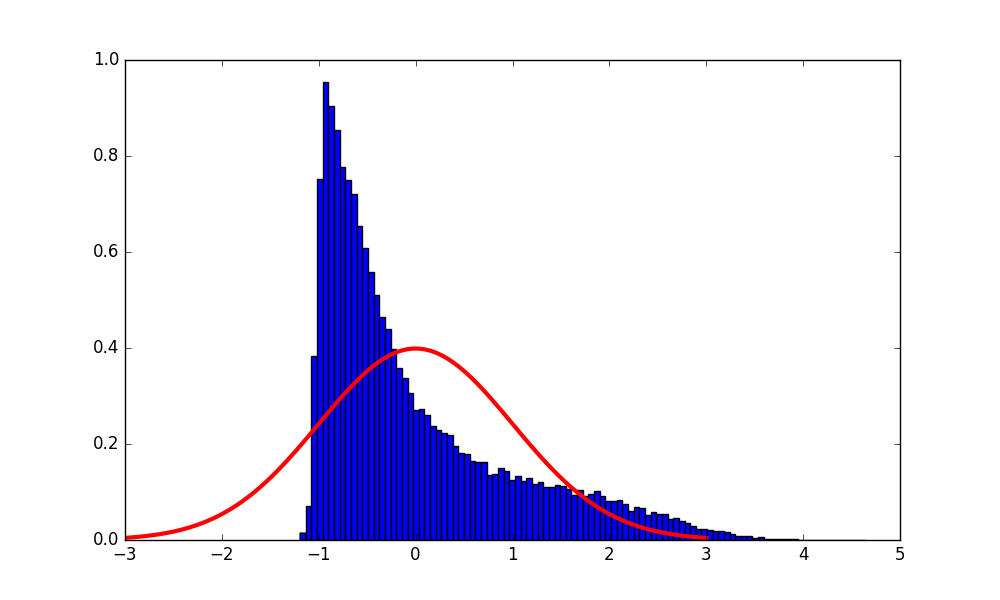  
- Anderson-Darling Test Statistic: 2467.86  
- Anderson-Darling Critical Value (1%): 1.09  
- Anderson-Darling Test Result: Reject  

- Kolmogorov-Smirnov p-value: 0.0  
- Kolmogorov-Smirnov Test Result: Reject  

- Shapiro-Wilk p-value: 0.0  
- Shapiro-Wilk Test Result: Reject  

#### Embedding Isotropy  
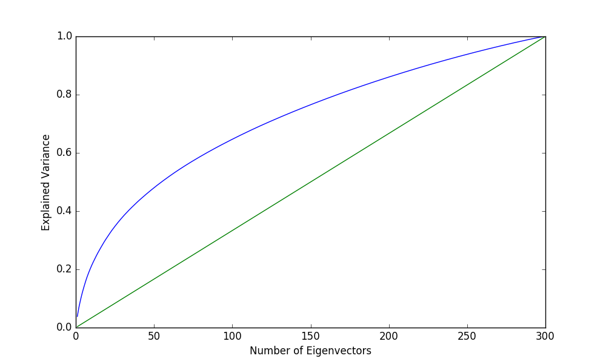  
- Isotropy: 0.57  

## Javanese  
- Vocabulary Size = 10,019  
- Embedding Length = 100  
#### Embedding L2 Norms  
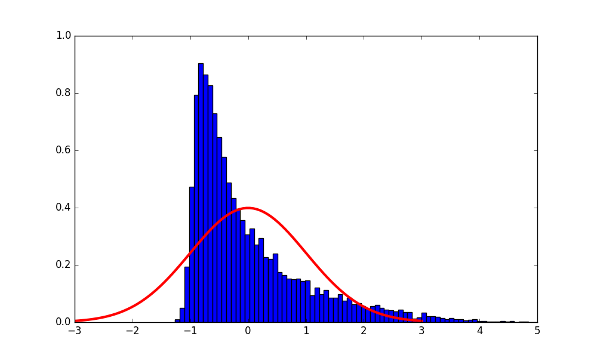  
- Anderson-Darling Test Statistic: 504.45  
- Anderson-Darling Critical Value (1%): 1.09  
- Anderson-Darling Test Result: Reject  

- Kolmogorov-Smirnov p-value: 0.0  
- Kolmogorov-Smirnov Test Result: Reject  

- Shapiro-Wilk p-value: 0.0  
- Shapiro-Wilk Test Result: Reject  

#### Embedding Isotropy  
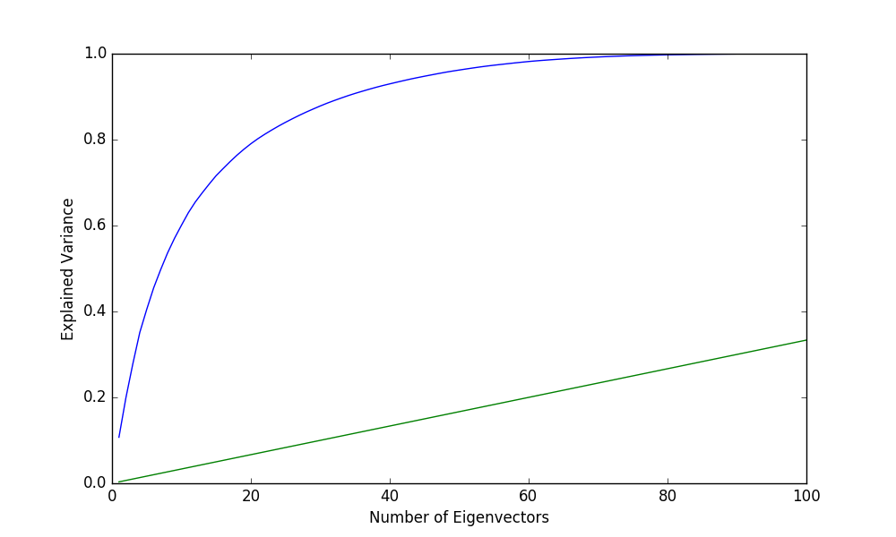  
- Isotropy: 0.25  

## Korean  
- Vocabulary Size = 30,185  
- Embedding Length = 200  
#### Embedding L2 Norms  
  
- Anderson-Darling Test Statistic: 1028.4  
- Anderson-Darling Critical Value (1%): 1.09  
- Anderson-Darling Test Result: Reject  

- Kolmogorov-Smirnov p-value: 0.0  
- Kolmogorov-Smirnov Test Result: Reject  

- Shapiro-Wilk p-value: 0.0  
- Shapiro-Wilk Test Result: Reject  

#### Embedding Isotropy  
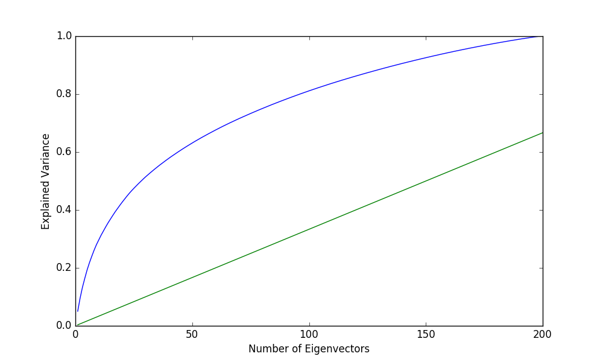  
- Isotropy: 0.49  

## Malay  
- Vocabulary Size = 10,010  
- Embedding Length = 100  
#### Embedding L2 Norms  
  
- Anderson-Darling Test Statistic: 114.92  
- Anderson-Darling Critical Value (1%): 1.09  
- Anderson-Darling Test Result: Reject  

- Kolmogorov-Smirnov p-value: 0.0  
- Kolmogorov-Smirnov Test Result: Reject  

- Shapiro-Wilk p-value: 0.0  
- Shapiro-Wilk Test Result: Reject  

#### Embedding Isotropy  
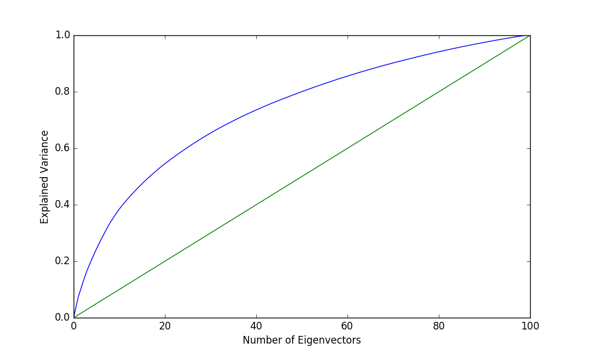  
- Isotropy: 0.52  

## Norwegian  
- Vocabulary Size = 50,209  
- Embedding Length = 300  
#### Embedding L2 Norms  
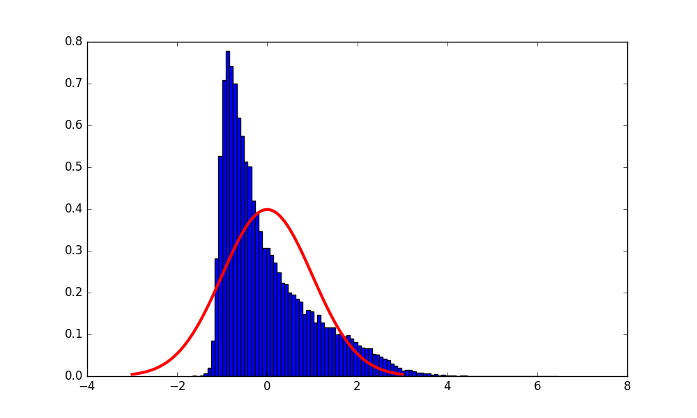  
- Anderson-Darling Test Statistic: 1939.92  
- Anderson-Darling Critical Value (1%): 1.09  
- Anderson-Darling Test Result: Reject  

- Kolmogorov-Smirnov p-value: 0.0  
- Kolmogorov-Smirnov Test Result: Reject  

- Shapiro-Wilk p-value: 0.0  
- Shapiro-Wilk Test Result: Reject  

#### Embedding Isotropy  
  
- Isotropy: 0.36  

## Norwegian Nynorsk  
- Vocabulary Size = 10,036  
- Embedding Length = 100  
#### Embedding L2 Norms  
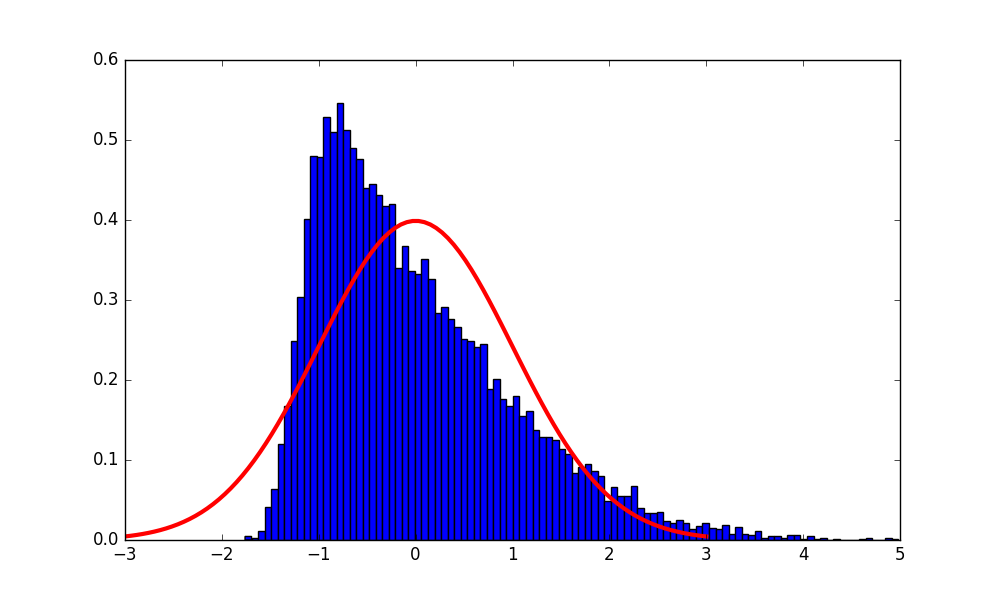  
- Anderson-Darling Test Statistic: 192.1  
- Anderson-Darling Critical Value (1%): 1.09  
- Anderson-Darling Test Result: Reject  

- Kolmogorov-Smirnov p-value: 0.0  
- Kolmogorov-Smirnov Test Result: Reject  

- Shapiro-Wilk p-value: 0.0  
- Shapiro-Wilk Test Result: Reject  

#### Embedding Isotropy  
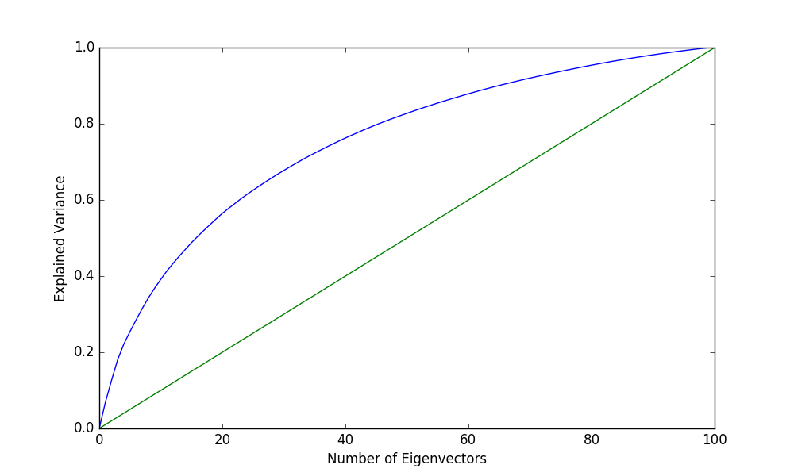  
- Isotropy: 0.49  

## Polish  
- Vocabulary Size = 50,035  
- Embedding Length = 300  
#### Embedding L2 Norms  
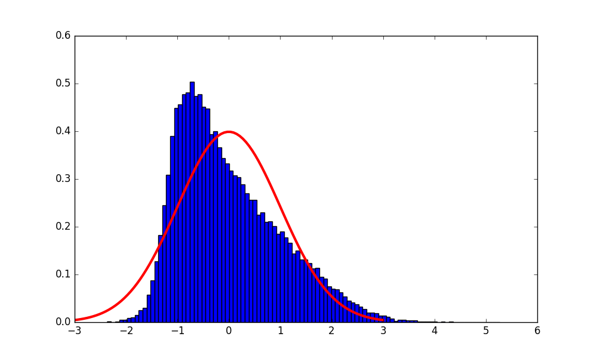  
- Anderson-Darling Test Statistic: 764.0  
- Anderson-Darling Critical Value (1%): 1.09  
- Anderson-Darling Test Result: Reject  

- Kolmogorov-Smirnov p-value: 0.0  
- Kolmogorov-Smirnov Test Result: Reject  

- Shapiro-Wilk p-value: 0.0  
- Shapiro-Wilk Test Result: Reject  

#### Embedding Isotropy  
  
- Isotropy: 0.43  

## Portuguese  
- Vocabulary Size = 50,246  
- Embedding Length = 300  
#### Embedding L2 Norms  
  
- Anderson-Darling Test Statistic: 1195.14  
- Anderson-Darling Critical Value (1%): 1.09  
- Anderson-Darling Test Result: Reject  

- Kolmogorov-Smirnov p-value: 0.0  
- Kolmogorov-Smirnov Test Result: Reject  

- Shapiro-Wilk p-value: 0.0  
- Shapiro-Wilk Test Result: Reject  

#### Embedding Isotropy  
  
- Isotropy: 0.42  

## Russian  
- Vocabulary Size = 50,102  
- Embedding Length = 300  
#### Embedding L2 Norms  
  
- Anderson-Darling Test Statistic: 1167.26  
- Anderson-Darling Critical Value (1%): 1.09  
- Anderson-Darling Test Result: Reject  

- Kolmogorov-Smirnov p-value: 0.0  
- Kolmogorov-Smirnov Test Result: Reject  

- Shapiro-Wilk p-value: 0.0  
- Shapiro-Wilk Test Result: Reject  

#### Embedding Isotropy  
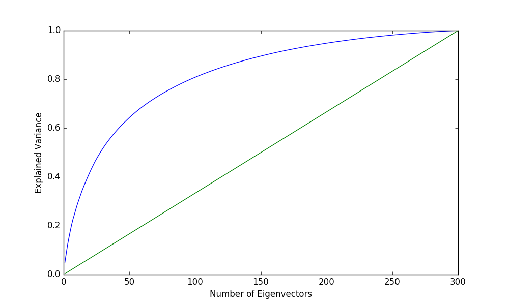  
- Isotropy: 0.36  

## Spanish  
- Vocabulary Size = 50,003  
- Embedding Length = 300  
#### Embedding L2 Norms  
  
- Anderson-Darling Test Statistic: 1194.04  
- Anderson-Darling Critical Value (1%): 1.09  
- Anderson-Darling Test Result: Reject  

- Kolmogorov-Smirnov p-value: 0.0  
- Kolmogorov-Smirnov Test Result: Reject  

- Shapiro-Wilk p-value: 0.0  
- Shapiro-Wilk Test Result: Reject  

#### Embedding Isotropy  
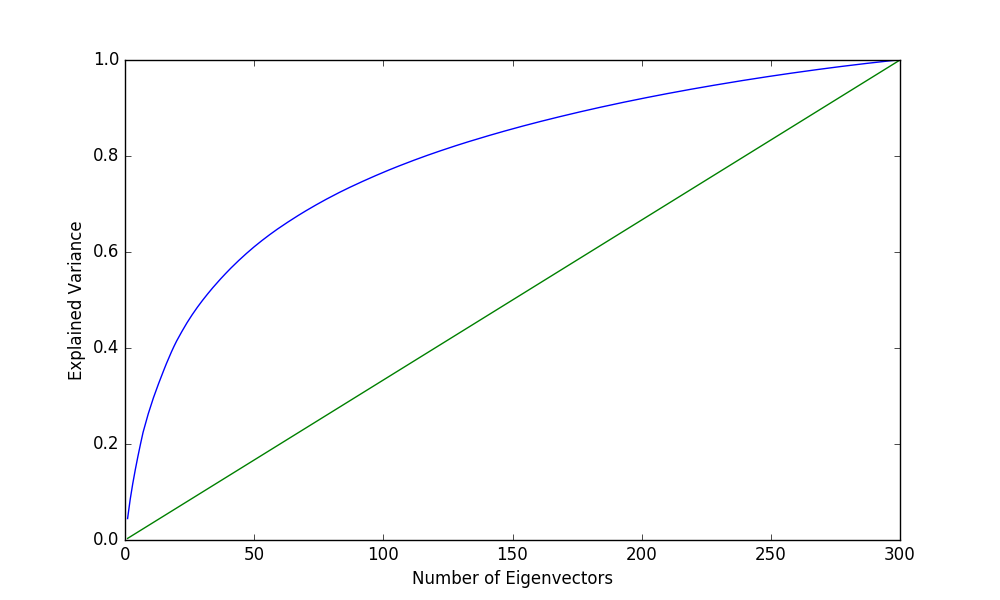  
- Isotropy: 0.41  

## Swahili  
- Vocabulary Size = 10,222  
- Embedding Length = 100  
#### Embedding L2 Norms  
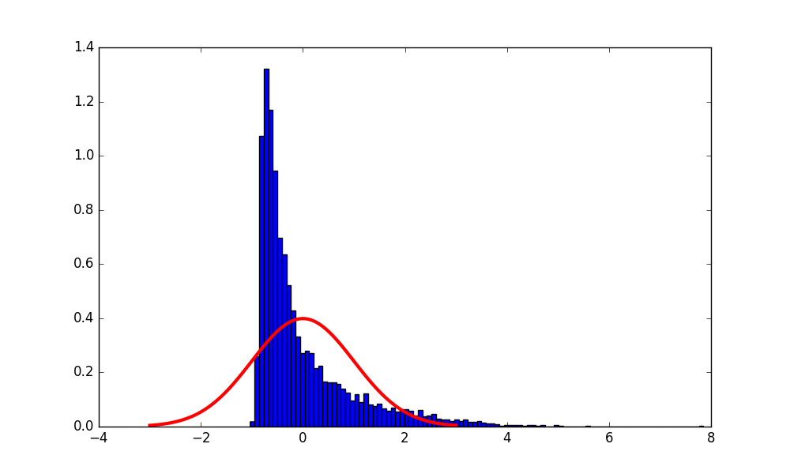  
- Anderson-Darling Test Statistic: 747.29  
- Anderson-Darling Critical Value (1%): 1.09  
- Anderson-Darling Test Result: Reject  

- Kolmogorov-Smirnov p-value: 0.0  
- Kolmogorov-Smirnov Test Result: Reject  

- Shapiro-Wilk p-value: 0.0  
- Shapiro-Wilk Test Result: Reject  

#### Embedding Isotropy  
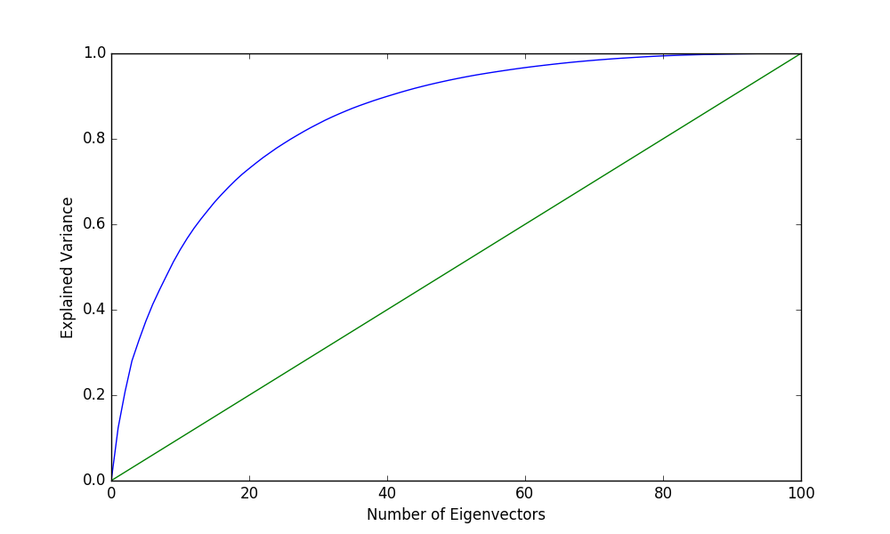  
- Isotropy: 0.29  

## Swedish  
- Vocabulary Size = 50,052  
- Embedding Length = 300  
#### Embedding L2 Norms  
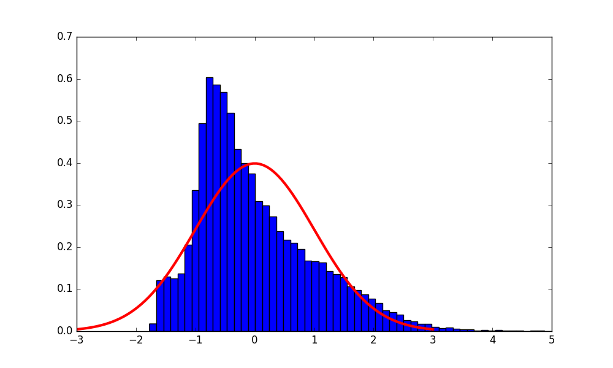  
- Anderson-Darling Test Statistic: 973.77  
- Anderson-Darling Critical Value (1%): 1.09  
- Anderson-Darling Test Result: Reject  

- Kolmogorov-Smirnov p-value: 0.0  
- Kolmogorov-Smirnov Test Result: Reject  

- Shapiro-Wilk p-value: 0.0  
- Shapiro-Wilk Test Result: Reject  

#### Embedding Isotropy  
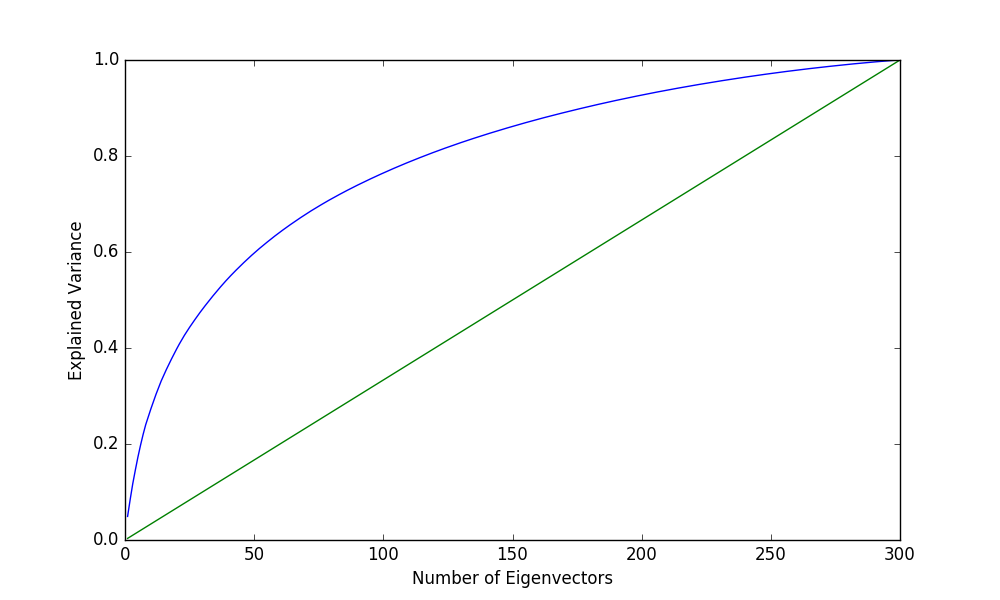  
- Isotropy: 0.41  

## Tagalog  
- Vocabulary Size = 10,068  
- Embedding Length = 100  
#### Embedding L2 Norms  
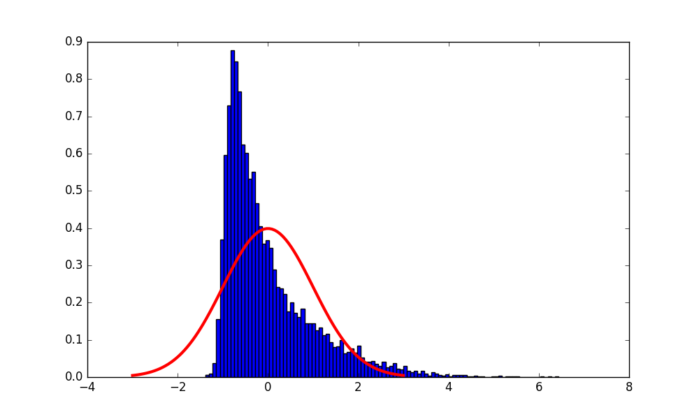  
- Anderson-Darling Test Statistic: 466.58  
- Anderson-Darling Critical Value (1%): 1.09  
- Anderson-Darling Test Result: Reject  

- Kolmogorov-Smirnov p-value: 0.0  
- Kolmogorov-Smirnov Test Result: Reject  

- Shapiro-Wilk p-value: 0.0  
- Shapiro-Wilk Test Result: Reject  

#### Embedding Isotropy  
  
- Isotropy: 0.3  

## Thai  
- Vocabulary Size = 30,225  
- Embedding Length = 300  
#### Embedding L2 Norms  
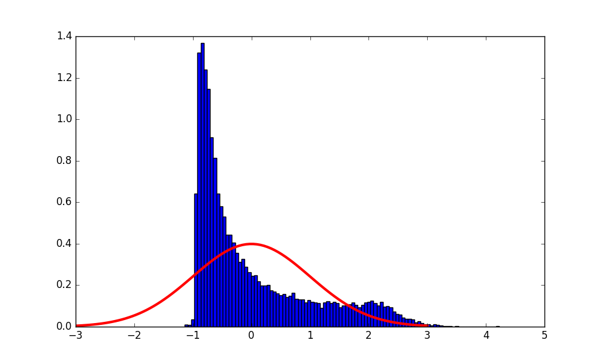  
- Anderson-Darling Test Statistic: 1942.47  
- Anderson-Darling Critical Value (1%): 1.09  
- Anderson-Darling Test Result: Reject  

- Kolmogorov-Smirnov p-value: 0.0  
- Kolmogorov-Smirnov Test Result: Reject  

- Shapiro-Wilk p-value: 0.0  
- Shapiro-Wilk Test Result: Reject  

#### Embedding Isotropy  
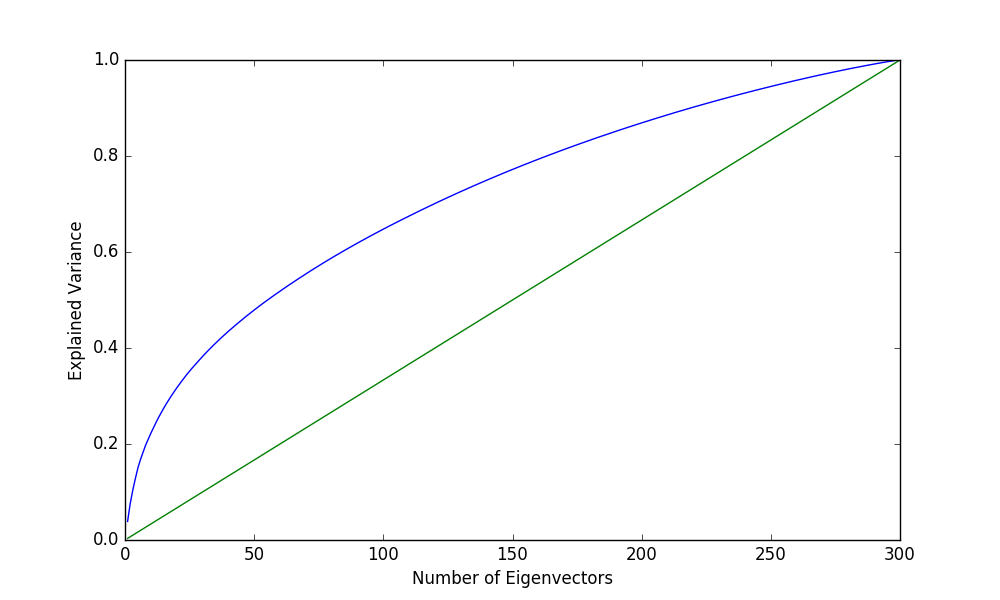  
- Isotropy: 0.56  

## Turkish  
- Vocabulary Size = 30,036  
- Embedding Length = 200  
#### Embedding L2 Norms  
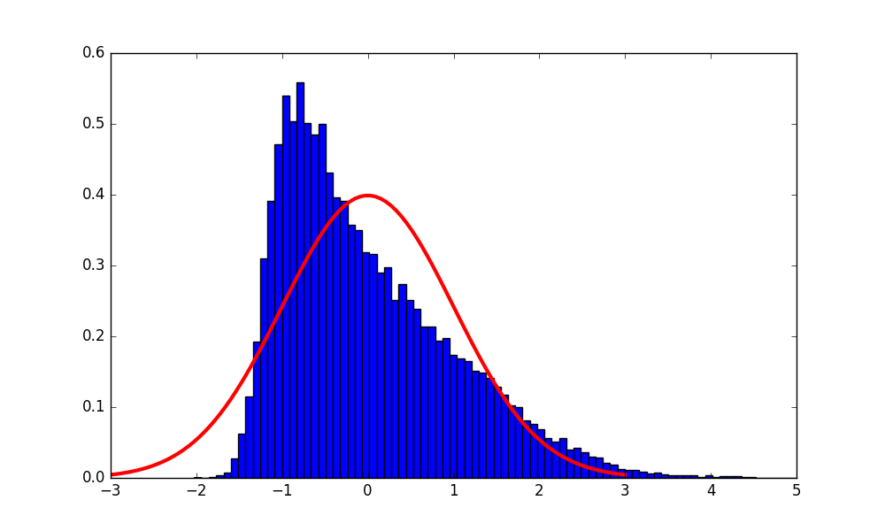  
- Anderson-Darling Test Statistic: 586.44  
- Anderson-Darling Critical Value (1%): 1.09  
- Anderson-Darling Test Result: Reject  

- Kolmogorov-Smirnov p-value: 0.0  
- Kolmogorov-Smirnov Test Result: Reject  

- Shapiro-Wilk p-value: 0.0  
- Shapiro-Wilk Test Result: Reject  

#### Embedding Isotropy  
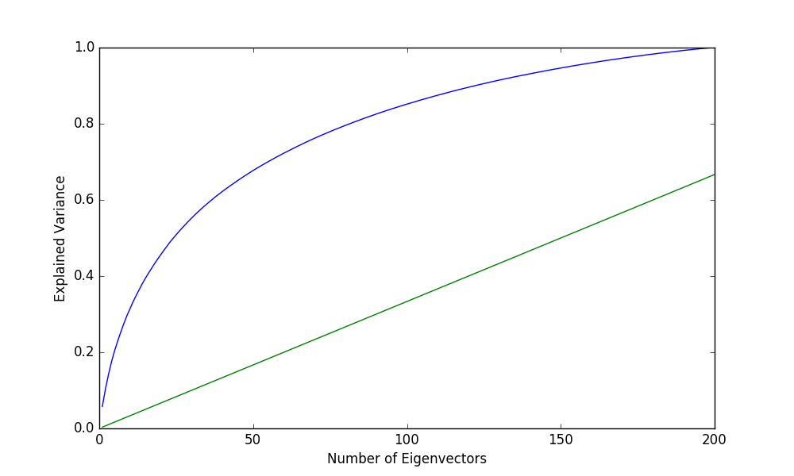  
- Isotropy: 0.44  

## Vietnamese  
- Vocabulary Size = 10,087  
- Embedding Length = 100  
#### Embedding L2 Norms  
  
- Anderson-Darling Test Statistic: 344.28  
- Anderson-Darling Critical Value (1%): 1.09  
- Anderson-Darling Test Result: Reject  

- Kolmogorov-Smirnov p-value: 0.0  
- Kolmogorov-Smirnov Test Result: Reject  

- Shapiro-Wilk p-value: 0.0  
- Shapiro-Wilk Test Result: Reject  

#### Embedding Isotropy  
  
- Isotropy: 0.49  

