# Polyglot EDA  
## af  
- Vocabulary Size = 49,004  
- Embedding Length = 64  
#### Embedding L2 Norms  
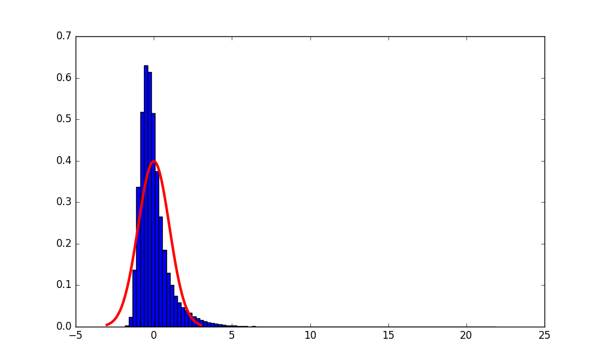  
- Anderson-Darling Test Statistic: 1887.16  
- Anderson-Darling Critical Value (1%): 1.09  
- Anderson-Darling Test Result: Reject  

- Kolmogorov-Smirnov p-value: 0.0  
- Kolmogorov-Smirnov Test Result: Reject  

- Shapiro-Wilk p-value: 0.0  
- Shapiro-Wilk Test Result: Reject  

#### Embedding Isotropy  
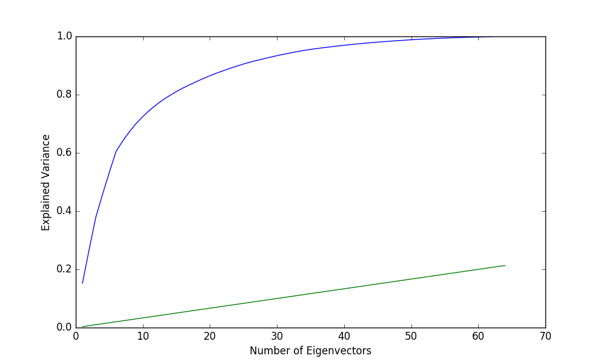  
- Isotropy: 0.26  

## als  
- Vocabulary Size = 52,004  
- Embedding Length = 64  
#### Embedding L2 Norms  
  
- Anderson-Darling Test Statistic: 2182.06  
- Anderson-Darling Critical Value (1%): 1.09  
- Anderson-Darling Test Result: Reject  

- Kolmogorov-Smirnov p-value: 0.0  
- Kolmogorov-Smirnov Test Result: Reject  

- Shapiro-Wilk p-value: 0.0  
- Shapiro-Wilk Test Result: Reject  

#### Embedding Isotropy  
  
- Isotropy: 0.21  

## am  
- Vocabulary Size = 10,004  
- Embedding Length = 64  
#### Embedding L2 Norms  
  
- Anderson-Darling Test Statistic: 650.54  
- Anderson-Darling Critical Value (1%): 1.09  
- Anderson-Darling Test Result: Reject  

- Kolmogorov-Smirnov p-value: 0.0  
- Kolmogorov-Smirnov Test Result: Reject  

- Shapiro-Wilk p-value: 0.0  
- Shapiro-Wilk Test Result: Reject  

#### Embedding Isotropy  
  
- Isotropy: 0.16  

## an  
- Vocabulary Size = 34,004  
- Embedding Length = 64  
#### Embedding L2 Norms  
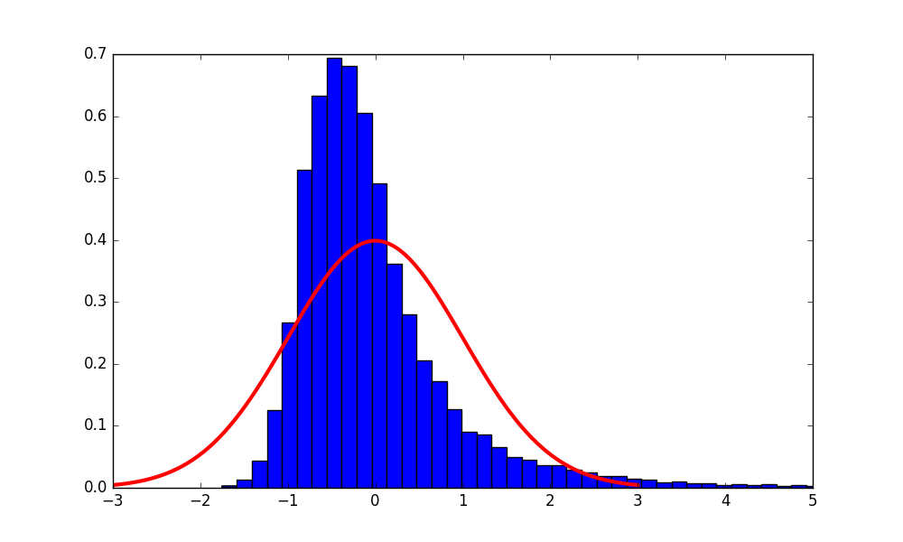  
- Anderson-Darling Test Statistic: 1632.99  
- Anderson-Darling Critical Value (1%): 1.09  
- Anderson-Darling Test Result: Reject  

- Kolmogorov-Smirnov p-value: 0.0  
- Kolmogorov-Smirnov Test Result: Reject  

- Shapiro-Wilk p-value: 0.0  
- Shapiro-Wilk Test Result: Reject  

#### Embedding Isotropy  
  
- Isotropy: 0.23  

## ar  
- Vocabulary Size = 100,004  
- Embedding Length = 64  
#### Embedding L2 Norms  
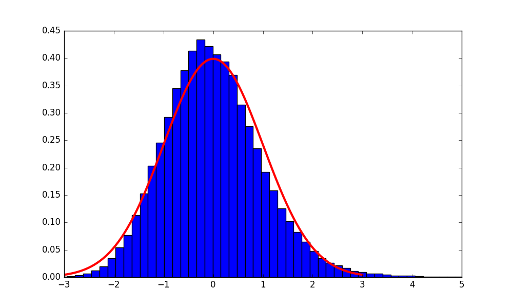  
- Anderson-Darling Test Statistic: 235.4  
- Anderson-Darling Critical Value (1%): 1.09  
- Anderson-Darling Test Result: Reject  

- Kolmogorov-Smirnov p-value: 0.0  
- Kolmogorov-Smirnov Test Result: Reject  

- Shapiro-Wilk p-value: 0.0  
- Shapiro-Wilk Test Result: Reject  

#### Embedding Isotropy  
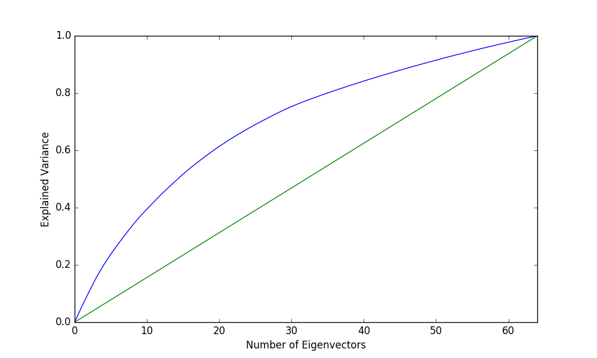  
- Isotropy: 0.6  

## arz  
- Vocabulary Size = 25,004  
- Embedding Length = 64  
#### Embedding L2 Norms  
  
- Anderson-Darling Test Statistic: 1393.88  
- Anderson-Darling Critical Value (1%): 1.09  
- Anderson-Darling Test Result: Reject  

- Kolmogorov-Smirnov p-value: 0.0  
- Kolmogorov-Smirnov Test Result: Reject  

- Shapiro-Wilk p-value: 0.0  
- Shapiro-Wilk Test Result: Reject  

#### Embedding Isotropy  
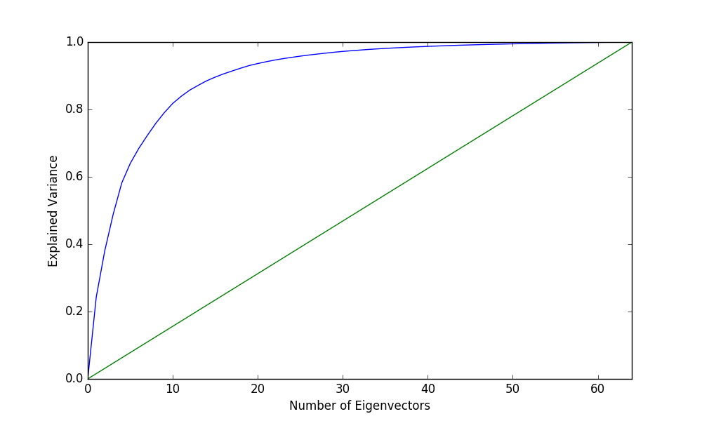  
- Isotropy: 0.18  

## as  
- Vocabulary Size = 22,004  
- Embedding Length = 64  
#### Embedding L2 Norms  
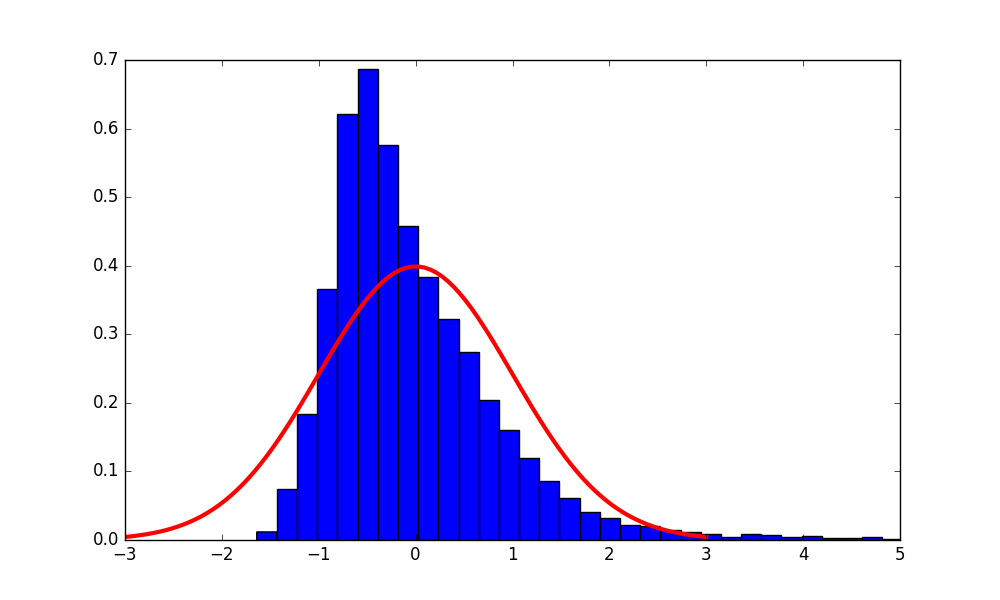  
- Anderson-Darling Test Statistic: 767.72  
- Anderson-Darling Critical Value (1%): 1.09  
- Anderson-Darling Test Result: Reject  

- Kolmogorov-Smirnov p-value: 0.0  
- Kolmogorov-Smirnov Test Result: Reject  

- Shapiro-Wilk p-value: 0.0  
- Shapiro-Wilk Test Result: Reject  

#### Embedding Isotropy  
  
- Isotropy: 0.15  

## ast  
- Vocabulary Size = 37,004  
- Embedding Length = 64  
#### Embedding L2 Norms  
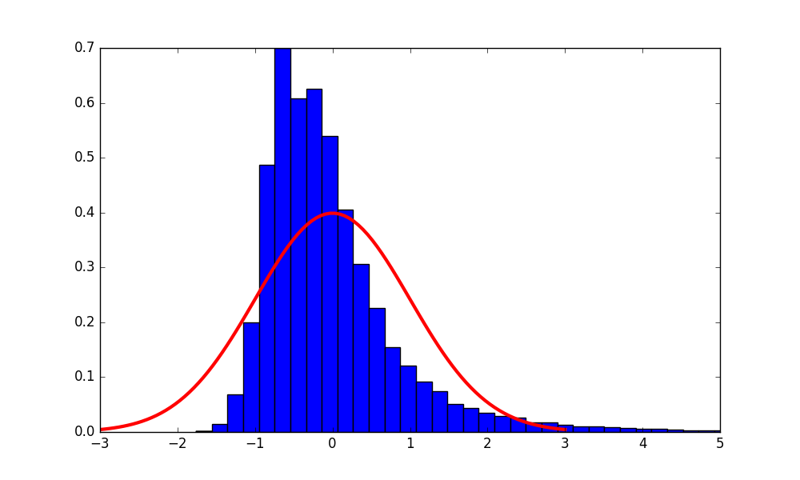  
- Anderson-Darling Test Statistic: 1675.76  
- Anderson-Darling Critical Value (1%): 1.09  
- Anderson-Darling Test Result: Reject  

- Kolmogorov-Smirnov p-value: 0.0  
- Kolmogorov-Smirnov Test Result: Reject  

- Shapiro-Wilk p-value: 0.0  
- Shapiro-Wilk Test Result: Reject  

#### Embedding Isotropy  
  
- Isotropy: 0.21  

## az  
- Vocabulary Size = 100,004  
- Embedding Length = 64  
#### Embedding L2 Norms  
  
- Anderson-Darling Test Statistic: 2990.73  
- Anderson-Darling Critical Value (1%): 1.09  
- Anderson-Darling Test Result: Reject  

- Kolmogorov-Smirnov p-value: 0.0  
- Kolmogorov-Smirnov Test Result: Reject  

- Shapiro-Wilk p-value: 0.0  
- Shapiro-Wilk Test Result: Reject  

#### Embedding Isotropy  
  
- Isotropy: 0.29  

## ba  
- Vocabulary Size = 14,004  
- Embedding Length = 64  
#### Embedding L2 Norms  
  
- Anderson-Darling Test Statistic: 951.33  
- Anderson-Darling Critical Value (1%): 1.09  
- Anderson-Darling Test Result: Reject  

- Kolmogorov-Smirnov p-value: 0.0  
- Kolmogorov-Smirnov Test Result: Reject  

- Shapiro-Wilk p-value: 0.0  
- Shapiro-Wilk Test Result: Reject  

#### Embedding Isotropy  
  
- Isotropy: 0.2  

## bar  
- Vocabulary Size = 22,004  
- Embedding Length = 64  
#### Embedding L2 Norms  
  
- Anderson-Darling Test Statistic: 1083.2  
- Anderson-Darling Critical Value (1%): 1.09  
- Anderson-Darling Test Result: Reject  

- Kolmogorov-Smirnov p-value: 0.0  
- Kolmogorov-Smirnov Test Result: Reject  

- Shapiro-Wilk p-value: 0.0  
- Shapiro-Wilk Test Result: Reject  

#### Embedding Isotropy  
  
- Isotropy: 0.16  

## be  
- Vocabulary Size = 93,004  
- Embedding Length = 64  
#### Embedding L2 Norms  
  
- Anderson-Darling Test Statistic: 3229.63  
- Anderson-Darling Critical Value (1%): 1.09  
- Anderson-Darling Test Result: Reject  

- Kolmogorov-Smirnov p-value: 0.0  
- Kolmogorov-Smirnov Test Result: Reject  

- Shapiro-Wilk p-value: 0.0  
- Shapiro-Wilk Test Result: Reject  

#### Embedding Isotropy  
  
- Isotropy: 0.28  

## bg  
- Vocabulary Size = 100,004  
- Embedding Length = 64  
#### Embedding L2 Norms  
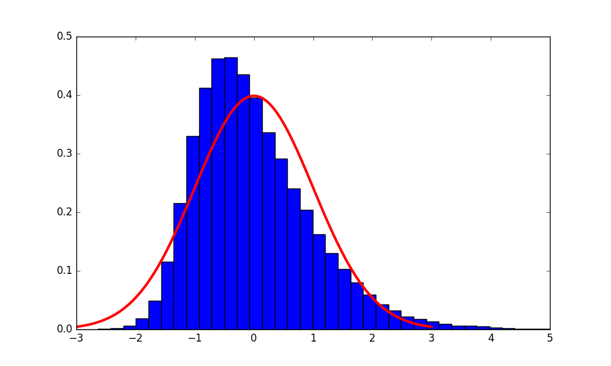  
- Anderson-Darling Test Statistic: 1081.43  
- Anderson-Darling Critical Value (1%): 1.09  
- Anderson-Darling Test Result: Reject  

- Kolmogorov-Smirnov p-value: 0.0  
- Kolmogorov-Smirnov Test Result: Reject  

- Shapiro-Wilk p-value: 0.0  
- Shapiro-Wilk Test Result: Reject  

#### Embedding Isotropy  
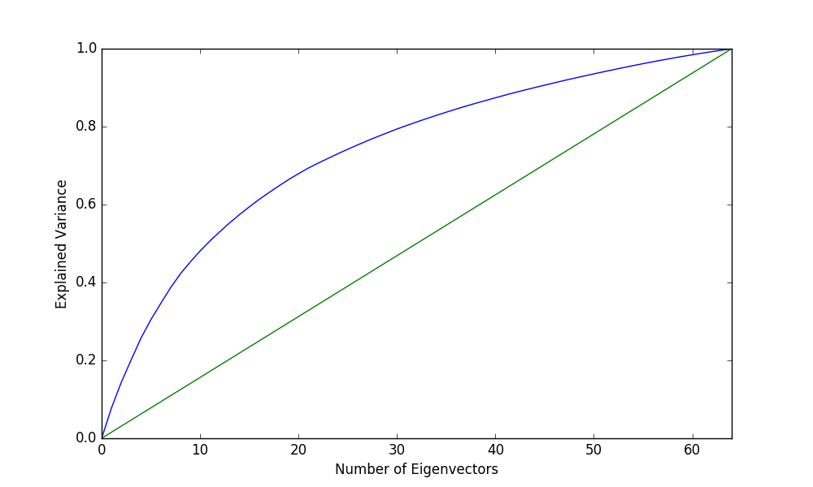  
- Isotropy: 0.51  

## bn  
- Vocabulary Size = 55,004  
- Embedding Length = 64  
#### Embedding L2 Norms  
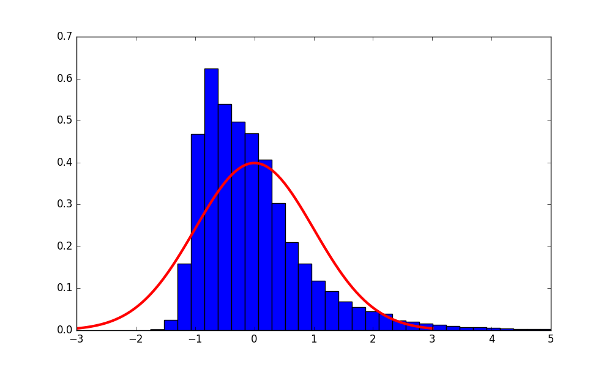  
- Anderson-Darling Test Statistic: 1815.71  
- Anderson-Darling Critical Value (1%): 1.09  
- Anderson-Darling Test Result: Reject  

- Kolmogorov-Smirnov p-value: 0.0  
- Kolmogorov-Smirnov Test Result: Reject  

- Shapiro-Wilk p-value: 0.0  
- Shapiro-Wilk Test Result: Reject  

#### Embedding Isotropy  
  
- Isotropy: 0.23  

## bo  
- Vocabulary Size = 4,004  
- Embedding Length = 64  
#### Embedding L2 Norms  
  
- Anderson-Darling Test Statistic: 253.36  
- Anderson-Darling Critical Value (1%): 1.09  
- Anderson-Darling Test Result: Reject  

- Kolmogorov-Smirnov p-value: 0.0  
- Kolmogorov-Smirnov Test Result: Reject  

- Shapiro-Wilk p-value: 0.0  
- Shapiro-Wilk Test Result: Reject  

#### Embedding Isotropy  
  
- Isotropy: 0.21  

## bpy  
- Vocabulary Size = 9,004  
- Embedding Length = 64  
#### Embedding L2 Norms  
  
- Anderson-Darling Test Statistic: 1083.51  
- Anderson-Darling Critical Value (1%): 1.09  
- Anderson-Darling Test Result: Reject  

- Kolmogorov-Smirnov p-value: 0.0  
- Kolmogorov-Smirnov Test Result: Reject  

- Shapiro-Wilk p-value: 0.0  
- Shapiro-Wilk Test Result: Reject  

#### Embedding Isotropy  
  
- Isotropy: 0.22  

## br  
- Vocabulary Size = 39,004  
- Embedding Length = 64  
#### Embedding L2 Norms  
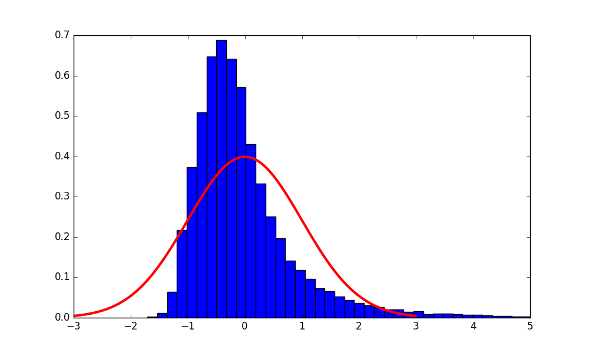  
- Anderson-Darling Test Statistic: 1769.77  
- Anderson-Darling Critical Value (1%): 1.09  
- Anderson-Darling Test Result: Reject  

- Kolmogorov-Smirnov p-value: 0.0  
- Kolmogorov-Smirnov Test Result: Reject  

- Shapiro-Wilk p-value: 0.0  
- Shapiro-Wilk Test Result: Reject  

#### Embedding Isotropy  
  
- Isotropy: 0.26  

## bs  
- Vocabulary Size = 85,004  
- Embedding Length = 64  
#### Embedding L2 Norms  
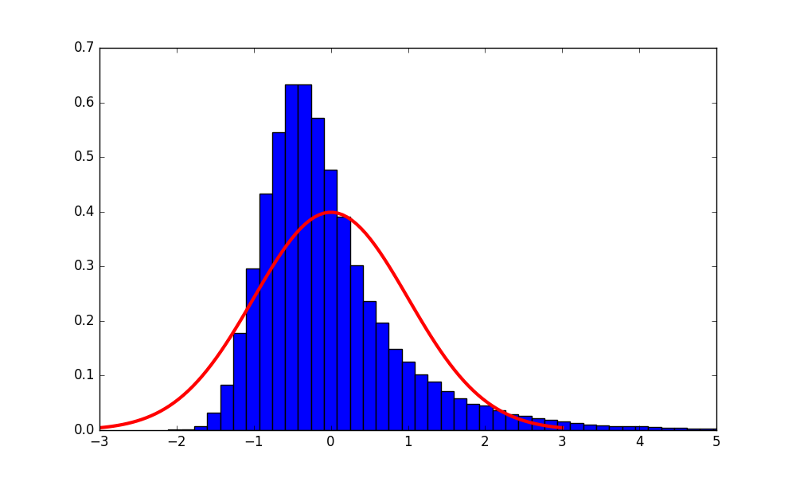  
- Anderson-Darling Test Statistic: 2913.9  
- Anderson-Darling Critical Value (1%): 1.09  
- Anderson-Darling Test Result: Reject  

- Kolmogorov-Smirnov p-value: 0.0  
- Kolmogorov-Smirnov Test Result: Reject  

- Shapiro-Wilk p-value: 0.0  
- Shapiro-Wilk Test Result: Reject  

#### Embedding Isotropy  
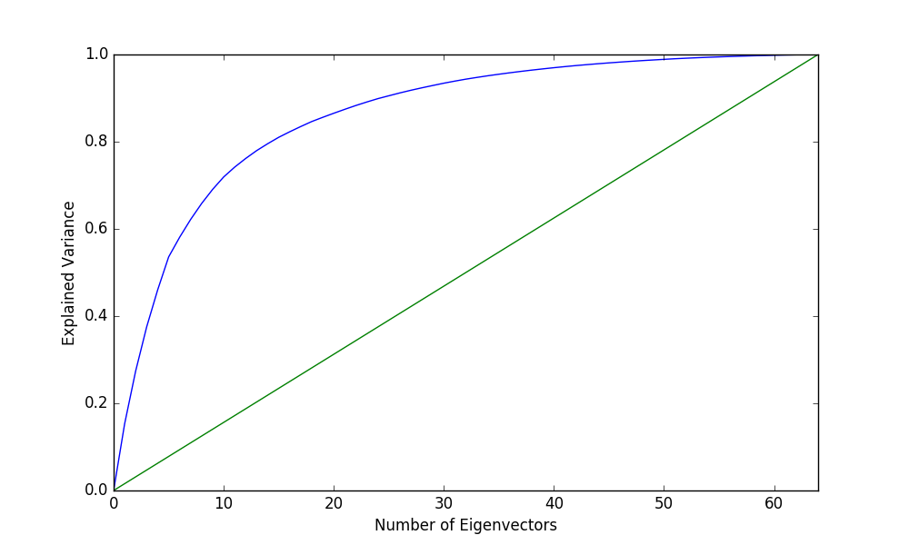  
- Isotropy: 0.26  

## ca  
- Vocabulary Size = 107,004  
- Embedding Length = 64  
#### Embedding L2 Norms  
  
- Anderson-Darling Test Statistic: 2877.16  
- Anderson-Darling Critical Value (1%): 1.09  
- Anderson-Darling Test Result: Reject  

- Kolmogorov-Smirnov p-value: 0.0  
- Kolmogorov-Smirnov Test Result: Reject  

- Shapiro-Wilk p-value: 0.0  
- Shapiro-Wilk Test Result: Reject  

#### Embedding Isotropy  
  
- Isotropy: 0.44  

## ce  
- Vocabulary Size = 13,004  
- Embedding Length = 64  
#### Embedding L2 Norms  
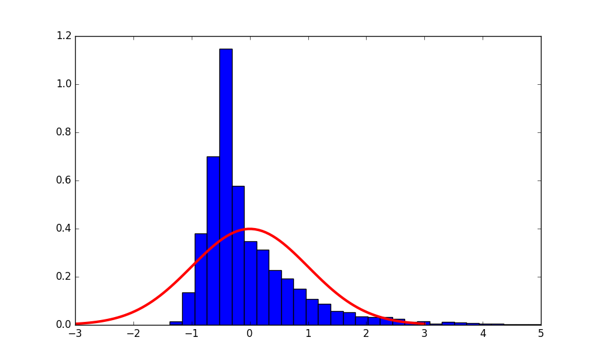  
- Anderson-Darling Test Statistic: 838.51  
- Anderson-Darling Critical Value (1%): 1.09  
- Anderson-Darling Test Result: Reject  

- Kolmogorov-Smirnov p-value: 0.0  
- Kolmogorov-Smirnov Test Result: Reject  

- Shapiro-Wilk p-value: 0.0  
- Shapiro-Wilk Test Result: Reject  

#### Embedding Isotropy  
  
- Isotropy: 0.18  

## ceb  
- Vocabulary Size = 51,004  
- Embedding Length = 64  
#### Embedding L2 Norms  
  
- Anderson-Darling Test Statistic: 5510.82  
- Anderson-Darling Critical Value (1%): 1.09  
- Anderson-Darling Test Result: Reject  

- Kolmogorov-Smirnov p-value: 0.0  
- Kolmogorov-Smirnov Test Result: Reject  

- Shapiro-Wilk p-value: 0.0  
- Shapiro-Wilk Test Result: Reject  

#### Embedding Isotropy  
  
- Isotropy: 0.13  

## cs  
- Vocabulary Size = 100,004  
- Embedding Length = 64  
#### Embedding L2 Norms  
  
- Anderson-Darling Test Statistic: 1632.84  
- Anderson-Darling Critical Value (1%): 1.09  
- Anderson-Darling Test Result: Reject  

- Kolmogorov-Smirnov p-value: 0.0  
- Kolmogorov-Smirnov Test Result: Reject  

- Shapiro-Wilk p-value: 0.0  
- Shapiro-Wilk Test Result: Reject  

#### Embedding Isotropy  
  
- Isotropy: 0.44  

## cv  
- Vocabulary Size = 17,004  
- Embedding Length = 64  
#### Embedding L2 Norms  
  
- Anderson-Darling Test Statistic: 882.63  
- Anderson-Darling Critical Value (1%): 1.09  
- Anderson-Darling Test Result: Reject  

- Kolmogorov-Smirnov p-value: 0.0  
- Kolmogorov-Smirnov Test Result: Reject  

- Shapiro-Wilk p-value: 0.0  
- Shapiro-Wilk Test Result: Reject  

#### Embedding Isotropy  
  
- Isotropy: 0.18  

## cy  
- Vocabulary Size = 38,004  
- Embedding Length = 64  
#### Embedding L2 Norms  
  
- Anderson-Darling Test Statistic: 1493.52  
- Anderson-Darling Critical Value (1%): 1.09  
- Anderson-Darling Test Result: Reject  

- Kolmogorov-Smirnov p-value: 0.0  
- Kolmogorov-Smirnov Test Result: Reject  

- Shapiro-Wilk p-value: 0.0  
- Shapiro-Wilk Test Result: Reject  

#### Embedding Isotropy  
  
- Isotropy: 0.26  

## da  
- Vocabulary Size = 100,004  
- Embedding Length = 64  
#### Embedding L2 Norms  
  
- Anderson-Darling Test Statistic: 1991.65  
- Anderson-Darling Critical Value (1%): 1.09  
- Anderson-Darling Test Result: Reject  

- Kolmogorov-Smirnov p-value: 0.0  
- Kolmogorov-Smirnov Test Result: Reject  

- Shapiro-Wilk p-value: 0.0  
- Shapiro-Wilk Test Result: Reject  

#### Embedding Isotropy  
  
- Isotropy: 0.45  

## de  
- Vocabulary Size = 100,004  
- Embedding Length = 64  
#### Embedding L2 Norms  
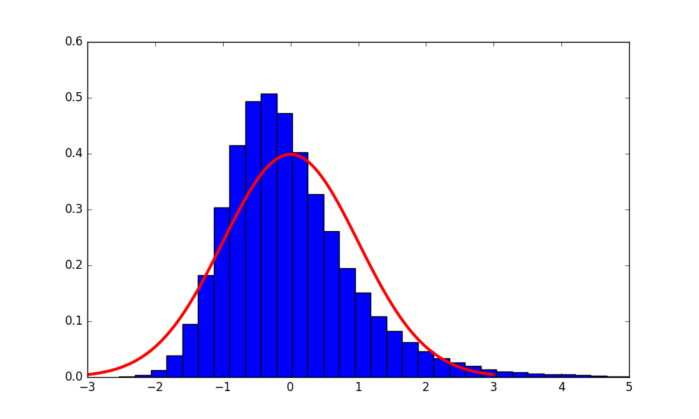  
- Anderson-Darling Test Statistic: 1487.48  
- Anderson-Darling Critical Value (1%): 1.09  
- Anderson-Darling Test Result: Reject  

- Kolmogorov-Smirnov p-value: 0.0  
- Kolmogorov-Smirnov Test Result: Reject  

- Shapiro-Wilk p-value: 0.0  
- Shapiro-Wilk Test Result: Reject  

#### Embedding Isotropy  
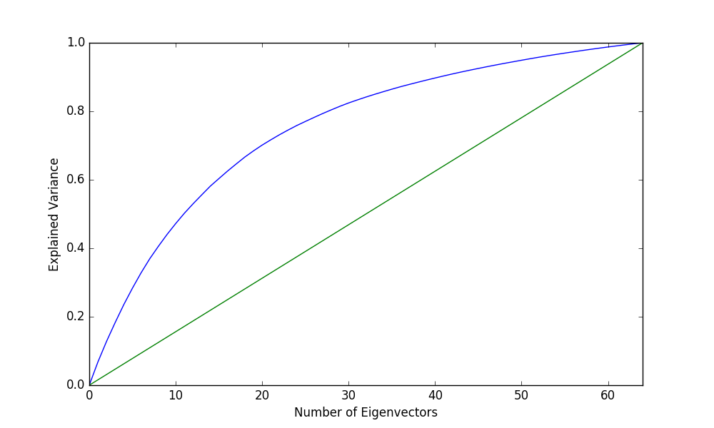  
- Isotropy: 0.49  

## diq  
- Vocabulary Size = 6,004  
- Embedding Length = 64  
#### Embedding L2 Norms  
  
- Anderson-Darling Test Statistic: 316.4  
- Anderson-Darling Critical Value (1%): 1.09  
- Anderson-Darling Test Result: Reject  

- Kolmogorov-Smirnov p-value: 0.0  
- Kolmogorov-Smirnov Test Result: Reject  

- Shapiro-Wilk p-value: 0.0  
- Shapiro-Wilk Test Result: Reject  

#### Embedding Isotropy  
  
- Isotropy: 0.16  

## dv  
- Vocabulary Size = 12,004  
- Embedding Length = 64  
#### Embedding L2 Norms  
  
- Anderson-Darling Test Statistic: 786.16  
- Anderson-Darling Critical Value (1%): 1.09  
- Anderson-Darling Test Result: Reject  

- Kolmogorov-Smirnov p-value: 0.0  
- Kolmogorov-Smirnov Test Result: Reject  

- Shapiro-Wilk p-value: 0.0  
- Shapiro-Wilk Test Result: Reject  

#### Embedding Isotropy  
  
- Isotropy: 0.16  

## el  
- Vocabulary Size = 100,004  
- Embedding Length = 64  
#### Embedding L2 Norms  
  
- Anderson-Darling Test Statistic: 3162.33  
- Anderson-Darling Critical Value (1%): 1.09  
- Anderson-Darling Test Result: Reject  

- Kolmogorov-Smirnov p-value: 0.0  
- Kolmogorov-Smirnov Test Result: Reject  

- Shapiro-Wilk p-value: 0.0  
- Shapiro-Wilk Test Result: Reject  

#### Embedding Isotropy  
  
- Isotropy: 0.35  

## en  
- Vocabulary Size = 100,004  
- Embedding Length = 64  
#### Embedding L2 Norms  
  
- Anderson-Darling Test Statistic: 1271.35  
- Anderson-Darling Critical Value (1%): 1.09  
- Anderson-Darling Test Result: Reject  

- Kolmogorov-Smirnov p-value: 0.0  
- Kolmogorov-Smirnov Test Result: Reject  

- Shapiro-Wilk p-value: 0.0  
- Shapiro-Wilk Test Result: Reject  

#### Embedding Isotropy  
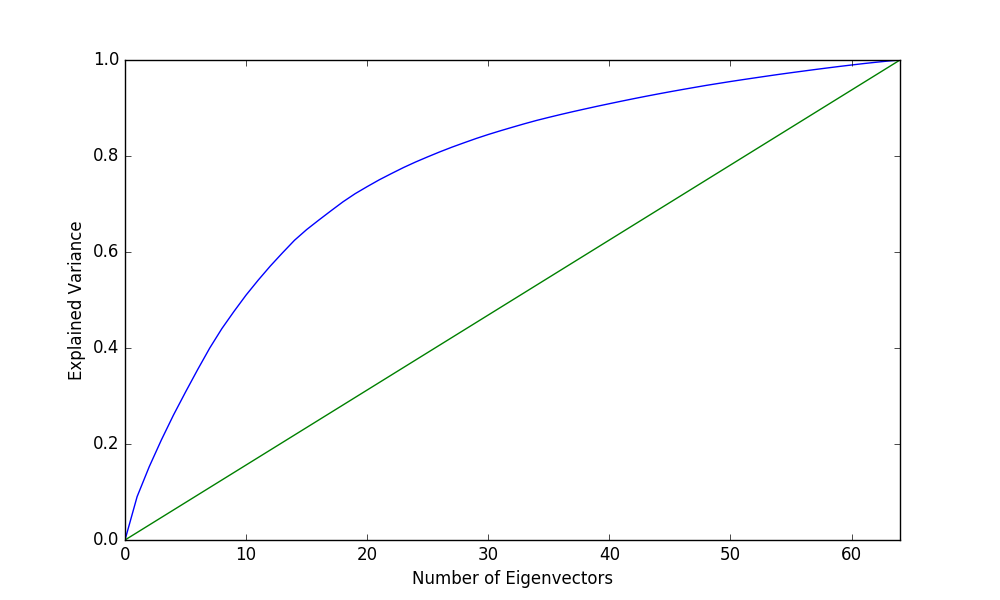  
- Isotropy: 0.45  

## eo  
- Vocabulary Size = 100,004  
- Embedding Length = 64  
#### Embedding L2 Norms  
  
- Anderson-Darling Test Statistic: 3374.0  
- Anderson-Darling Critical Value (1%): 1.09  
- Anderson-Darling Test Result: Reject  

- Kolmogorov-Smirnov p-value: 0.0  
- Kolmogorov-Smirnov Test Result: Reject  

- Shapiro-Wilk p-value: 0.0  
- Shapiro-Wilk Test Result: Reject  

#### Embedding Isotropy  
  
- Isotropy: 0.36  

## es  
- Vocabulary Size = 100,004  
- Embedding Length = 64  
#### Embedding L2 Norms  
  
- Anderson-Darling Test Statistic: 1678.22  
- Anderson-Darling Critical Value (1%): 1.09  
- Anderson-Darling Test Result: Reject  

- Kolmogorov-Smirnov p-value: 0.0  
- Kolmogorov-Smirnov Test Result: Reject  

- Shapiro-Wilk p-value: 0.0  
- Shapiro-Wilk Test Result: Reject  

#### Embedding Isotropy  
  
- Isotropy: 0.46  

## et  
- Vocabulary Size = 100,004  
- Embedding Length = 64  
#### Embedding L2 Norms  
  
- Anderson-Darling Test Statistic: 3157.07  
- Anderson-Darling Critical Value (1%): 1.09  
- Anderson-Darling Test Result: Reject  

- Kolmogorov-Smirnov p-value: 0.0  
- Kolmogorov-Smirnov Test Result: Reject  

- Shapiro-Wilk p-value: 0.0  
- Shapiro-Wilk Test Result: Reject  

#### Embedding Isotropy  
  
- Isotropy: 0.35  

## eu  
- Vocabulary Size = 100,004  
- Embedding Length = 64  
#### Embedding L2 Norms  
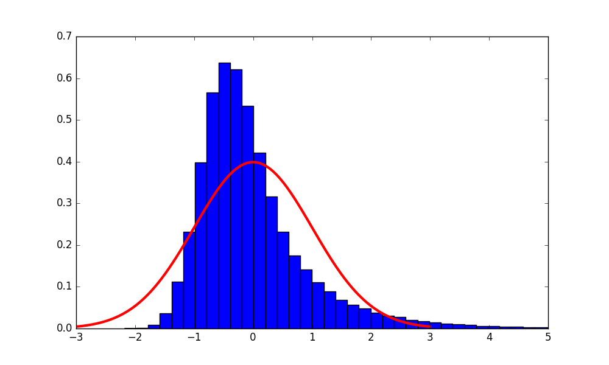  
- Anderson-Darling Test Statistic: 3612.74  
- Anderson-Darling Critical Value (1%): 1.09  
- Anderson-Darling Test Result: Reject  

- Kolmogorov-Smirnov p-value: 0.0  
- Kolmogorov-Smirnov Test Result: Reject  

- Shapiro-Wilk p-value: 0.0  
- Shapiro-Wilk Test Result: Reject  

#### Embedding Isotropy  
  
- Isotropy: 0.29  

## fa  
- Vocabulary Size = 100,004  
- Embedding Length = 64  
#### Embedding L2 Norms  
  
- Anderson-Darling Test Statistic: 1677.63  
- Anderson-Darling Critical Value (1%): 1.09  
- Anderson-Darling Test Result: Reject  

- Kolmogorov-Smirnov p-value: 0.0  
- Kolmogorov-Smirnov Test Result: Reject  

- Shapiro-Wilk p-value: 0.0  
- Shapiro-Wilk Test Result: Reject  

#### Embedding Isotropy  
  
- Isotropy: 0.38  

## fi  
- Vocabulary Size = 139,004  
- Embedding Length = 64  
#### Embedding L2 Norms  
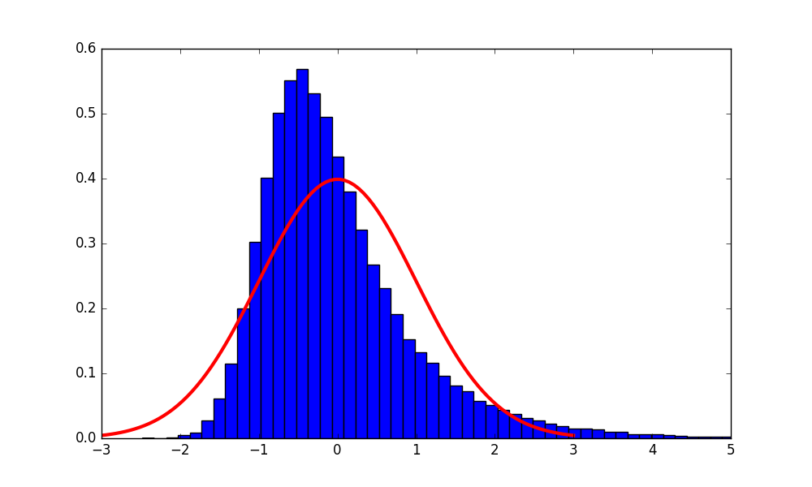  
- Anderson-Darling Test Statistic: 3301.89  
- Anderson-Darling Critical Value (1%): 1.09  
- Anderson-Darling Test Result: Reject  

- Kolmogorov-Smirnov p-value: 0.0  
- Kolmogorov-Smirnov Test Result: Reject  

- Shapiro-Wilk p-value: 0.0  
- Shapiro-Wilk Test Result: Reject  

#### Embedding Isotropy  
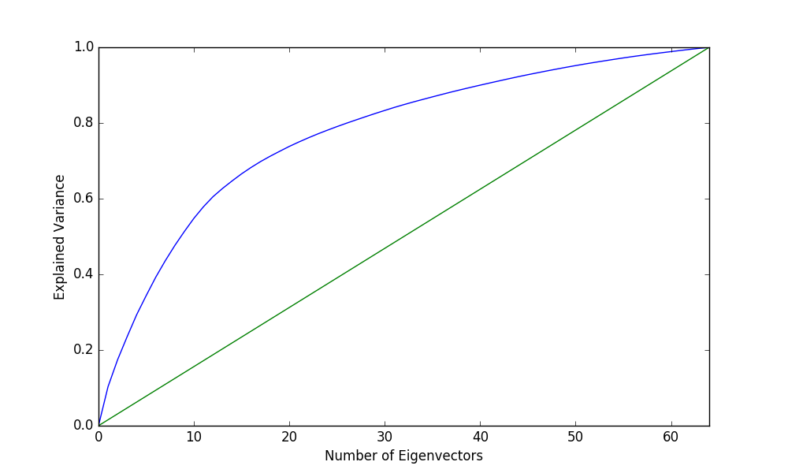  
- Isotropy: 0.44  

## fo  
- Vocabulary Size = 12,004  
- Embedding Length = 64  
#### Embedding L2 Norms  
  
- Anderson-Darling Test Statistic: 599.74  
- Anderson-Darling Critical Value (1%): 1.09  
- Anderson-Darling Test Result: Reject  

- Kolmogorov-Smirnov p-value: 0.0  
- Kolmogorov-Smirnov Test Result: Reject  

- Shapiro-Wilk p-value: 0.0  
- Shapiro-Wilk Test Result: Reject  

#### Embedding Isotropy  
  
- Isotropy: 0.17  

## fr  
- Vocabulary Size = 100,004  
- Embedding Length = 64  
#### Embedding L2 Norms  
  
- Anderson-Darling Test Statistic: 1712.25  
- Anderson-Darling Critical Value (1%): 1.09  
- Anderson-Darling Test Result: Reject  

- Kolmogorov-Smirnov p-value: 0.0  
- Kolmogorov-Smirnov Test Result: Reject  

- Shapiro-Wilk p-value: 0.0  
- Shapiro-Wilk Test Result: Reject  

#### Embedding Isotropy  
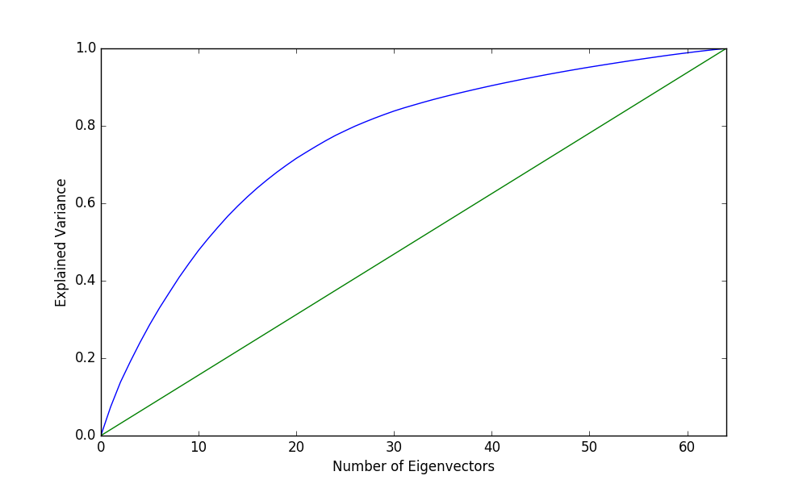  
- Isotropy: 0.47  

## fy  
- Vocabulary Size = 41,004  
- Embedding Length = 64  
#### Embedding L2 Norms  
  
- Anderson-Darling Test Statistic: 1717.4  
- Anderson-Darling Critical Value (1%): 1.09  
- Anderson-Darling Test Result: Reject  

- Kolmogorov-Smirnov p-value: 0.0  
- Kolmogorov-Smirnov Test Result: Reject  

- Shapiro-Wilk p-value: 0.0  
- Shapiro-Wilk Test Result: Reject  

#### Embedding Isotropy  
  
- Isotropy: 0.23  

## ga  
- Vocabulary Size = 25,004  
- Embedding Length = 64  
#### Embedding L2 Norms  
  
- Anderson-Darling Test Statistic: 1188.41  
- Anderson-Darling Critical Value (1%): 1.09  
- Anderson-Darling Test Result: Reject  

- Kolmogorov-Smirnov p-value: 0.0  
- Kolmogorov-Smirnov Test Result: Reject  

- Shapiro-Wilk p-value: 0.0  
- Shapiro-Wilk Test Result: Reject  

#### Embedding Isotropy  
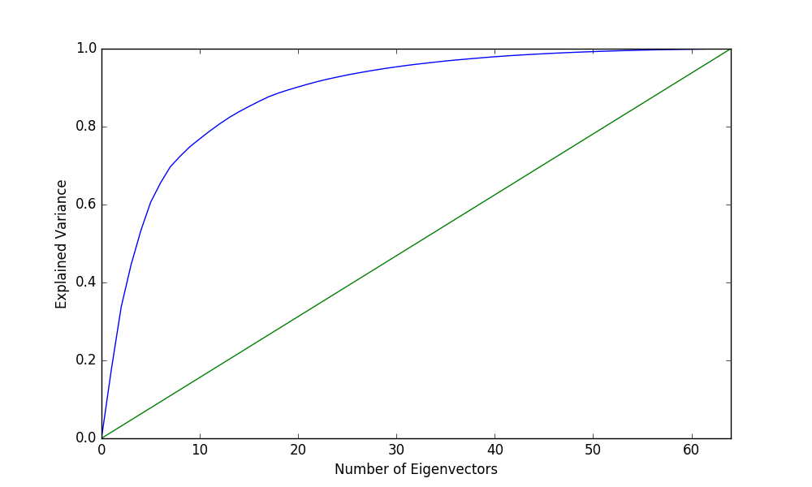  
- Isotropy: 0.22  

## gan  
- Vocabulary Size = 3,004  
- Embedding Length = 64  
#### Embedding L2 Norms  
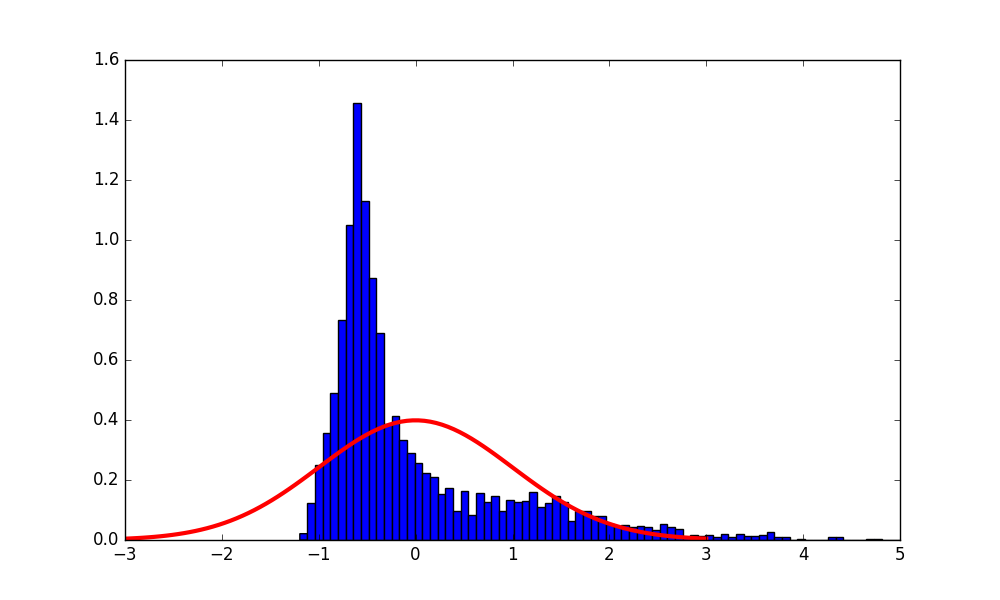  
- Anderson-Darling Test Statistic: 211.61  
- Anderson-Darling Critical Value (1%): 1.09  
- Anderson-Darling Test Result: Reject  

- Kolmogorov-Smirnov p-value: 0.0  
- Kolmogorov-Smirnov Test Result: Reject  

- Shapiro-Wilk p-value: 0.0  
- Shapiro-Wilk Test Result: Reject  

#### Embedding Isotropy  
  
- Isotropy: 0.22  

## gd  
- Vocabulary Size = 9,004  
- Embedding Length = 64  
#### Embedding L2 Norms  
  
- Anderson-Darling Test Statistic: 448.95  
- Anderson-Darling Critical Value (1%): 1.09  
- Anderson-Darling Test Result: Reject  

- Kolmogorov-Smirnov p-value: 0.0  
- Kolmogorov-Smirnov Test Result: Reject  

- Shapiro-Wilk p-value: 0.0  
- Shapiro-Wilk Test Result: Reject  

#### Embedding Isotropy  
  
- Isotropy: 0.19  

## gl  
- Vocabulary Size = 100,004  
- Embedding Length = 64  
#### Embedding L2 Norms  
  
- Anderson-Darling Test Statistic: 3538.26  
- Anderson-Darling Critical Value (1%): 1.09  
- Anderson-Darling Test Result: Reject  

- Kolmogorov-Smirnov p-value: 0.0  
- Kolmogorov-Smirnov Test Result: Reject  

- Shapiro-Wilk p-value: 0.0  
- Shapiro-Wilk Test Result: Reject  

#### Embedding Isotropy  
  
- Isotropy: 0.34  

## gu  
- Vocabulary Size = 52,004  
- Embedding Length = 64  
#### Embedding L2 Norms  
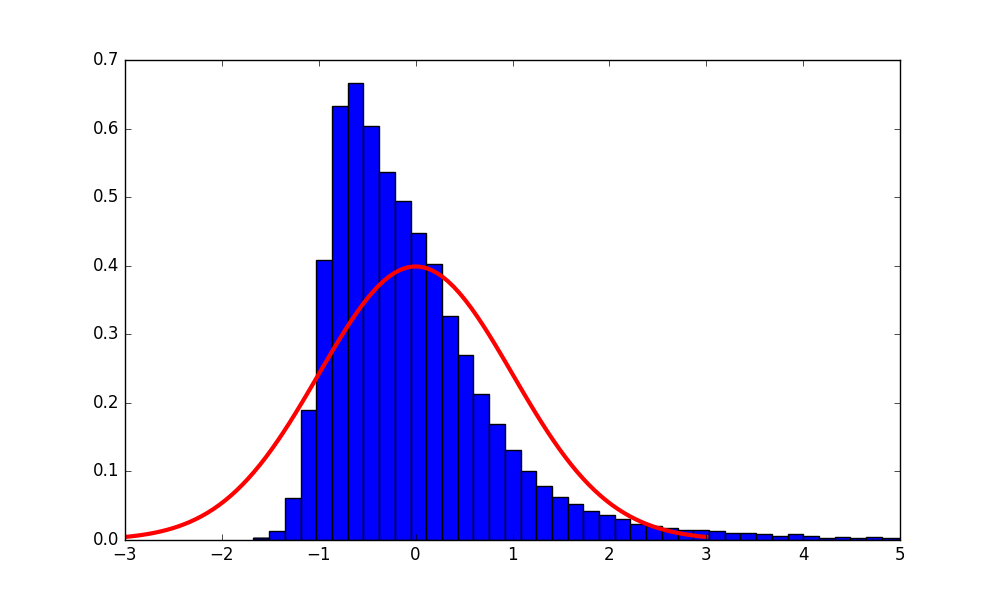  
- Anderson-Darling Test Statistic: 2014.97  
- Anderson-Darling Critical Value (1%): 1.09  
- Anderson-Darling Test Result: Reject  

- Kolmogorov-Smirnov p-value: 0.0  
- Kolmogorov-Smirnov Test Result: Reject  

- Shapiro-Wilk p-value: 0.0  
- Shapiro-Wilk Test Result: Reject  

#### Embedding Isotropy  
  
- Isotropy: 0.21  

## gv  
- Vocabulary Size = 7,004  
- Embedding Length = 64  
#### Embedding L2 Norms  
  
- Anderson-Darling Test Statistic: 460.29  
- Anderson-Darling Critical Value (1%): 1.09  
- Anderson-Darling Test Result: Reject  

- Kolmogorov-Smirnov p-value: 0.0  
- Kolmogorov-Smirnov Test Result: Reject  

- Shapiro-Wilk p-value: 0.0  
- Shapiro-Wilk Test Result: Reject  

#### Embedding Isotropy  
  
- Isotropy: 0.17  

## he  
- Vocabulary Size = 125,004  
- Embedding Length = 64  
#### Embedding L2 Norms  
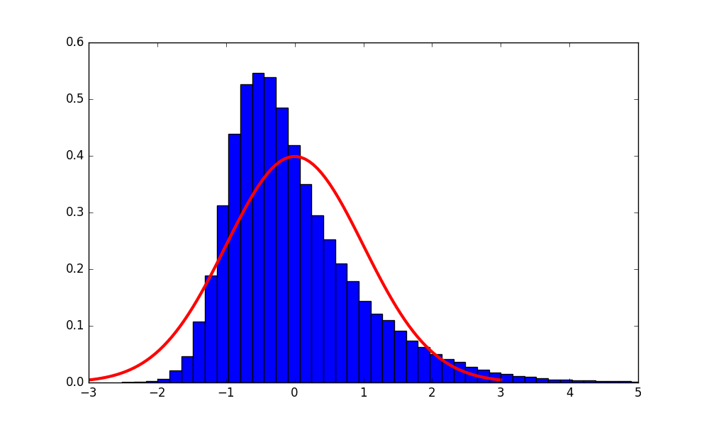  
- Anderson-Darling Test Statistic: 2680.28  
- Anderson-Darling Critical Value (1%): 1.09  
- Anderson-Darling Test Result: Reject  

- Kolmogorov-Smirnov p-value: 0.0  
- Kolmogorov-Smirnov Test Result: Reject  

- Shapiro-Wilk p-value: 0.0  
- Shapiro-Wilk Test Result: Reject  

#### Embedding Isotropy  
  
- Isotropy: 0.45  

## hi  
- Vocabulary Size = 94,004  
- Embedding Length = 64  
#### Embedding L2 Norms  
  
- Anderson-Darling Test Statistic: 2214.19  
- Anderson-Darling Critical Value (1%): 1.09  
- Anderson-Darling Test Result: Reject  

- Kolmogorov-Smirnov p-value: 0.0  
- Kolmogorov-Smirnov Test Result: Reject  

- Shapiro-Wilk p-value: 0.0  
- Shapiro-Wilk Test Result: Reject  

#### Embedding Isotropy  
  
- Isotropy: 0.3  

## hif  
- Vocabulary Size = 4,004  
- Embedding Length = 64  
#### Embedding L2 Norms  
  
- Anderson-Darling Test Statistic: 298.06  
- Anderson-Darling Critical Value (1%): 1.09  
- Anderson-Darling Test Result: Reject  

- Kolmogorov-Smirnov p-value: 0.0  
- Kolmogorov-Smirnov Test Result: Reject  

- Shapiro-Wilk p-value: 0.0  
- Shapiro-Wilk Test Result: Reject  

#### Embedding Isotropy  
  
- Isotropy: 0.2  

## hr  
- Vocabulary Size = 100,004  
- Embedding Length = 64  
#### Embedding L2 Norms  
  
- Anderson-Darling Test Statistic: 2060.03  
- Anderson-Darling Critical Value (1%): 1.09  
- Anderson-Darling Test Result: Reject  

- Kolmogorov-Smirnov p-value: 0.0  
- Kolmogorov-Smirnov Test Result: Reject  

- Shapiro-Wilk p-value: 0.0  
- Shapiro-Wilk Test Result: Reject  

#### Embedding Isotropy  
  
- Isotropy: 0.4  

## hsb  
- Vocabulary Size = 10,004  
- Embedding Length = 64  
#### Embedding L2 Norms  
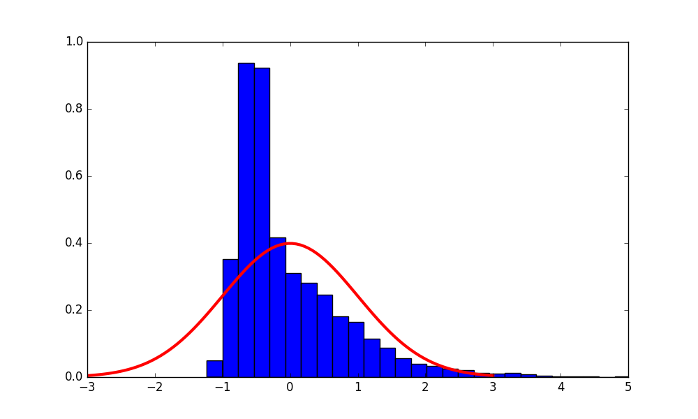  
- Anderson-Darling Test Statistic: 573.8  
- Anderson-Darling Critical Value (1%): 1.09  
- Anderson-Darling Test Result: Reject  

- Kolmogorov-Smirnov p-value: 0.0  
- Kolmogorov-Smirnov Test Result: Reject  

- Shapiro-Wilk p-value: 0.0  
- Shapiro-Wilk Test Result: Reject  

#### Embedding Isotropy  
  
- Isotropy: 0.18  

## ht  
- Vocabulary Size = 6,004  
- Embedding Length = 64  
#### Embedding L2 Norms  
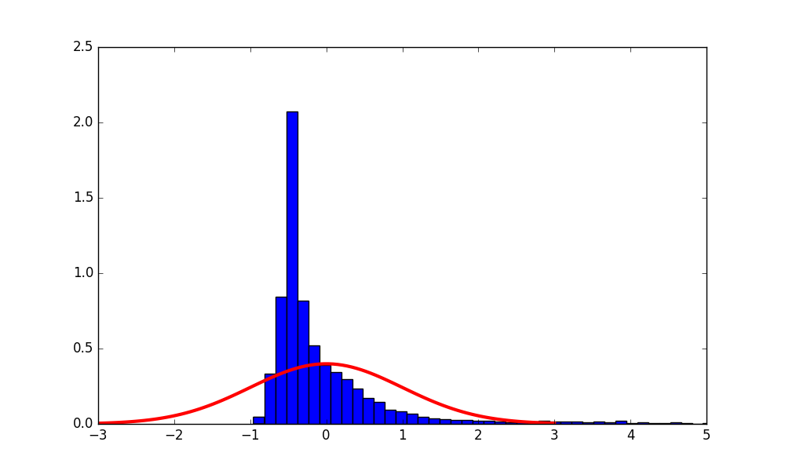  
- Anderson-Darling Test Statistic: 678.19  
- Anderson-Darling Critical Value (1%): 1.09  
- Anderson-Darling Test Result: Reject  

- Kolmogorov-Smirnov p-value: 0.0  
- Kolmogorov-Smirnov Test Result: Reject  

- Shapiro-Wilk p-value: 0.0  
- Shapiro-Wilk Test Result: Reject  

#### Embedding Isotropy  
  
- Isotropy: 0.23  

## hu  
- Vocabulary Size = 153,004  
- Embedding Length = 64  
#### Embedding L2 Norms  
  
- Anderson-Darling Test Statistic: 4099.99  
- Anderson-Darling Critical Value (1%): 1.09  
- Anderson-Darling Test Result: Reject  

- Kolmogorov-Smirnov p-value: 0.0  
- Kolmogorov-Smirnov Test Result: Reject  

- Shapiro-Wilk p-value: 0.0  
- Shapiro-Wilk Test Result: Reject  

#### Embedding Isotropy  
  
- Isotropy: 0.43  

## hy  
- Vocabulary Size = 47,004  
- Embedding Length = 64  
#### Embedding L2 Norms  
  
- Anderson-Darling Test Statistic: 1775.44  
- Anderson-Darling Critical Value (1%): 1.09  
- Anderson-Darling Test Result: Reject  

- Kolmogorov-Smirnov p-value: 0.0  
- Kolmogorov-Smirnov Test Result: Reject  

- Shapiro-Wilk p-value: 0.0  
- Shapiro-Wilk Test Result: Reject  

#### Embedding Isotropy  
  
- Isotropy: 0.23  

## ia  
- Vocabulary Size = 13,004  
- Embedding Length = 64  
#### Embedding L2 Norms  
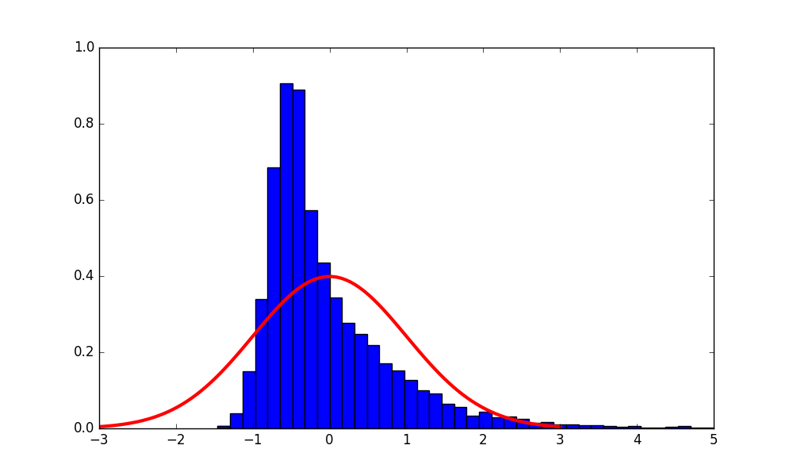  
- Anderson-Darling Test Statistic: 718.79  
- Anderson-Darling Critical Value (1%): 1.09  
- Anderson-Darling Test Result: Reject  

- Kolmogorov-Smirnov p-value: 0.0  
- Kolmogorov-Smirnov Test Result: Reject  

- Shapiro-Wilk p-value: 0.0  
- Shapiro-Wilk Test Result: Reject  

#### Embedding Isotropy  
  
- Isotropy: 0.17  

## id  
- Vocabulary Size = 100,004  
- Embedding Length = 64  
#### Embedding L2 Norms  
  
- Anderson-Darling Test Statistic: 3251.12  
- Anderson-Darling Critical Value (1%): 1.09  
- Anderson-Darling Test Result: Reject  

- Kolmogorov-Smirnov p-value: 0.0  
- Kolmogorov-Smirnov Test Result: Reject  

- Shapiro-Wilk p-value: 0.0  
- Shapiro-Wilk Test Result: Reject  

#### Embedding Isotropy  
  
- Isotropy: 0.38  

## ilo  
- Vocabulary Size = 6,004  
- Embedding Length = 64  
#### Embedding L2 Norms  
  
- Anderson-Darling Test Statistic: 382.31  
- Anderson-Darling Critical Value (1%): 1.09  
- Anderson-Darling Test Result: Reject  

- Kolmogorov-Smirnov p-value: 0.0  
- Kolmogorov-Smirnov Test Result: Reject  

- Shapiro-Wilk p-value: 0.0  
- Shapiro-Wilk Test Result: Reject  

#### Embedding Isotropy  
  
- Isotropy: 0.18  

## io  
- Vocabulary Size = 14,004  
- Embedding Length = 64  
#### Embedding L2 Norms  
  
- Anderson-Darling Test Statistic: 826.6  
- Anderson-Darling Critical Value (1%): 1.09  
- Anderson-Darling Test Result: Reject  

- Kolmogorov-Smirnov p-value: 0.0  
- Kolmogorov-Smirnov Test Result: Reject  

- Shapiro-Wilk p-value: 0.0  
- Shapiro-Wilk Test Result: Reject  

#### Embedding Isotropy  
  
- Isotropy: 0.22  

## is  
- Vocabulary Size = 55,004  
- Embedding Length = 64  
#### Embedding L2 Norms  
  
- Anderson-Darling Test Statistic: 2093.47  
- Anderson-Darling Critical Value (1%): 1.09  
- Anderson-Darling Test Result: Reject  

- Kolmogorov-Smirnov p-value: 0.0  
- Kolmogorov-Smirnov Test Result: Reject  

- Shapiro-Wilk p-value: 0.0  
- Shapiro-Wilk Test Result: Reject  

#### Embedding Isotropy  
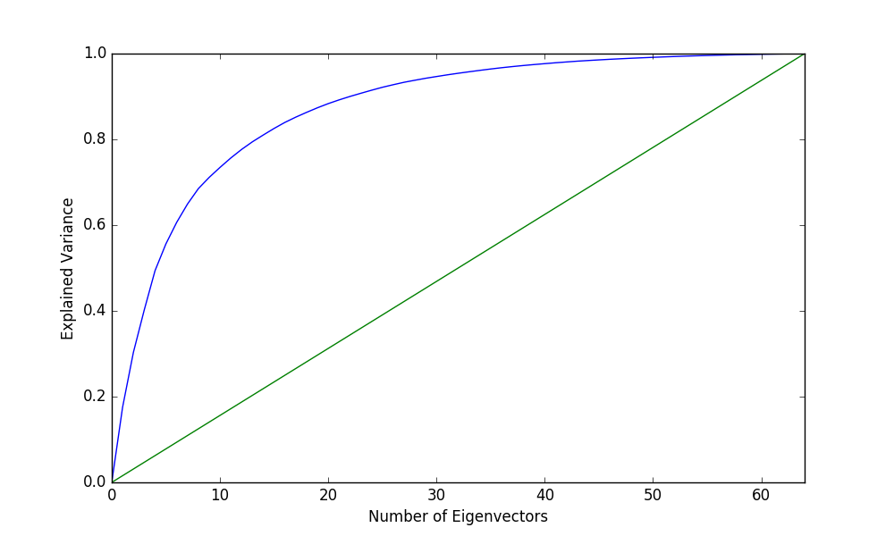  
- Isotropy: 0.24  

## it  
- Vocabulary Size = 100,004  
- Embedding Length = 64  
#### Embedding L2 Norms  
  
- Anderson-Darling Test Statistic: 3194.05  
- Anderson-Darling Critical Value (1%): 1.09  
- Anderson-Darling Test Result: Reject  

- Kolmogorov-Smirnov p-value: 0.0  
- Kolmogorov-Smirnov Test Result: Reject  

- Shapiro-Wilk p-value: 0.0  
- Shapiro-Wilk Test Result: Reject  

#### Embedding Isotropy  
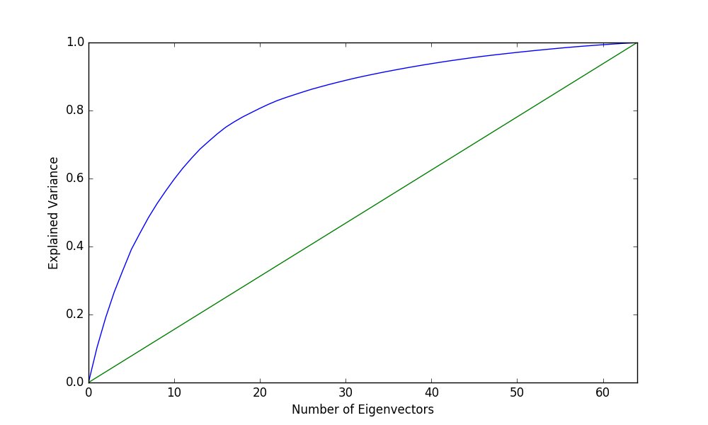  
- Isotropy: 0.36  

## ja  
- Vocabulary Size = 145,004  
- Embedding Length = 64  
#### Embedding L2 Norms  
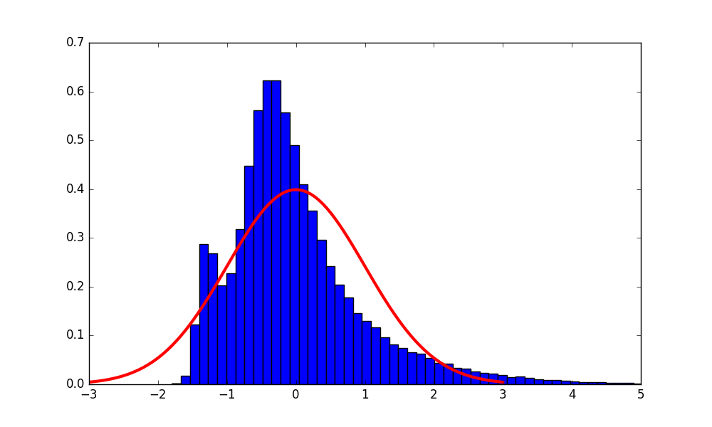  
- Anderson-Darling Test Statistic: 3410.59  
- Anderson-Darling Critical Value (1%): 1.09  
- Anderson-Darling Test Result: Reject  

- Kolmogorov-Smirnov p-value: 0.0  
- Kolmogorov-Smirnov Test Result: Reject  

- Shapiro-Wilk p-value: 0.0  
- Shapiro-Wilk Test Result: Reject  

#### Embedding Isotropy  
  
- Isotropy: 0.32  

## jv  
- Vocabulary Size = 42,004  
- Embedding Length = 64  
#### Embedding L2 Norms  
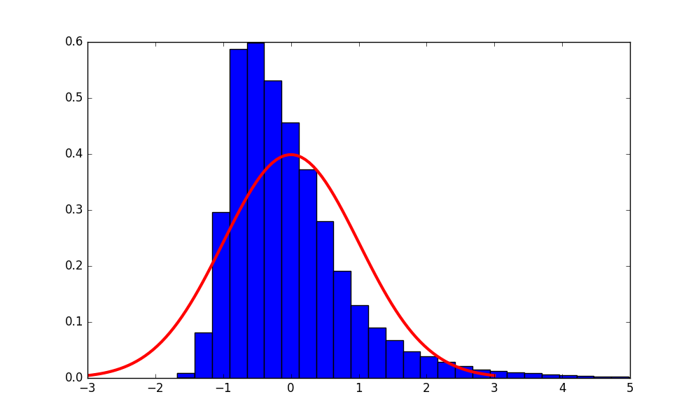  
- Anderson-Darling Test Statistic: 1440.37  
- Anderson-Darling Critical Value (1%): 1.09  
- Anderson-Darling Test Result: Reject  

- Kolmogorov-Smirnov p-value: 0.0  
- Kolmogorov-Smirnov Test Result: Reject  

- Shapiro-Wilk p-value: 0.0  
- Shapiro-Wilk Test Result: Reject  

#### Embedding Isotropy  
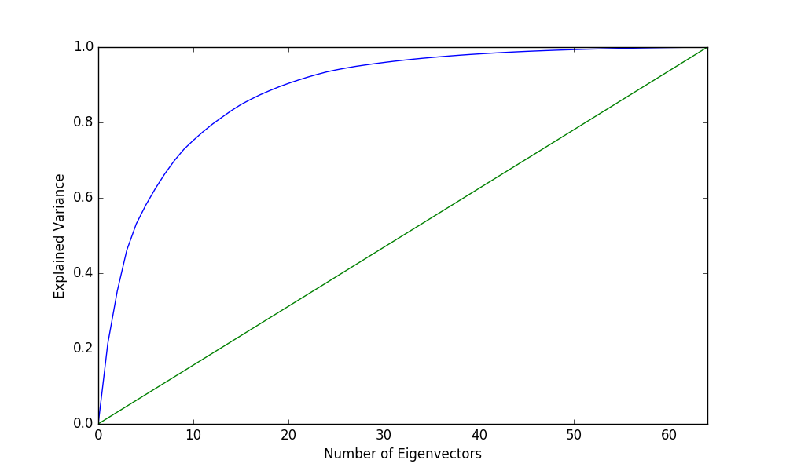  
- Isotropy: 0.22  

## ka  
- Vocabulary Size = 98,004  
- Embedding Length = 64  
#### Embedding L2 Norms  
  
- Anderson-Darling Test Statistic: 3444.33  
- Anderson-Darling Critical Value (1%): 1.09  
- Anderson-Darling Test Result: Reject  

- Kolmogorov-Smirnov p-value: 0.0  
- Kolmogorov-Smirnov Test Result: Reject  

- Shapiro-Wilk p-value: 0.0  
- Shapiro-Wilk Test Result: Reject  

#### Embedding Isotropy  
  
- Isotropy: 0.27  

## kk  
- Vocabulary Size = 100,004  
- Embedding Length = 64  
#### Embedding L2 Norms  
  
- Anderson-Darling Test Statistic: 3269.82  
- Anderson-Darling Critical Value (1%): 1.09  
- Anderson-Darling Test Result: Reject  

- Kolmogorov-Smirnov p-value: 0.0  
- Kolmogorov-Smirnov Test Result: Reject  

- Shapiro-Wilk p-value: 0.0  
- Shapiro-Wilk Test Result: Reject  

#### Embedding Isotropy  
  
- Isotropy: 0.33  

## km  
- Vocabulary Size = 14,004  
- Embedding Length = 64  
#### Embedding L2 Norms  
  
- Anderson-Darling Test Statistic: 536.27  
- Anderson-Darling Critical Value (1%): 1.09  
- Anderson-Darling Test Result: Reject  

- Kolmogorov-Smirnov p-value: 0.0  
- Kolmogorov-Smirnov Test Result: Reject  

- Shapiro-Wilk p-value: 0.0  
- Shapiro-Wilk Test Result: Reject  

#### Embedding Isotropy  
  
- Isotropy: 0.18  

## kn  
- Vocabulary Size = 100,004  
- Embedding Length = 64  
#### Embedding L2 Norms  
  
- Anderson-Darling Test Statistic: 3735.55  
- Anderson-Darling Critical Value (1%): 1.09  
- Anderson-Darling Test Result: Reject  

- Kolmogorov-Smirnov p-value: 0.0  
- Kolmogorov-Smirnov Test Result: Reject  

- Shapiro-Wilk p-value: 0.0  
- Shapiro-Wilk Test Result: Reject  

#### Embedding Isotropy  
  
- Isotropy: 0.23  

## ko  
- Vocabulary Size = 121,004  
- Embedding Length = 64  
#### Embedding L2 Norms  
  
- Anderson-Darling Test Statistic: 2505.27  
- Anderson-Darling Critical Value (1%): 1.09  
- Anderson-Darling Test Result: Reject  

- Kolmogorov-Smirnov p-value: 0.0  
- Kolmogorov-Smirnov Test Result: Reject  

- Shapiro-Wilk p-value: 0.0  
- Shapiro-Wilk Test Result: Reject  

#### Embedding Isotropy  
  
- Isotropy: 0.39  

## ku  
- Vocabulary Size = 24,004  
- Embedding Length = 64  
#### Embedding L2 Norms  
  
- Anderson-Darling Test Statistic: 1030.76  
- Anderson-Darling Critical Value (1%): 1.09  
- Anderson-Darling Test Result: Reject  

- Kolmogorov-Smirnov p-value: 0.0  
- Kolmogorov-Smirnov Test Result: Reject  

- Shapiro-Wilk p-value: 0.0  
- Shapiro-Wilk Test Result: Reject  

#### Embedding Isotropy  
  
- Isotropy: 0.19  

## ky  
- Vocabulary Size = 53,004  
- Embedding Length = 64  
#### Embedding L2 Norms  
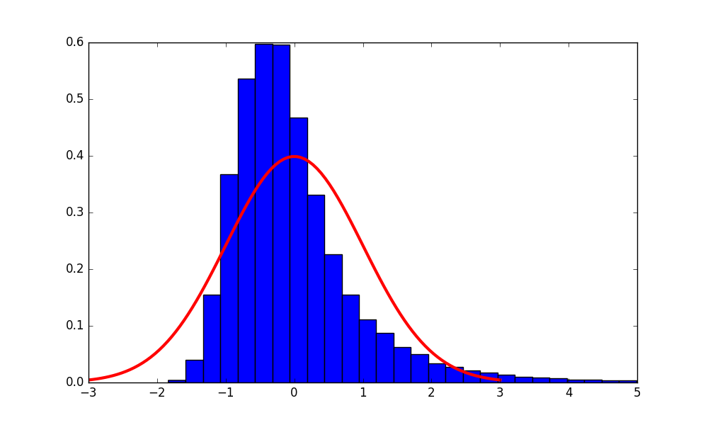  
- Anderson-Darling Test Statistic: 1882.0  
- Anderson-Darling Critical Value (1%): 1.09  
- Anderson-Darling Test Result: Reject  

- Kolmogorov-Smirnov p-value: 0.0  
- Kolmogorov-Smirnov Test Result: Reject  

- Shapiro-Wilk p-value: 0.0  
- Shapiro-Wilk Test Result: Reject  

#### Embedding Isotropy  
  
- Isotropy: 0.25  

## la  
- Vocabulary Size = 64,004  
- Embedding Length = 64  
#### Embedding L2 Norms  
  
- Anderson-Darling Test Statistic: 2648.11  
- Anderson-Darling Critical Value (1%): 1.09  
- Anderson-Darling Test Result: Reject  

- Kolmogorov-Smirnov p-value: 0.0  
- Kolmogorov-Smirnov Test Result: Reject  

- Shapiro-Wilk p-value: 0.0  
- Shapiro-Wilk Test Result: Reject  

#### Embedding Isotropy  
  
- Isotropy: 0.25  

## lb  
- Vocabulary Size = 40,004  
- Embedding Length = 64  
#### Embedding L2 Norms  
  
- Anderson-Darling Test Statistic: 1659.76  
- Anderson-Darling Critical Value (1%): 1.09  
- Anderson-Darling Test Result: Reject  

- Kolmogorov-Smirnov p-value: 0.0  
- Kolmogorov-Smirnov Test Result: Reject  

- Shapiro-Wilk p-value: 0.0  
- Shapiro-Wilk Test Result: Reject  

#### Embedding Isotropy  
  
- Isotropy: 0.23  

## li  
- Vocabulary Size = 21,004  
- Embedding Length = 64  
#### Embedding L2 Norms  
  
- Anderson-Darling Test Statistic: 1063.61  
- Anderson-Darling Critical Value (1%): 1.09  
- Anderson-Darling Test Result: Reject  

- Kolmogorov-Smirnov p-value: 0.0  
- Kolmogorov-Smirnov Test Result: Reject  

- Shapiro-Wilk p-value: 0.0  
- Shapiro-Wilk Test Result: Reject  

#### Embedding Isotropy  
  
- Isotropy: 0.17  

## lmo  
- Vocabulary Size = 30,004  
- Embedding Length = 64  
#### Embedding L2 Norms  
  
- Anderson-Darling Test Statistic: 1562.66  
- Anderson-Darling Critical Value (1%): 1.09  
- Anderson-Darling Test Result: Reject  

- Kolmogorov-Smirnov p-value: 0.0  
- Kolmogorov-Smirnov Test Result: Reject  

- Shapiro-Wilk p-value: 0.0  
- Shapiro-Wilk Test Result: Reject  

#### Embedding Isotropy  
  
- Isotropy: 0.2  

## lt  
- Vocabulary Size = 100,004  
- Embedding Length = 64  
#### Embedding L2 Norms  
  
- Anderson-Darling Test Statistic: 2961.27  
- Anderson-Darling Critical Value (1%): 1.09  
- Anderson-Darling Test Result: Reject  

- Kolmogorov-Smirnov p-value: 0.0  
- Kolmogorov-Smirnov Test Result: Reject  

- Shapiro-Wilk p-value: 0.0  
- Shapiro-Wilk Test Result: Reject  

#### Embedding Isotropy  
  
- Isotropy: 0.37  

## lv  
- Vocabulary Size = 94,004  
- Embedding Length = 64  
#### Embedding L2 Norms  
  
- Anderson-Darling Test Statistic: 3259.82  
- Anderson-Darling Critical Value (1%): 1.09  
- Anderson-Darling Test Result: Reject  

- Kolmogorov-Smirnov p-value: 0.0  
- Kolmogorov-Smirnov Test Result: Reject  

- Shapiro-Wilk p-value: 0.0  
- Shapiro-Wilk Test Result: Reject  

#### Embedding Isotropy  
  
- Isotropy: 0.29  

## mg  
- Vocabulary Size = 12,004  
- Embedding Length = 64  
#### Embedding L2 Norms  
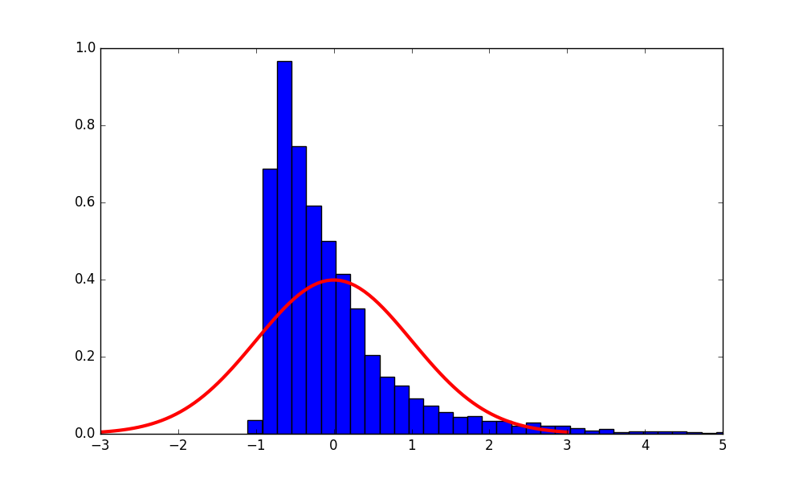  
- Anderson-Darling Test Statistic: 819.98  
- Anderson-Darling Critical Value (1%): 1.09  
- Anderson-Darling Test Result: Reject  

- Kolmogorov-Smirnov p-value: 0.0  
- Kolmogorov-Smirnov Test Result: Reject  

- Shapiro-Wilk p-value: 0.0  
- Shapiro-Wilk Test Result: Reject  

#### Embedding Isotropy  
  
- Isotropy: 0.26  

## mk  
- Vocabulary Size = 100,004  
- Embedding Length = 64  
#### Embedding L2 Norms  
  
- Anderson-Darling Test Statistic: 3249.09  
- Anderson-Darling Critical Value (1%): 1.09  
- Anderson-Darling Test Result: Reject  

- Kolmogorov-Smirnov p-value: 0.0  
- Kolmogorov-Smirnov Test Result: Reject  

- Shapiro-Wilk p-value: 0.0  
- Shapiro-Wilk Test Result: Reject  

#### Embedding Isotropy  
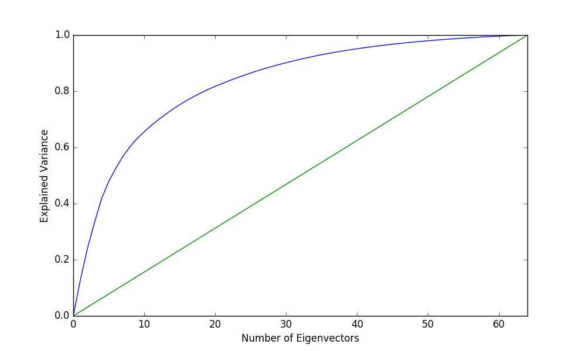  
- Isotropy: 0.32  

## ml  
- Vocabulary Size = 94,004  
- Embedding Length = 64  
#### Embedding L2 Norms  
  
- Anderson-Darling Test Statistic: 3204.54  
- Anderson-Darling Critical Value (1%): 1.09  
- Anderson-Darling Test Result: Reject  

- Kolmogorov-Smirnov p-value: 0.0  
- Kolmogorov-Smirnov Test Result: Reject  

- Shapiro-Wilk p-value: 0.0  
- Shapiro-Wilk Test Result: Reject  

#### Embedding Isotropy  
  
- Isotropy: 0.23  

## mn  
- Vocabulary Size = 28,004  
- Embedding Length = 64  
#### Embedding L2 Norms  
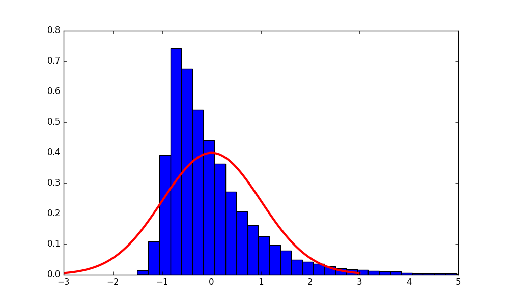  
- Anderson-Darling Test Statistic: 1197.61  
- Anderson-Darling Critical Value (1%): 1.09  
- Anderson-Darling Test Result: Reject  

- Kolmogorov-Smirnov p-value: 0.0  
- Kolmogorov-Smirnov Test Result: Reject  

- Shapiro-Wilk p-value: 0.0  
- Shapiro-Wilk Test Result: Reject  

#### Embedding Isotropy  
  
- Isotropy: 0.19  

## mr  
- Vocabulary Size = 47,004  
- Embedding Length = 64  
#### Embedding L2 Norms  
  
- Anderson-Darling Test Statistic: 1778.22  
- Anderson-Darling Critical Value (1%): 1.09  
- Anderson-Darling Test Result: Reject  

- Kolmogorov-Smirnov p-value: 0.0  
- Kolmogorov-Smirnov Test Result: Reject  

- Shapiro-Wilk p-value: 0.0  
- Shapiro-Wilk Test Result: Reject  

#### Embedding Isotropy  
  
- Isotropy: 0.2  

## ms  
- Vocabulary Size = 88,004  
- Embedding Length = 64  
#### Embedding L2 Norms  
  
- Anderson-Darling Test Statistic: 2545.49  
- Anderson-Darling Critical Value (1%): 1.09  
- Anderson-Darling Test Result: Reject  

- Kolmogorov-Smirnov p-value: 0.0  
- Kolmogorov-Smirnov Test Result: Reject  

- Shapiro-Wilk p-value: 0.0  
- Shapiro-Wilk Test Result: Reject  

#### Embedding Isotropy  
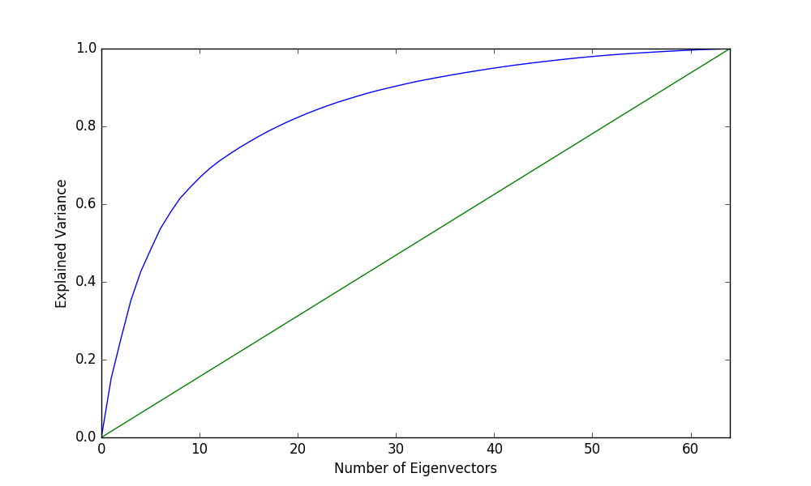  
- Isotropy: 0.31  

## mt  
- Vocabulary Size = 16,004  
- Embedding Length = 64  
#### Embedding L2 Norms  
  
- Anderson-Darling Test Statistic: 906.72  
- Anderson-Darling Critical Value (1%): 1.09  
- Anderson-Darling Test Result: Reject  

- Kolmogorov-Smirnov p-value: 0.0  
- Kolmogorov-Smirnov Test Result: Reject  

- Shapiro-Wilk p-value: 0.0  
- Shapiro-Wilk Test Result: Reject  

#### Embedding Isotropy  
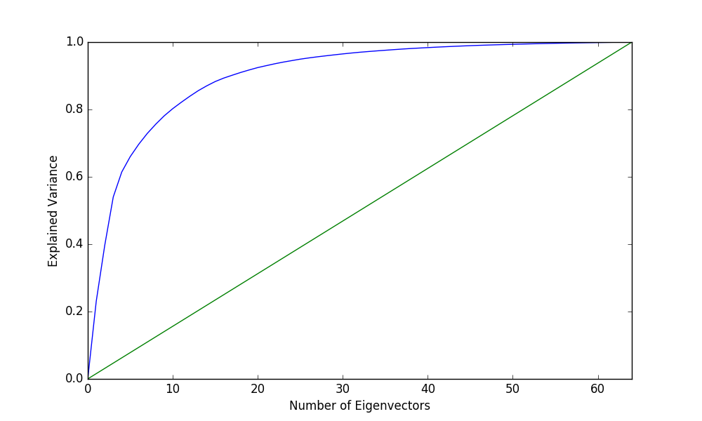  
- Isotropy: 0.18  

## my  
- Vocabulary Size = 54,004  
- Embedding Length = 64  
#### Embedding L2 Norms  
  
- Anderson-Darling Test Statistic: 1835.15  
- Anderson-Darling Critical Value (1%): 1.09  
- Anderson-Darling Test Result: Reject  

- Kolmogorov-Smirnov p-value: 0.0  
- Kolmogorov-Smirnov Test Result: Reject  

- Shapiro-Wilk p-value: 0.0  
- Shapiro-Wilk Test Result: Reject  

#### Embedding Isotropy  
  
- Isotropy: 0.19  

## ne  
- Vocabulary Size = 42,004  
- Embedding Length = 64  
#### Embedding L2 Norms  
  
- Anderson-Darling Test Statistic: 1674.75  
- Anderson-Darling Critical Value (1%): 1.09  
- Anderson-Darling Test Result: Reject  

- Kolmogorov-Smirnov p-value: 0.0  
- Kolmogorov-Smirnov Test Result: Reject  

- Shapiro-Wilk p-value: 0.0  
- Shapiro-Wilk Test Result: Reject  

#### Embedding Isotropy  
  
- Isotropy: 0.18  

## nl  
- Vocabulary Size = 100,004  
- Embedding Length = 64  
#### Embedding L2 Norms  
  
- Anderson-Darling Test Statistic: 3625.25  
- Anderson-Darling Critical Value (1%): 1.09  
- Anderson-Darling Test Result: Reject  

- Kolmogorov-Smirnov p-value: 0.0  
- Kolmogorov-Smirnov Test Result: Reject  

- Shapiro-Wilk p-value: 0.0  
- Shapiro-Wilk Test Result: Reject  

#### Embedding Isotropy  
  
- Isotropy: 0.39  

## nn  
- Vocabulary Size = 100,004  
- Embedding Length = 64  
#### Embedding L2 Norms  
  
- Anderson-Darling Test Statistic: 3822.99  
- Anderson-Darling Critical Value (1%): 1.09  
- Anderson-Darling Test Result: Reject  

- Kolmogorov-Smirnov p-value: 0.0  
- Kolmogorov-Smirnov Test Result: Reject  

- Shapiro-Wilk p-value: 0.0  
- Shapiro-Wilk Test Result: Reject  

#### Embedding Isotropy  
  
- Isotropy: 0.3  

## no  
- Vocabulary Size = 100,004  
- Embedding Length = 64  
#### Embedding L2 Norms  
  
- Anderson-Darling Test Statistic: 2703.58  
- Anderson-Darling Critical Value (1%): 1.09  
- Anderson-Darling Test Result: Reject  

- Kolmogorov-Smirnov p-value: 0.0  
- Kolmogorov-Smirnov Test Result: Reject  

- Shapiro-Wilk p-value: 0.0  
- Shapiro-Wilk Test Result: Reject  

#### Embedding Isotropy  
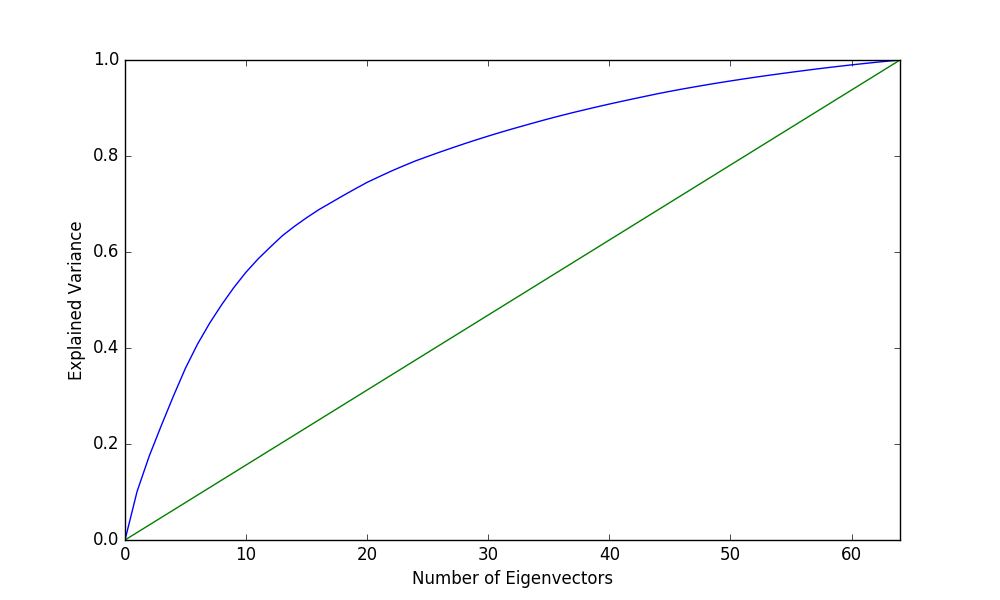  
- Isotropy: 0.43  

## oc  
- Vocabulary Size = 71,004  
- Embedding Length = 64  
#### Embedding L2 Norms  
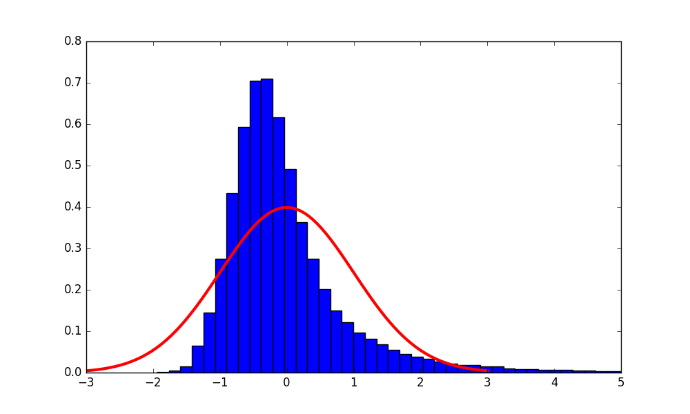  
- Anderson-Darling Test Statistic: 3309.71  
- Anderson-Darling Critical Value (1%): 1.09  
- Anderson-Darling Test Result: Reject  

- Kolmogorov-Smirnov p-value: 0.0  
- Kolmogorov-Smirnov Test Result: Reject  

- Shapiro-Wilk p-value: 0.0  
- Shapiro-Wilk Test Result: Reject  

#### Embedding Isotropy  
  
- Isotropy: 0.26  

## or  
- Vocabulary Size = 13,004  
- Embedding Length = 64  
#### Embedding L2 Norms  
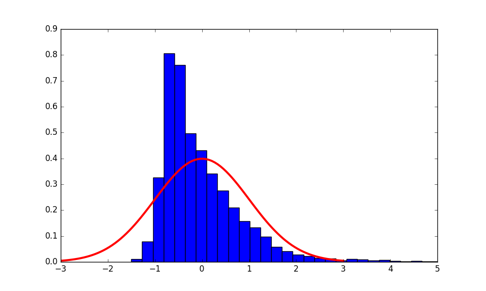  
- Anderson-Darling Test Statistic: 604.61  
- Anderson-Darling Critical Value (1%): 1.09  
- Anderson-Darling Test Result: Reject  

- Kolmogorov-Smirnov p-value: 0.0  
- Kolmogorov-Smirnov Test Result: Reject  

- Shapiro-Wilk p-value: 0.0  
- Shapiro-Wilk Test Result: Reject  

#### Embedding Isotropy  
  
- Isotropy: 0.14  

## os  
- Vocabulary Size = 7,004  
- Embedding Length = 64  
#### Embedding L2 Norms  
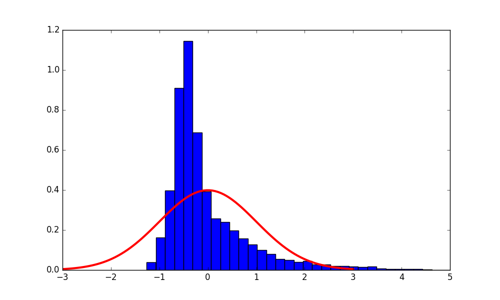  
- Anderson-Darling Test Statistic: 510.8  
- Anderson-Darling Critical Value (1%): 1.09  
- Anderson-Darling Test Result: Reject  

- Kolmogorov-Smirnov p-value: 0.0  
- Kolmogorov-Smirnov Test Result: Reject  

- Shapiro-Wilk p-value: 0.0  
- Shapiro-Wilk Test Result: Reject  

#### Embedding Isotropy  
  
- Isotropy: 0.17  

## pa  
- Vocabulary Size = 14,004  
- Embedding Length = 64  
#### Embedding L2 Norms  
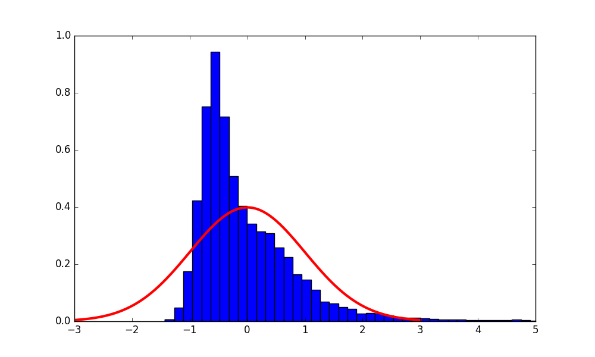  
- Anderson-Darling Test Statistic: 699.49  
- Anderson-Darling Critical Value (1%): 1.09  
- Anderson-Darling Test Result: Reject  

- Kolmogorov-Smirnov p-value: 0.0  
- Kolmogorov-Smirnov Test Result: Reject  

- Shapiro-Wilk p-value: 0.0  
- Shapiro-Wilk Test Result: Reject  

#### Embedding Isotropy  
  
- Isotropy: 0.16  

## pam  
- Vocabulary Size = 9,004  
- Embedding Length = 64  
#### Embedding L2 Norms  
  
- Anderson-Darling Test Statistic: 480.33  
- Anderson-Darling Critical Value (1%): 1.09  
- Anderson-Darling Test Result: Reject  

- Kolmogorov-Smirnov p-value: 0.0  
- Kolmogorov-Smirnov Test Result: Reject  

- Shapiro-Wilk p-value: 0.0  
- Shapiro-Wilk Test Result: Reject  

#### Embedding Isotropy  
  
- Isotropy: 0.16  

## pl  
- Vocabulary Size = 238,004  
- Embedding Length = 64  
#### Embedding L2 Norms  
  
- Anderson-Darling Test Statistic: 5027.6  
- Anderson-Darling Critical Value (1%): 1.09  
- Anderson-Darling Test Result: Reject  

- Kolmogorov-Smirnov p-value: 0.0  
- Kolmogorov-Smirnov Test Result: Reject  

- Shapiro-Wilk p-value: 0.0  
- Shapiro-Wilk Test Result: Reject  

#### Embedding Isotropy  
  
- Isotropy: 0.45  

## pms  
- Vocabulary Size = 18,004  
- Embedding Length = 64  
#### Embedding L2 Norms  
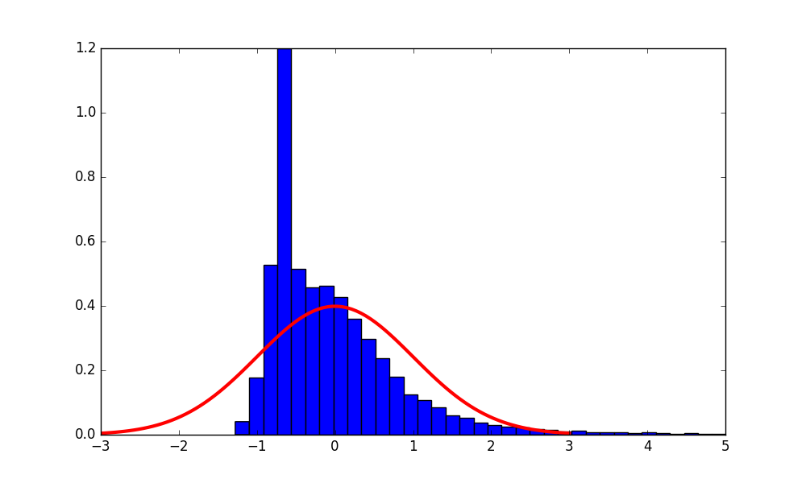  
- Anderson-Darling Test Statistic: 905.57  
- Anderson-Darling Critical Value (1%): 1.09  
- Anderson-Darling Test Result: Reject  

- Kolmogorov-Smirnov p-value: 0.0  
- Kolmogorov-Smirnov Test Result: Reject  

- Shapiro-Wilk p-value: 0.0  
- Shapiro-Wilk Test Result: Reject  

#### Embedding Isotropy  
  
- Isotropy: 0.22  

## ps  
- Vocabulary Size = 20,004  
- Embedding Length = 64  
#### Embedding L2 Norms  
  
- Anderson-Darling Test Statistic: 1143.34  
- Anderson-Darling Critical Value (1%): 1.09  
- Anderson-Darling Test Result: Reject  

- Kolmogorov-Smirnov p-value: 0.0  
- Kolmogorov-Smirnov Test Result: Reject  

- Shapiro-Wilk p-value: 0.0  
- Shapiro-Wilk Test Result: Reject  

#### Embedding Isotropy  
  
- Isotropy: 0.17  

## pt  
- Vocabulary Size = 100,004  
- Embedding Length = 64  
#### Embedding L2 Norms  
  
- Anderson-Darling Test Statistic: 3637.67  
- Anderson-Darling Critical Value (1%): 1.09  
- Anderson-Darling Test Result: Reject  

- Kolmogorov-Smirnov p-value: 0.0  
- Kolmogorov-Smirnov Test Result: Reject  

- Shapiro-Wilk p-value: 0.0  
- Shapiro-Wilk Test Result: Reject  

#### Embedding Isotropy  
  
- Isotropy: 0.38  

## qu  
- Vocabulary Size = 7,004  
- Embedding Length = 64  
#### Embedding L2 Norms  
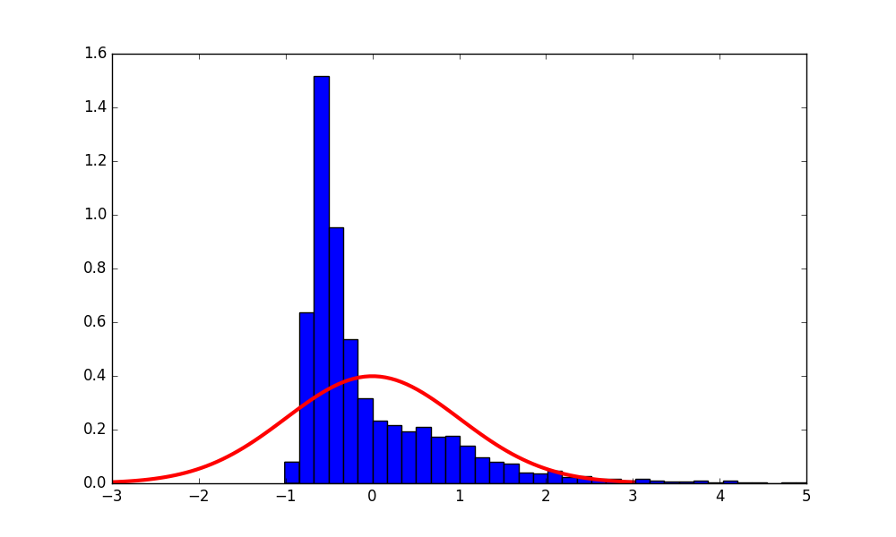  
- Anderson-Darling Test Statistic: 542.33  
- Anderson-Darling Critical Value (1%): 1.09  
- Anderson-Darling Test Result: Reject  

- Kolmogorov-Smirnov p-value: 0.0  
- Kolmogorov-Smirnov Test Result: Reject  

- Shapiro-Wilk p-value: 0.0  
- Shapiro-Wilk Test Result: Reject  

#### Embedding Isotropy  
  
- Isotropy: 0.2  

## rm  
- Vocabulary Size = 9,004  
- Embedding Length = 64  
#### Embedding L2 Norms  
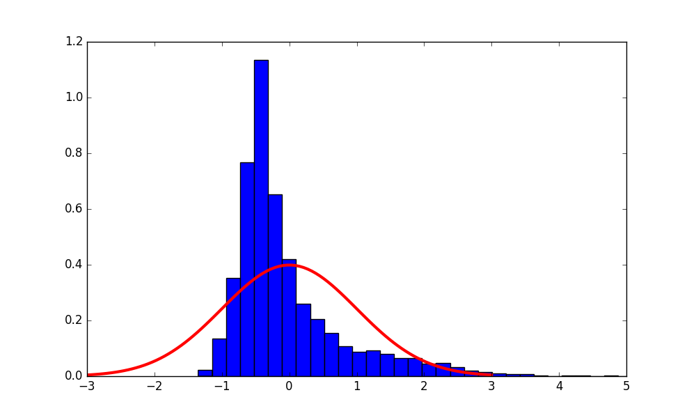  
- Anderson-Darling Test Statistic: 636.1  
- Anderson-Darling Critical Value (1%): 1.09  
- Anderson-Darling Test Result: Reject  

- Kolmogorov-Smirnov p-value: 0.0  
- Kolmogorov-Smirnov Test Result: Reject  

- Shapiro-Wilk p-value: 0.0  
- Shapiro-Wilk Test Result: Reject  

#### Embedding Isotropy  
  
- Isotropy: 0.15  

## ro  
- Vocabulary Size = 100,004  
- Embedding Length = 64  
#### Embedding L2 Norms  
  
- Anderson-Darling Test Statistic: 2663.2  
- Anderson-Darling Critical Value (1%): 1.09  
- Anderson-Darling Test Result: Reject  

- Kolmogorov-Smirnov p-value: 0.0  
- Kolmogorov-Smirnov Test Result: Reject  

- Shapiro-Wilk p-value: 0.0  
- Shapiro-Wilk Test Result: Reject  

#### Embedding Isotropy  
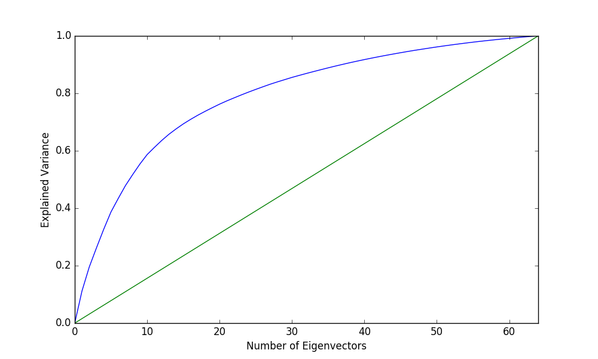  
- Isotropy: 0.4  

## ru  
- Vocabulary Size = 100,004  
- Embedding Length = 64  
#### Embedding L2 Norms  
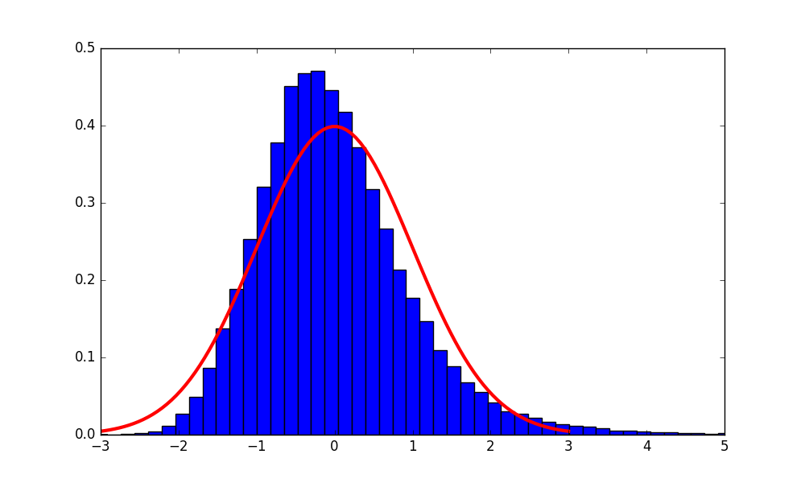  
- Anderson-Darling Test Statistic: 838.48  
- Anderson-Darling Critical Value (1%): 1.09  
- Anderson-Darling Test Result: Reject  

- Kolmogorov-Smirnov p-value: 0.0  
- Kolmogorov-Smirnov Test Result: Reject  

- Shapiro-Wilk p-value: 0.0  
- Shapiro-Wilk Test Result: Reject  

#### Embedding Isotropy  
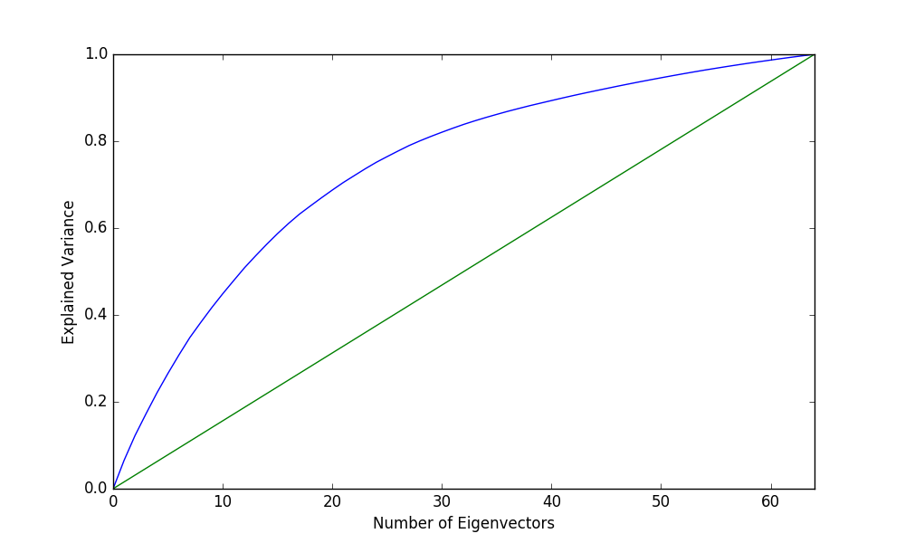  
- Isotropy: 0.5  

## sa  
- Vocabulary Size = 21,004  
- Embedding Length = 64  
#### Embedding L2 Norms  
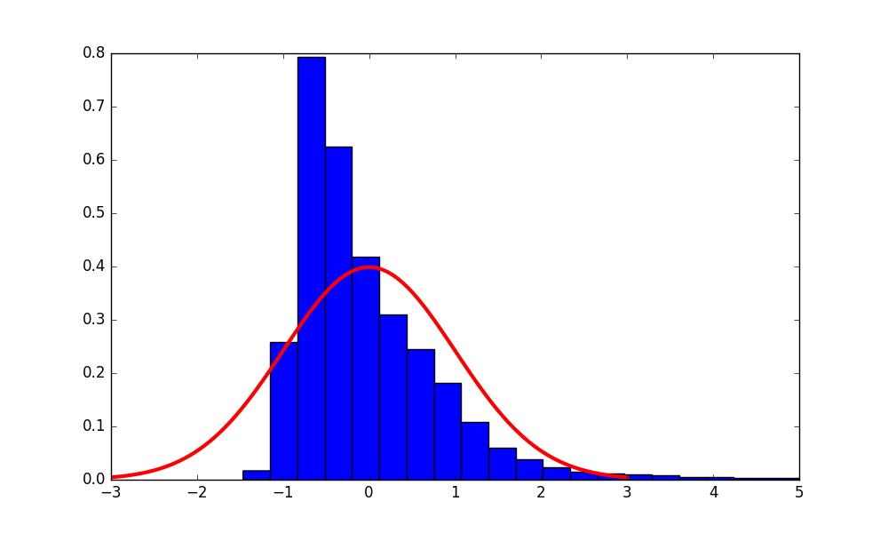  
- Anderson-Darling Test Statistic: 975.03  
- Anderson-Darling Critical Value (1%): 1.09  
- Anderson-Darling Test Result: Reject  

- Kolmogorov-Smirnov p-value: 0.0  
- Kolmogorov-Smirnov Test Result: Reject  

- Shapiro-Wilk p-value: 0.0  
- Shapiro-Wilk Test Result: Reject  

#### Embedding Isotropy  
  
- Isotropy: 0.16  

## sah  
- Vocabulary Size = 11,004  
- Embedding Length = 64  
#### Embedding L2 Norms  
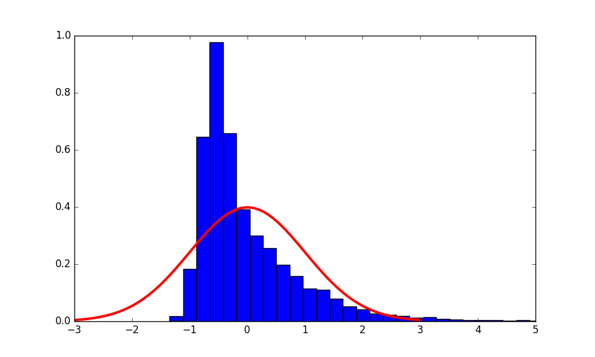  
- Anderson-Darling Test Statistic: 621.47  
- Anderson-Darling Critical Value (1%): 1.09  
- Anderson-Darling Test Result: Reject  

- Kolmogorov-Smirnov p-value: 0.0  
- Kolmogorov-Smirnov Test Result: Reject  

- Shapiro-Wilk p-value: 0.0  
- Shapiro-Wilk Test Result: Reject  

#### Embedding Isotropy  
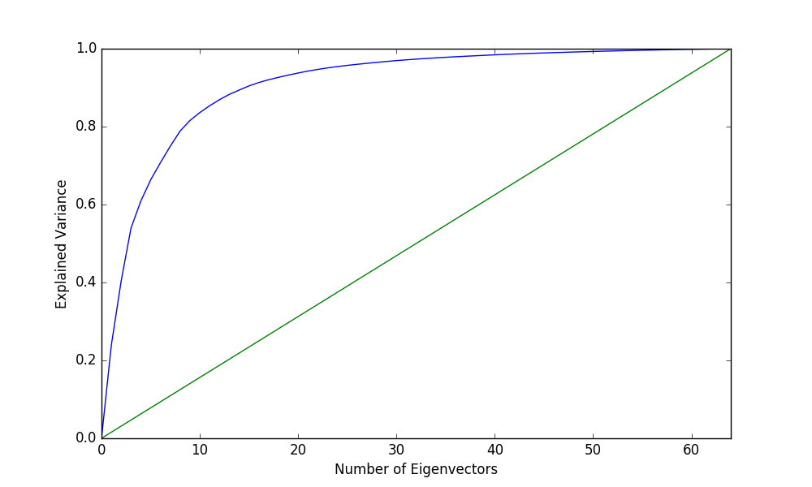  
- Isotropy: 0.17  

## scn  
- Vocabulary Size = 20,004  
- Embedding Length = 64  
#### Embedding L2 Norms  
  
- Anderson-Darling Test Statistic: 1140.87  
- Anderson-Darling Critical Value (1%): 1.09  
- Anderson-Darling Test Result: Reject  

- Kolmogorov-Smirnov p-value: 0.0  
- Kolmogorov-Smirnov Test Result: Reject  

- Shapiro-Wilk p-value: 0.0  
- Shapiro-Wilk Test Result: Reject  

#### Embedding Isotropy  
  
- Isotropy: 0.17  

## sco  
- Vocabulary Size = 22,004  
- Embedding Length = 64  
#### Embedding L2 Norms  
  
- Anderson-Darling Test Statistic: 974.6  
- Anderson-Darling Critical Value (1%): 1.09  
- Anderson-Darling Test Result: Reject  

- Kolmogorov-Smirnov p-value: 0.0  
- Kolmogorov-Smirnov Test Result: Reject  

- Shapiro-Wilk p-value: 0.0  
- Shapiro-Wilk Test Result: Reject  

#### Embedding Isotropy  
  
- Isotropy: 0.22  

## se  
- Vocabulary Size = 3,004  
- Embedding Length = 64  
#### Embedding L2 Norms  
  
- Anderson-Darling Test Statistic: 261.93  
- Anderson-Darling Critical Value (1%): 1.09  
- Anderson-Darling Test Result: Reject  

- Kolmogorov-Smirnov p-value: 0.0  
- Kolmogorov-Smirnov Test Result: Reject  

- Shapiro-Wilk p-value: 0.0  
- Shapiro-Wilk Test Result: Reject  

#### Embedding Isotropy  
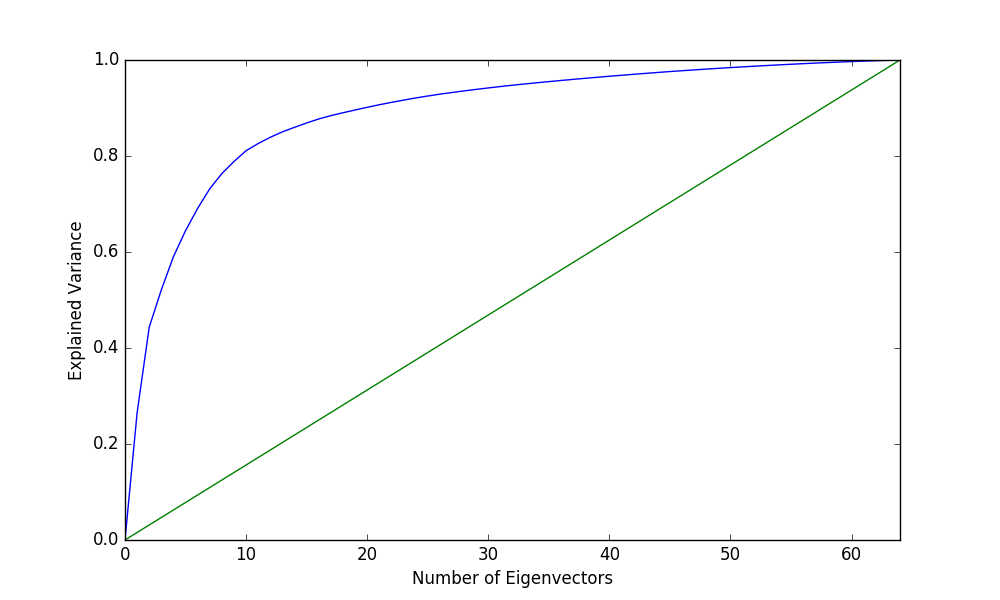  
- Isotropy: 0.21  

## sh  
- Vocabulary Size = 100,004  
- Embedding Length = 64  
#### Embedding L2 Norms  
  
- Anderson-Darling Test Statistic: 2686.51  
- Anderson-Darling Critical Value (1%): 1.09  
- Anderson-Darling Test Result: Reject  

- Kolmogorov-Smirnov p-value: 0.0  
- Kolmogorov-Smirnov Test Result: Reject  

- Shapiro-Wilk p-value: 0.0  
- Shapiro-Wilk Test Result: Reject  

#### Embedding Isotropy  
  
- Isotropy: 0.36  

## si  
- Vocabulary Size = 51,004  
- Embedding Length = 64  
#### Embedding L2 Norms  
  
- Anderson-Darling Test Statistic: 1623.48  
- Anderson-Darling Critical Value (1%): 1.09  
- Anderson-Darling Test Result: Reject  

- Kolmogorov-Smirnov p-value: 0.0  
- Kolmogorov-Smirnov Test Result: Reject  

- Shapiro-Wilk p-value: 0.0  
- Shapiro-Wilk Test Result: Reject  

#### Embedding Isotropy  
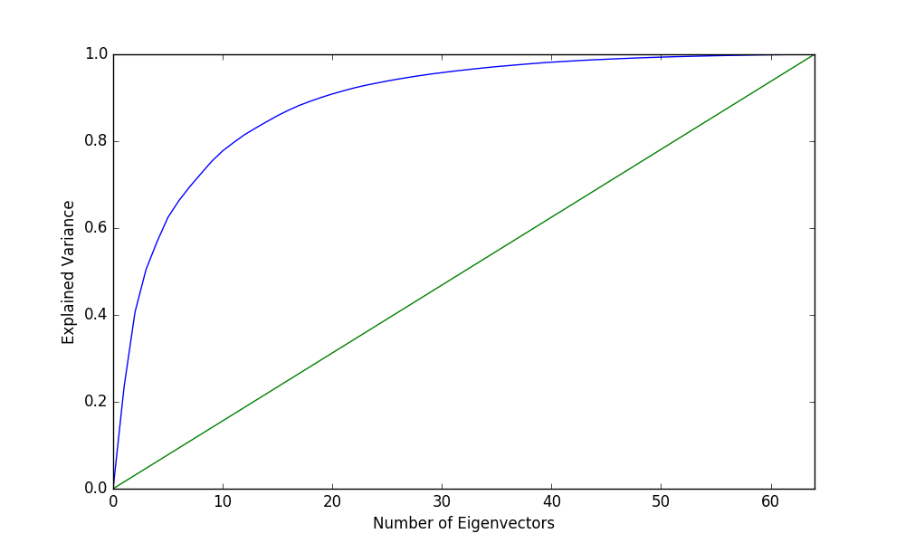  
- Isotropy: 0.2  

## sk  
- Vocabulary Size = 100,004  
- Embedding Length = 64  
#### Embedding L2 Norms  
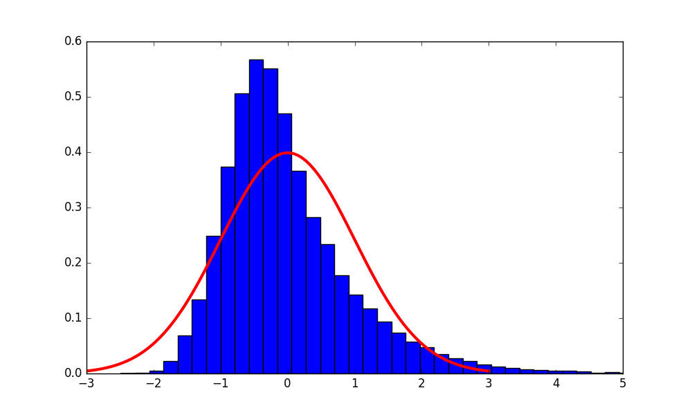  
- Anderson-Darling Test Statistic: 2211.96  
- Anderson-Darling Critical Value (1%): 1.09  
- Anderson-Darling Test Result: Reject  

- Kolmogorov-Smirnov p-value: 0.0  
- Kolmogorov-Smirnov Test Result: Reject  

- Shapiro-Wilk p-value: 0.0  
- Shapiro-Wilk Test Result: Reject  

#### Embedding Isotropy  
  
- Isotropy: 0.37  

## sl  
- Vocabulary Size = 100,004  
- Embedding Length = 64  
#### Embedding L2 Norms  
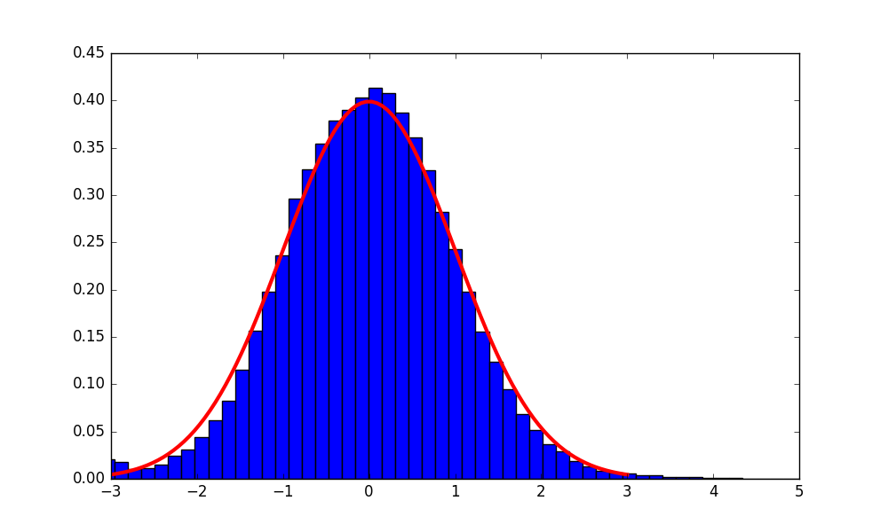  
- Anderson-Darling Test Statistic: 52.7  
- Anderson-Darling Critical Value (1%): 1.09  
- Anderson-Darling Test Result: Reject  

- Kolmogorov-Smirnov p-value: 0.0  
- Kolmogorov-Smirnov Test Result: Reject  

- Shapiro-Wilk p-value: 0.0  
- Shapiro-Wilk Test Result: Reject  

#### Embedding Isotropy  
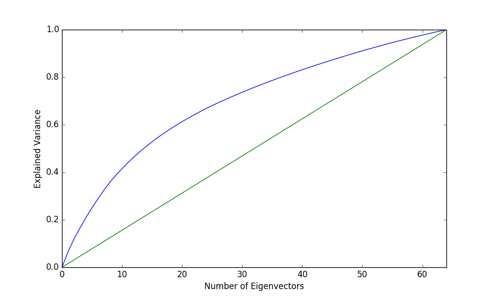  
- Isotropy: 0.6  

## sq  
- Vocabulary Size = 82,004  
- Embedding Length = 64  
#### Embedding L2 Norms  
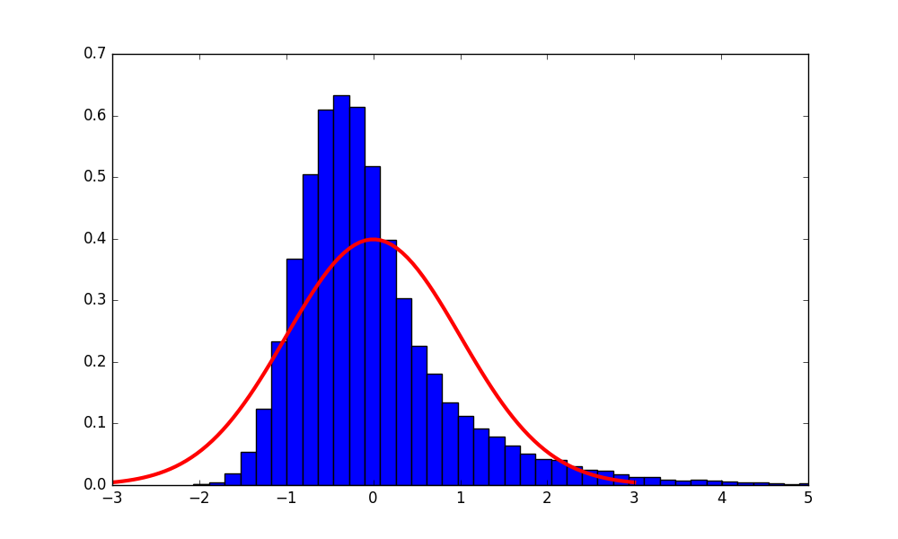  
- Anderson-Darling Test Statistic: 2890.84  
- Anderson-Darling Critical Value (1%): 1.09  
- Anderson-Darling Test Result: Reject  

- Kolmogorov-Smirnov p-value: 0.0  
- Kolmogorov-Smirnov Test Result: Reject  

- Shapiro-Wilk p-value: 0.0  
- Shapiro-Wilk Test Result: Reject  

#### Embedding Isotropy  
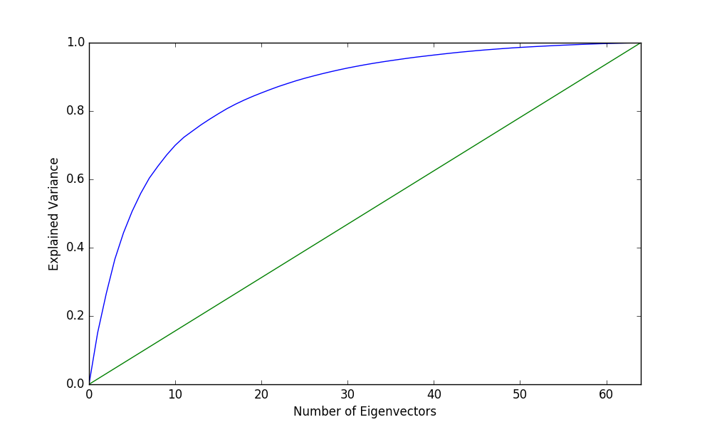  
- Isotropy: 0.28  

## sr  
- Vocabulary Size = 100,004  
- Embedding Length = 64  
#### Embedding L2 Norms  
  
- Anderson-Darling Test Statistic: 2261.84  
- Anderson-Darling Critical Value (1%): 1.09  
- Anderson-Darling Test Result: Reject  

- Kolmogorov-Smirnov p-value: 0.0  
- Kolmogorov-Smirnov Test Result: Reject  

- Shapiro-Wilk p-value: 0.0  
- Shapiro-Wilk Test Result: Reject  

#### Embedding Isotropy  
  
- Isotropy: 0.39  

## su  
- Vocabulary Size = 25,004  
- Embedding Length = 64  
#### Embedding L2 Norms  
  
- Anderson-Darling Test Statistic: 1097.06  
- Anderson-Darling Critical Value (1%): 1.09  
- Anderson-Darling Test Result: Reject  

- Kolmogorov-Smirnov p-value: 0.0  
- Kolmogorov-Smirnov Test Result: Reject  

- Shapiro-Wilk p-value: 0.0  
- Shapiro-Wilk Test Result: Reject  

#### Embedding Isotropy  
  
- Isotropy: 0.17  

## sv  
- Vocabulary Size = 100,004  
- Embedding Length = 64  
#### Embedding L2 Norms  
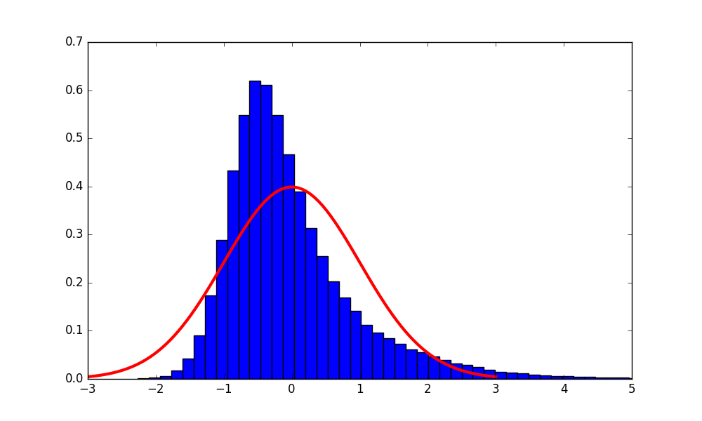  
- Anderson-Darling Test Statistic: 3047.53  
- Anderson-Darling Critical Value (1%): 1.09  
- Anderson-Darling Test Result: Reject  

- Kolmogorov-Smirnov p-value: 0.0  
- Kolmogorov-Smirnov Test Result: Reject  

- Shapiro-Wilk p-value: 0.0  
- Shapiro-Wilk Test Result: Reject  

#### Embedding Isotropy  
  
- Isotropy: 0.41  

## sw  
- Vocabulary Size = 26,004  
- Embedding Length = 64  
#### Embedding L2 Norms  
  
- Anderson-Darling Test Statistic: 952.94  
- Anderson-Darling Critical Value (1%): 1.09  
- Anderson-Darling Test Result: Reject  

- Kolmogorov-Smirnov p-value: 0.0  
- Kolmogorov-Smirnov Test Result: Reject  

- Shapiro-Wilk p-value: 0.0  
- Shapiro-Wilk Test Result: Reject  

#### Embedding Isotropy  
  
- Isotropy: 0.21  

## szl  
- Vocabulary Size = 4,004  
- Embedding Length = 64  
#### Embedding L2 Norms  
  
- Anderson-Darling Test Statistic: 299.57  
- Anderson-Darling Critical Value (1%): 1.09  
- Anderson-Darling Test Result: Reject  

- Kolmogorov-Smirnov p-value: 0.0  
- Kolmogorov-Smirnov Test Result: Reject  

- Shapiro-Wilk p-value: 0.0  
- Shapiro-Wilk Test Result: Reject  

#### Embedding Isotropy  
  
- Isotropy: 0.2  

## ta  
- Vocabulary Size = 100,004  
- Embedding Length = 64  
#### Embedding L2 Norms  
  
- Anderson-Darling Test Statistic: 3419.28  
- Anderson-Darling Critical Value (1%): 1.09  
- Anderson-Darling Test Result: Reject  

- Kolmogorov-Smirnov p-value: 0.0  
- Kolmogorov-Smirnov Test Result: Reject  

- Shapiro-Wilk p-value: 0.0  
- Shapiro-Wilk Test Result: Reject  

#### Embedding Isotropy  
  
- Isotropy: 0.27  

## te  
- Vocabulary Size = 100,004  
- Embedding Length = 64  
#### Embedding L2 Norms  
  
- Anderson-Darling Test Statistic: 3564.73  
- Anderson-Darling Critical Value (1%): 1.09  
- Anderson-Darling Test Result: Reject  

- Kolmogorov-Smirnov p-value: 0.0  
- Kolmogorov-Smirnov Test Result: Reject  

- Shapiro-Wilk p-value: 0.0  
- Shapiro-Wilk Test Result: Reject  

#### Embedding Isotropy  
  
- Isotropy: 0.26  

## tg  
- Vocabulary Size = 15,004  
- Embedding Length = 64  
#### Embedding L2 Norms  
  
- Anderson-Darling Test Statistic: 790.55  
- Anderson-Darling Critical Value (1%): 1.09  
- Anderson-Darling Test Result: Reject  

- Kolmogorov-Smirnov p-value: 0.0  
- Kolmogorov-Smirnov Test Result: Reject  

- Shapiro-Wilk p-value: 0.0  
- Shapiro-Wilk Test Result: Reject  

#### Embedding Isotropy  
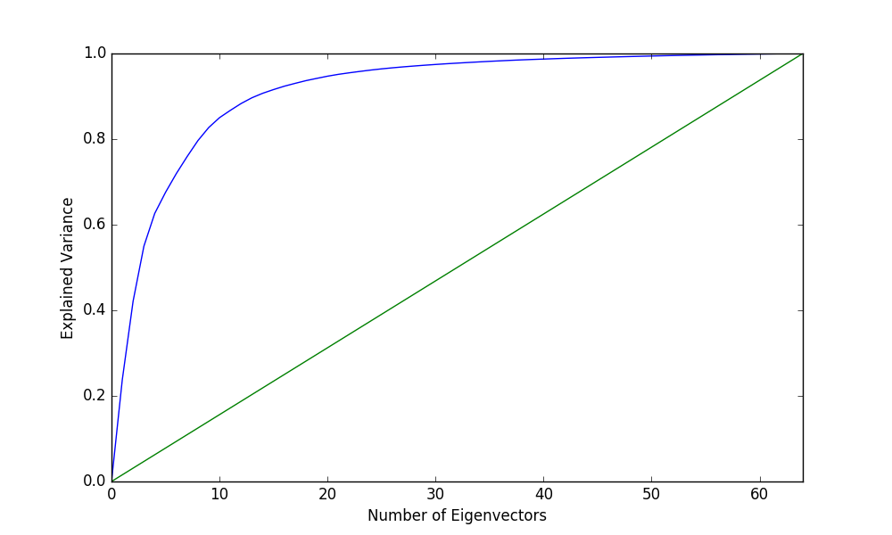  
- Isotropy: 0.16  

## th  
- Vocabulary Size = 55,004  
- Embedding Length = 64  
#### Embedding L2 Norms  
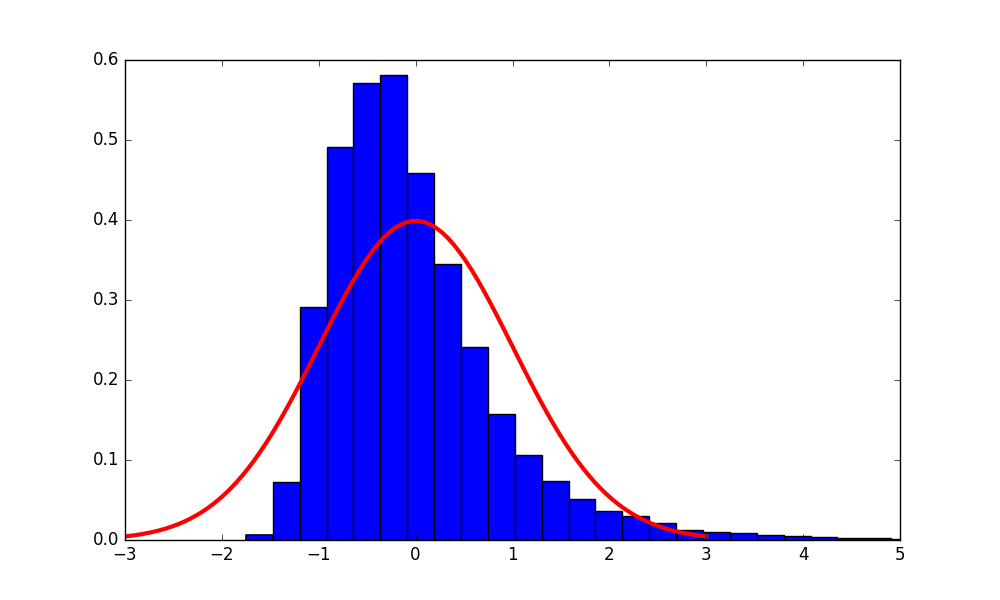  
- Anderson-Darling Test Statistic: 1761.16  
- Anderson-Darling Critical Value (1%): 1.09  
- Anderson-Darling Test Result: Reject  

- Kolmogorov-Smirnov p-value: 0.0  
- Kolmogorov-Smirnov Test Result: Reject  

- Shapiro-Wilk p-value: 0.0  
- Shapiro-Wilk Test Result: Reject  

#### Embedding Isotropy  
  
- Isotropy: 0.23  

## tk  
- Vocabulary Size = 14,004  
- Embedding Length = 64  
#### Embedding L2 Norms  
  
- Anderson-Darling Test Statistic: 715.81  
- Anderson-Darling Critical Value (1%): 1.09  
- Anderson-Darling Test Result: Reject  

- Kolmogorov-Smirnov p-value: 0.0  
- Kolmogorov-Smirnov Test Result: Reject  

- Shapiro-Wilk p-value: 0.0  
- Shapiro-Wilk Test Result: Reject  

#### Embedding Isotropy  
  
- Isotropy: 0.17  

## tl  
- Vocabulary Size = 41,004  
- Embedding Length = 64  
#### Embedding L2 Norms  
  
- Anderson-Darling Test Statistic: 1523.08  
- Anderson-Darling Critical Value (1%): 1.09  
- Anderson-Darling Test Result: Reject  

- Kolmogorov-Smirnov p-value: 0.0  
- Kolmogorov-Smirnov Test Result: Reject  

- Shapiro-Wilk p-value: 0.0  
- Shapiro-Wilk Test Result: Reject  

#### Embedding Isotropy  
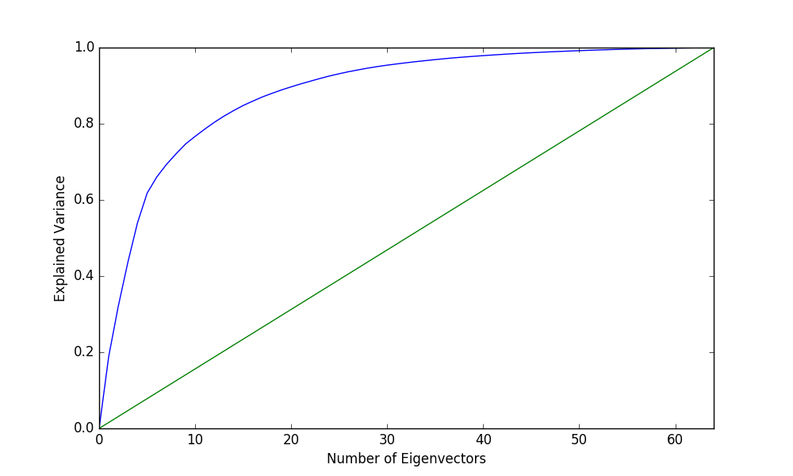  
- Isotropy: 0.22  

## tr  
- Vocabulary Size = 100,004  
- Embedding Length = 64  
#### Embedding L2 Norms  
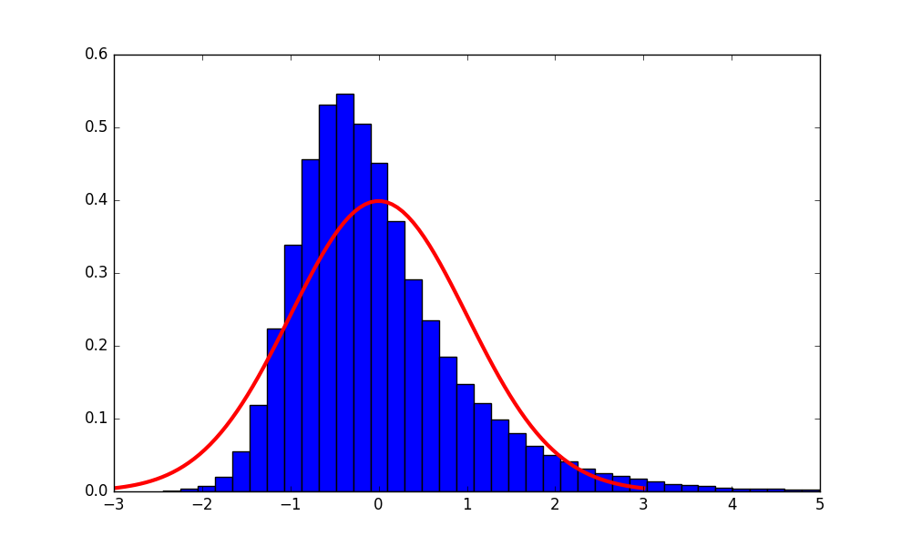  
- Anderson-Darling Test Statistic: 2092.02  
- Anderson-Darling Critical Value (1%): 1.09  
- Anderson-Darling Test Result: Reject  

- Kolmogorov-Smirnov p-value: 0.0  
- Kolmogorov-Smirnov Test Result: Reject  

- Shapiro-Wilk p-value: 0.0  
- Shapiro-Wilk Test Result: Reject  

#### Embedding Isotropy  
  
- Isotropy: 0.41  

## tt  
- Vocabulary Size = 25,004  
- Embedding Length = 64  
#### Embedding L2 Norms  
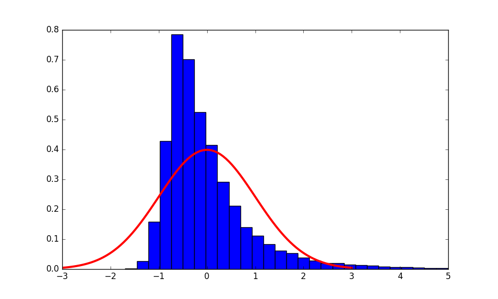  
- Anderson-Darling Test Statistic: 1253.95  
- Anderson-Darling Critical Value (1%): 1.09  
- Anderson-Darling Test Result: Reject  

- Kolmogorov-Smirnov p-value: 0.0  
- Kolmogorov-Smirnov Test Result: Reject  

- Shapiro-Wilk p-value: 0.0  
- Shapiro-Wilk Test Result: Reject  

#### Embedding Isotropy  
  
- Isotropy: 0.19  

## ug  
- Vocabulary Size = 13,004  
- Embedding Length = 64  
#### Embedding L2 Norms  
  
- Anderson-Darling Test Statistic: 731.39  
- Anderson-Darling Critical Value (1%): 1.09  
- Anderson-Darling Test Result: Reject  

- Kolmogorov-Smirnov p-value: 0.0  
- Kolmogorov-Smirnov Test Result: Reject  

- Shapiro-Wilk p-value: 0.0  
- Shapiro-Wilk Test Result: Reject  

#### Embedding Isotropy  
  
- Isotropy: 0.16  

## uk  
- Vocabulary Size = 155,004  
- Embedding Length = 64  
#### Embedding L2 Norms  
  
- Anderson-Darling Test Statistic: 3555.65  
- Anderson-Darling Critical Value (1%): 1.09  
- Anderson-Darling Test Result: Reject  

- Kolmogorov-Smirnov p-value: 0.0  
- Kolmogorov-Smirnov Test Result: Reject  

- Shapiro-Wilk p-value: 0.0  
- Shapiro-Wilk Test Result: Reject  

#### Embedding Isotropy  
  
- Isotropy: 0.43  

## ur  
- Vocabulary Size = 29,004  
- Embedding Length = 64  
#### Embedding L2 Norms  
  
- Anderson-Darling Test Statistic: 1071.14  
- Anderson-Darling Critical Value (1%): 1.09  
- Anderson-Darling Test Result: Reject  

- Kolmogorov-Smirnov p-value: 0.0  
- Kolmogorov-Smirnov Test Result: Reject  

- Shapiro-Wilk p-value: 0.0  
- Shapiro-Wilk Test Result: Reject  

#### Embedding Isotropy  
  
- Isotropy: 0.26  

## uz  
- Vocabulary Size = 21,004  
- Embedding Length = 64  
#### Embedding L2 Norms  
  
- Anderson-Darling Test Statistic: 1321.4  
- Anderson-Darling Critical Value (1%): 1.09  
- Anderson-Darling Test Result: Reject  

- Kolmogorov-Smirnov p-value: 0.0  
- Kolmogorov-Smirnov Test Result: Reject  

- Shapiro-Wilk p-value: 0.0  
- Shapiro-Wilk Test Result: Reject  

#### Embedding Isotropy  
  
- Isotropy: 0.18  

## vec  
- Vocabulary Size = 18,004  
- Embedding Length = 64  
#### Embedding L2 Norms  
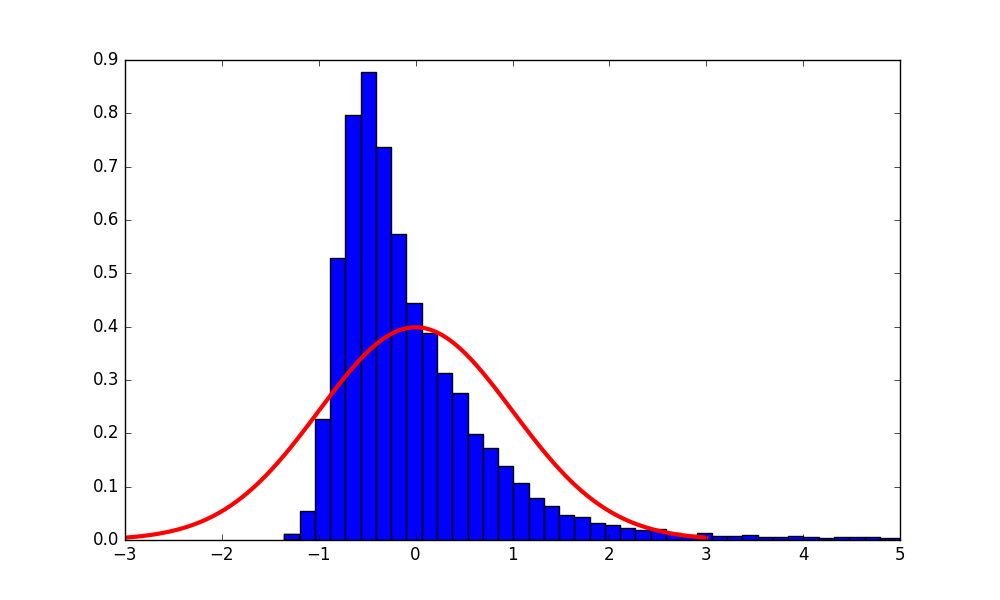  
- Anderson-Darling Test Statistic: 1075.87  
- Anderson-Darling Critical Value (1%): 1.09  
- Anderson-Darling Test Result: Reject  

- Kolmogorov-Smirnov p-value: 0.0  
- Kolmogorov-Smirnov Test Result: Reject  

- Shapiro-Wilk p-value: 0.0  
- Shapiro-Wilk Test Result: Reject  

#### Embedding Isotropy  
  
- Isotropy: 0.17  

## vi  
- Vocabulary Size = 100,004  
- Embedding Length = 64  
#### Embedding L2 Norms  
  
- Anderson-Darling Test Statistic: 5688.24  
- Anderson-Darling Critical Value (1%): 1.09  
- Anderson-Darling Test Result: Reject  

- Kolmogorov-Smirnov p-value: 0.0  
- Kolmogorov-Smirnov Test Result: Reject  

- Shapiro-Wilk p-value: 0.0  
- Shapiro-Wilk Test Result: Reject  

#### Embedding Isotropy  
  
- Isotropy: 0.35  

## vls  
- Vocabulary Size = 12,004  
- Embedding Length = 64  
#### Embedding L2 Norms  
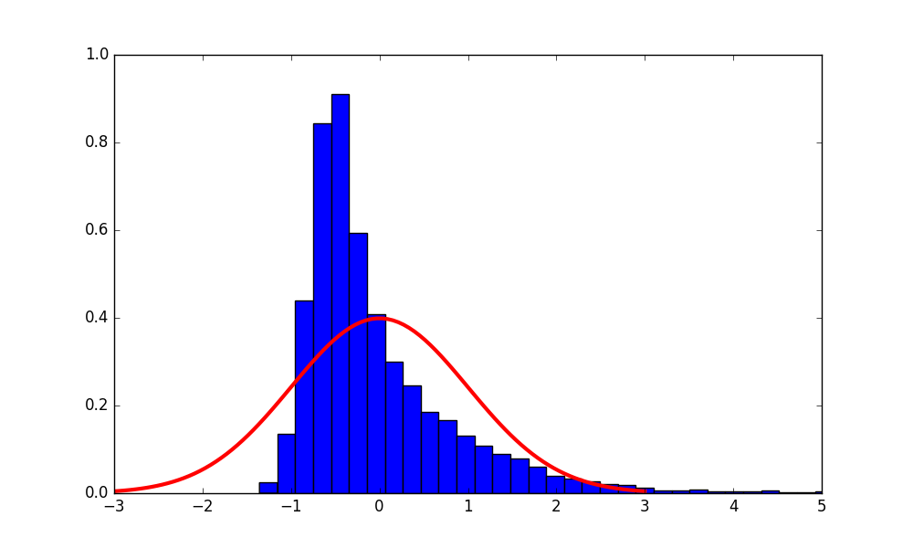  
- Anderson-Darling Test Statistic: 679.41  
- Anderson-Darling Critical Value (1%): 1.09  
- Anderson-Darling Test Result: Reject  

- Kolmogorov-Smirnov p-value: 0.0  
- Kolmogorov-Smirnov Test Result: Reject  

- Shapiro-Wilk p-value: 0.0  
- Shapiro-Wilk Test Result: Reject  

#### Embedding Isotropy  
  
- Isotropy: 0.16  

## vo  
- Vocabulary Size = 21,004  
- Embedding Length = 64  
#### Embedding L2 Norms  
  
- Anderson-Darling Test Statistic: 2254.92  
- Anderson-Darling Critical Value (1%): 1.09  
- Anderson-Darling Test Result: Reject  

- Kolmogorov-Smirnov p-value: 0.0  
- Kolmogorov-Smirnov Test Result: Reject  

- Shapiro-Wilk p-value: 0.0  
- Shapiro-Wilk Test Result: Reject  

#### Embedding Isotropy  
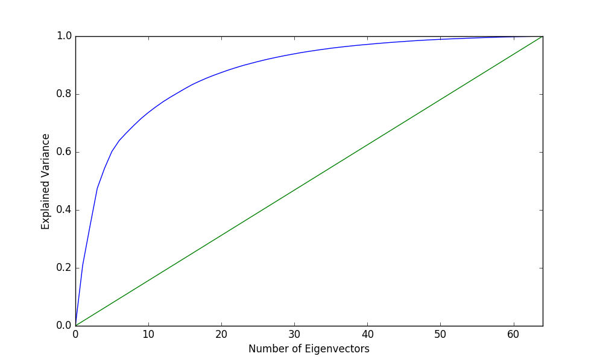  
- Isotropy: 0.24  

## wa  
- Vocabulary Size = 15,004  
- Embedding Length = 64  
#### Embedding L2 Norms  
  
- Anderson-Darling Test Statistic: 986.95  
- Anderson-Darling Critical Value (1%): 1.09  
- Anderson-Darling Test Result: Reject  

- Kolmogorov-Smirnov p-value: 0.0  
- Kolmogorov-Smirnov Test Result: Reject  

- Shapiro-Wilk p-value: 0.0  
- Shapiro-Wilk Test Result: Reject  

#### Embedding Isotropy  
  
- Isotropy: 0.21  

## war  
- Vocabulary Size = 19,004  
- Embedding Length = 64  
#### Embedding L2 Norms  
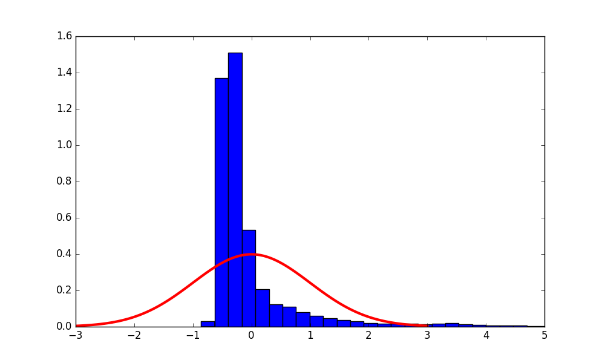  
- Anderson-Darling Test Statistic: 2896.21  
- Anderson-Darling Critical Value (1%): 1.09  
- Anderson-Darling Test Result: Reject  

- Kolmogorov-Smirnov p-value: 0.0  
- Kolmogorov-Smirnov Test Result: Reject  

- Shapiro-Wilk p-value: 0.0  
- Shapiro-Wilk Test Result: Reject  

#### Embedding Isotropy  
  
- Isotropy: 0.19  

## yi  
- Vocabulary Size = 17,004  
- Embedding Length = 64  
#### Embedding L2 Norms  
  
- Anderson-Darling Test Statistic: 953.21  
- Anderson-Darling Critical Value (1%): 1.09  
- Anderson-Darling Test Result: Reject  

- Kolmogorov-Smirnov p-value: 0.0  
- Kolmogorov-Smirnov Test Result: Reject  

- Shapiro-Wilk p-value: 0.0  
- Shapiro-Wilk Test Result: Reject  

#### Embedding Isotropy  
  
- Isotropy: 0.2  

## yo  
- Vocabulary Size = 9,004  
- Embedding Length = 64  
#### Embedding L2 Norms  
  
- Anderson-Darling Test Statistic: 649.72  
- Anderson-Darling Critical Value (1%): 1.09  
- Anderson-Darling Test Result: Reject  

- Kolmogorov-Smirnov p-value: 0.0  
- Kolmogorov-Smirnov Test Result: Reject  

- Shapiro-Wilk p-value: 0.0  
- Shapiro-Wilk Test Result: Reject  

#### Embedding Isotropy  
  
- Isotropy: 0.15  

## zh  
- Vocabulary Size = 100,004  
- Embedding Length = 64  
#### Embedding L2 Norms  
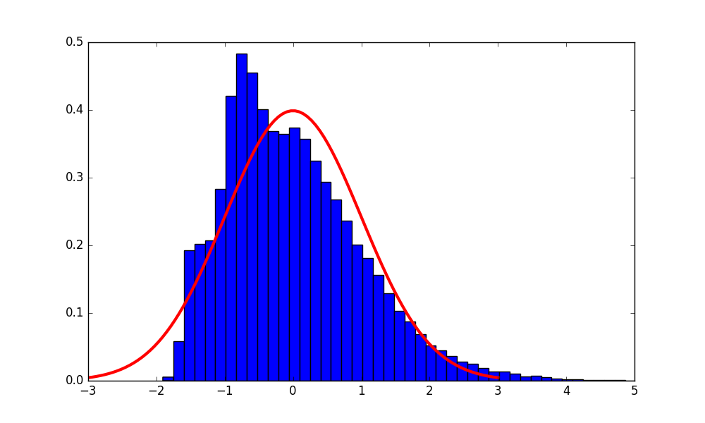  
- Anderson-Darling Test Statistic: 877.06  
- Anderson-Darling Critical Value (1%): 1.09  
- Anderson-Darling Test Result: Reject  

- Kolmogorov-Smirnov p-value: 0.0  
- Kolmogorov-Smirnov Test Result: Reject  

- Shapiro-Wilk p-value: 0.0  
- Shapiro-Wilk Test Result: Reject  

#### Embedding Isotropy  
  
- Isotropy: 0.44  

## zhc  
- Vocabulary Size = 100,004  
- Embedding Length = 64  
#### Embedding L2 Norms  
  
- Anderson-Darling Test Statistic: 7247.73  
- Anderson-Darling Critical Value (1%): 1.09  
- Anderson-Darling Test Result: Reject  

- Kolmogorov-Smirnov p-value: 0.0  
- Kolmogorov-Smirnov Test Result: Reject  

- Shapiro-Wilk p-value: 0.0  
- Shapiro-Wilk Test Result: Reject  

#### Embedding Isotropy  
  
- Isotropy: 0.43  

