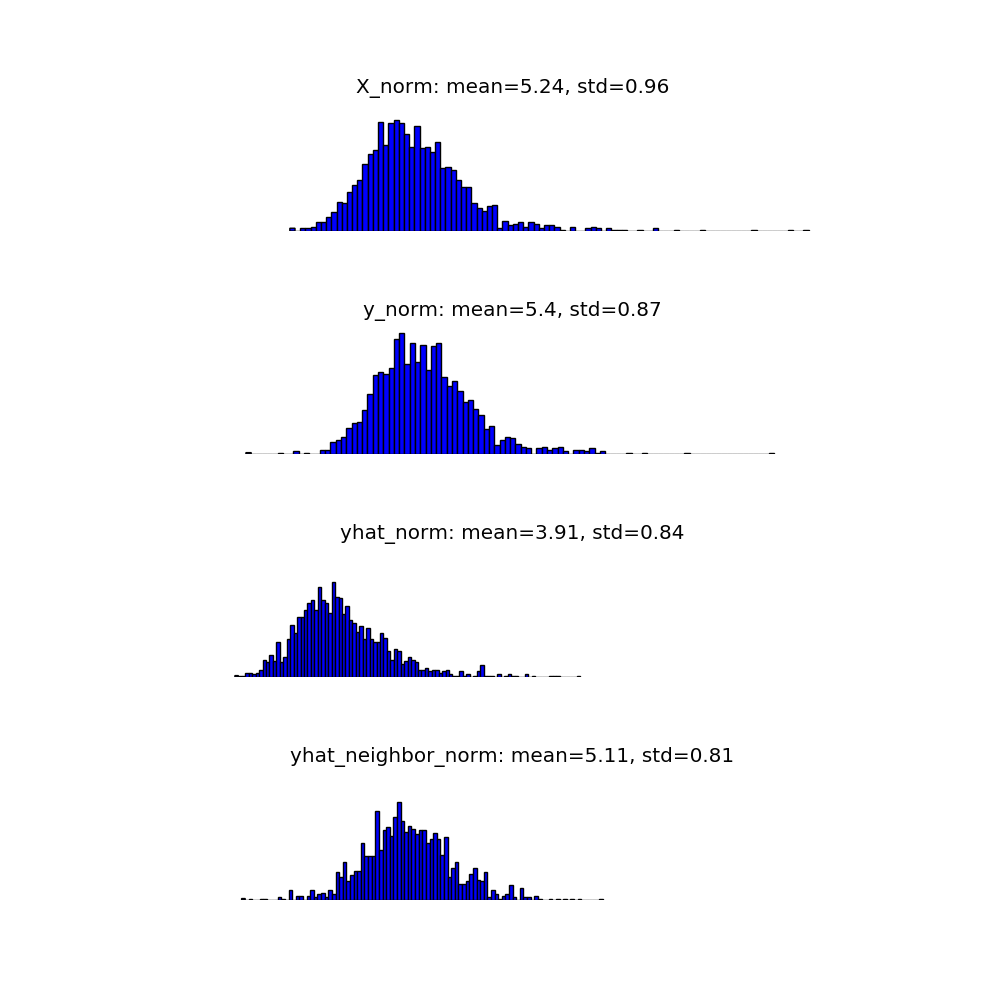
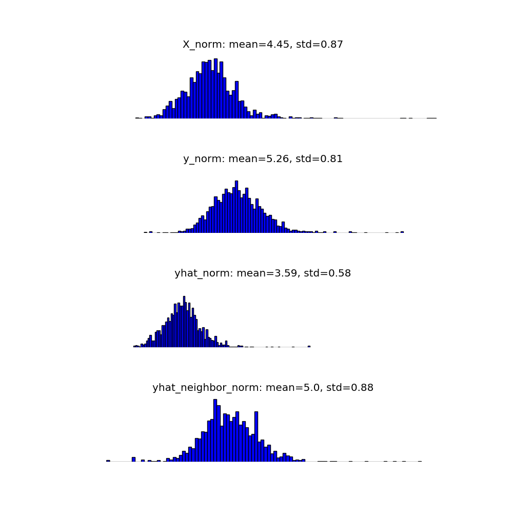
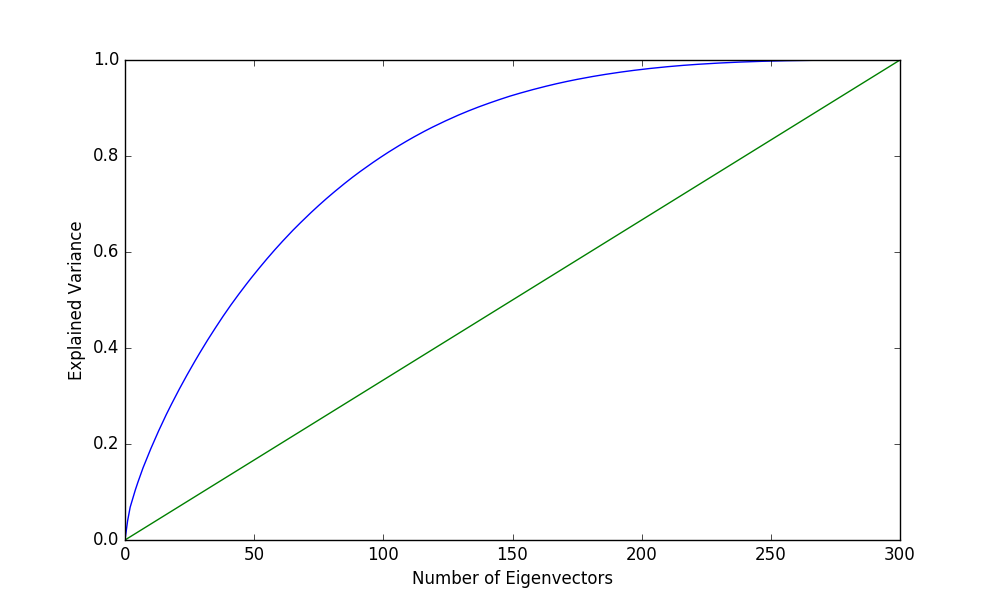
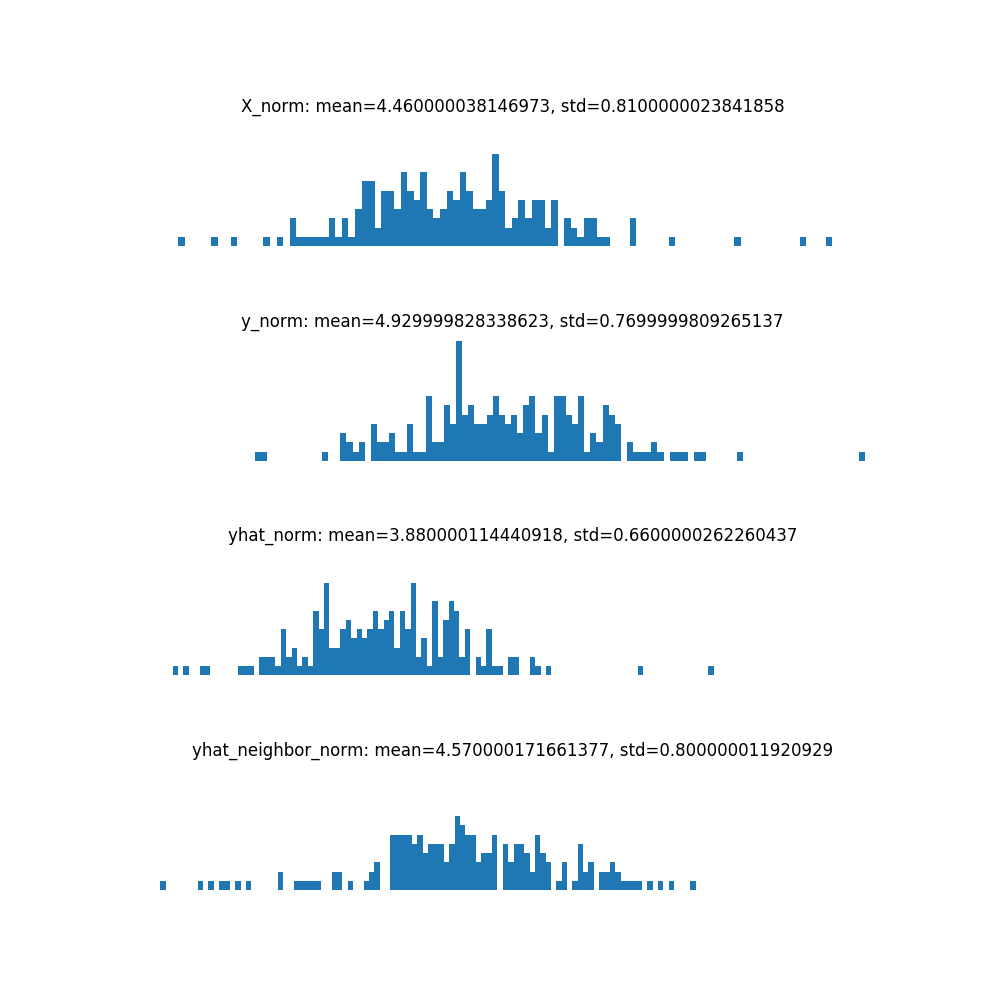
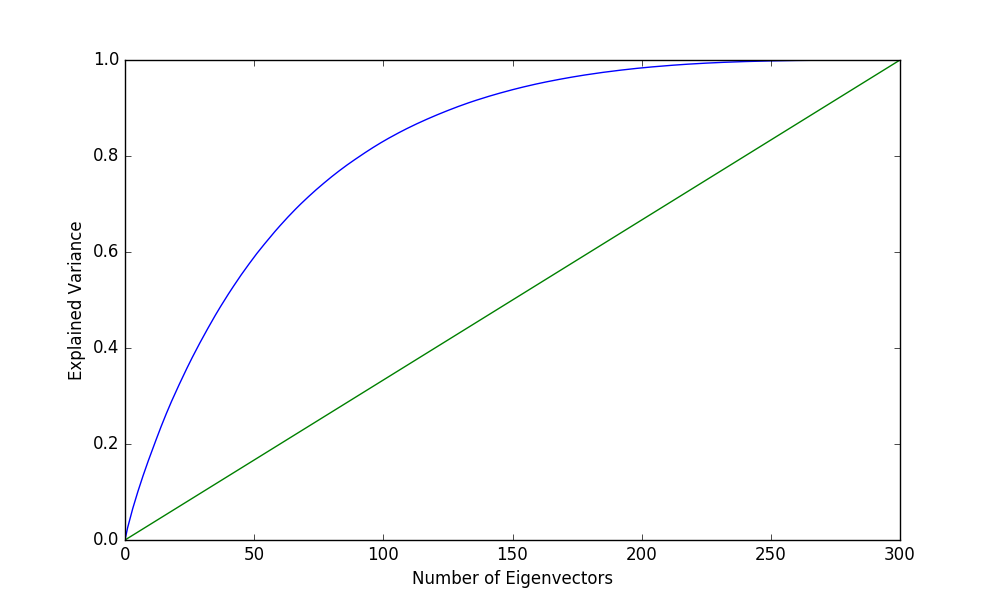
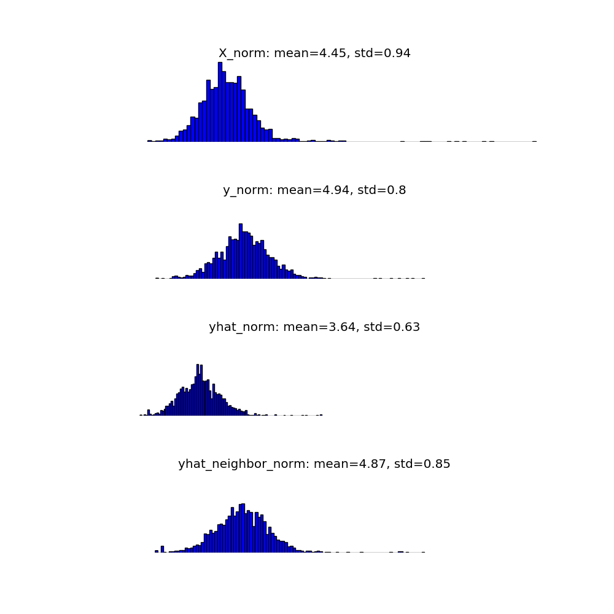
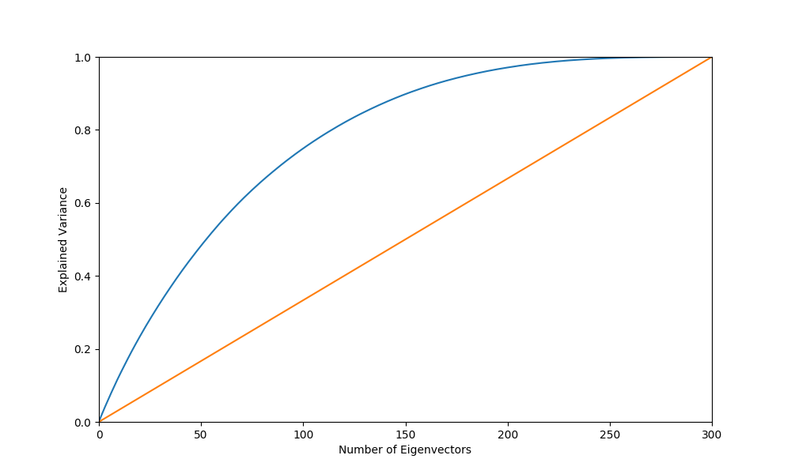
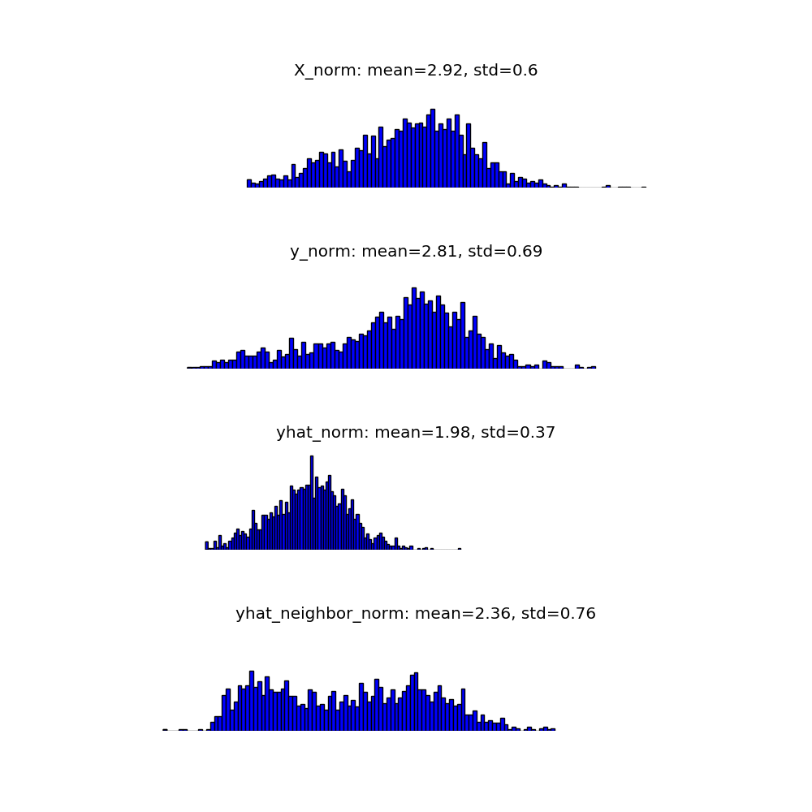

# Translation Matrix Results  
## En to Ru Fasttext_Random  
- En Vocabulary Size = 1,259,685  
- En Embedding Length = 300  
- Ru Vocabulary Size = 944,211  
- Ru Embedding Length = 300  
- Train Size = 5,000  
- Test Size = 1,500  
- <b>Test Accuracy = 3.9%</b>  

#### Test L2 Norms  
- X_norm: L2 norms for En test vectors  
- y_norm: L2 norms for Ru test vectors  
- yhat_norm: L2 norms for X.dot(T) test vectors (T = translation matrix)  
- yhat_neighbor norm: L2 norms for nearest neighborto X.dot(T) in y test vectors  
  

#### Translation Matrix Isotropy  
- Isotropy = 32.3%  
  

## En to Ru Fasttext_Top  
- En Vocabulary Size = 1,259,685  
- En Embedding Length = 300  
- Ru Vocabulary Size = 944,211  
- Ru Embedding Length = 300  
- Train Size = 5,000  
- Test Size = 1,500  
- <b>Test Accuracy = 46.3%</b>  

#### Test L2 Norms  
- X_norm: L2 norms for En test vectors  
- y_norm: L2 norms for Ru test vectors  
- yhat_norm: L2 norms for X.dot(T) test vectors (T = translation matrix)  
- yhat_neighbor norm: L2 norms for nearest neighborto X.dot(T) in y test vectors  
  

#### Translation Matrix Isotropy  
- Isotropy = 38.2%  
  

## En to De Fasttext_Random  
- En Vocabulary Size = 1,259,685  
- En Embedding Length = 300  
- De Vocabulary Size = 1,137,616  
- De Embedding Length = 300  
- Train Size = 5,000  
- Test Size = 1,500  
- <b>Test Accuracy = 21.9%</b>  

#### Test L2 Norms  
- X_norm: L2 norms for En test vectors  
- y_norm: L2 norms for De test vectors  
- yhat_norm: L2 norms for X.dot(T) test vectors (T = translation matrix)  
- yhat_neighbor norm: L2 norms for nearest neighborto X.dot(T) in y test vectors  
  

#### Translation Matrix Isotropy  
- Isotropy = 35.6%  
  

## En to De Fasttext_Top  
- En Vocabulary Size = 1,259,685  
- En Embedding Length = 300  
- De Vocabulary Size = 1,137,616  
- De Embedding Length = 300  
- Train Size = 5,000  
- Test Size = 1,500  
- <b>Test Accuracy = 63.6%</b>  

#### Test L2 Norms  
- X_norm: L2 norms for En test vectors  
- y_norm: L2 norms for De test vectors  
- yhat_norm: L2 norms for X.dot(T) test vectors (T = translation matrix)  
- yhat_neighbor norm: L2 norms for nearest neighborto X.dot(T) in y test vectors  
  

#### Translation Matrix Isotropy  
- Isotropy = 43.4%  
  

## En to It Zeroshot  
- En Vocabulary Size = 200,000  
- En Embedding Length = 300  
- It Vocabulary Size = 200,000  
- It Embedding Length = 300  
- Train Size = 5,000  
- Test Size = 1,869  
- <b>Test Accuracy = 27.9%</b>  

#### Test L2 Norms  
- X_norm: L2 norms for En test vectors  
- y_norm: L2 norms for It test vectors  
- yhat_norm: L2 norms for X.dot(T) test vectors (T = translation matrix)  
- yhat_neighbor norm: L2 norms for nearest neighborto X.dot(T) in y test vectors  
  

#### Translation Matrix Isotropy  
- Isotropy = 46.6%  
  

