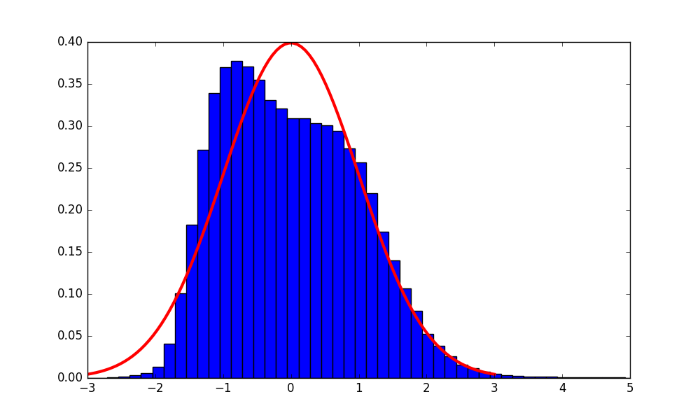

# Zeroshot EDA  
## English  
- Vocabulary Size = 200,000  
- Embedding Length = 300  
#### Embedding L2 Norms  
  
- Anderson-Darling Test Statistic: 1093.46  
- Anderson-Darling Critical Value (1%): 1.09  
- Anderson-Darling Test Result: Reject  

- Kolmogorov-Smirnov p-value: 0.0  
- Kolmogorov-Smirnov Test Result: Reject  

- Shapiro-Wilk p-value: 0.0  
- Shapiro-Wilk Test Result: Reject  

#### Embedding Isotropy  
  
- Isotropy: 0.59  

## Italian  
- Vocabulary Size = 200,000  
- Embedding Length = 300  
#### Embedding L2 Norms  
  
- Anderson-Darling Test Statistic: 2305.98  
- Anderson-Darling Critical Value (1%): 1.09  
- Anderson-Darling Test Result: Reject  

- Kolmogorov-Smirnov p-value: 0.0  
- Kolmogorov-Smirnov Test Result: Reject  

- Shapiro-Wilk p-value: 0.0  
- Shapiro-Wilk Test Result: Reject  

#### Embedding Isotropy  
  
- Isotropy: 0.59  

